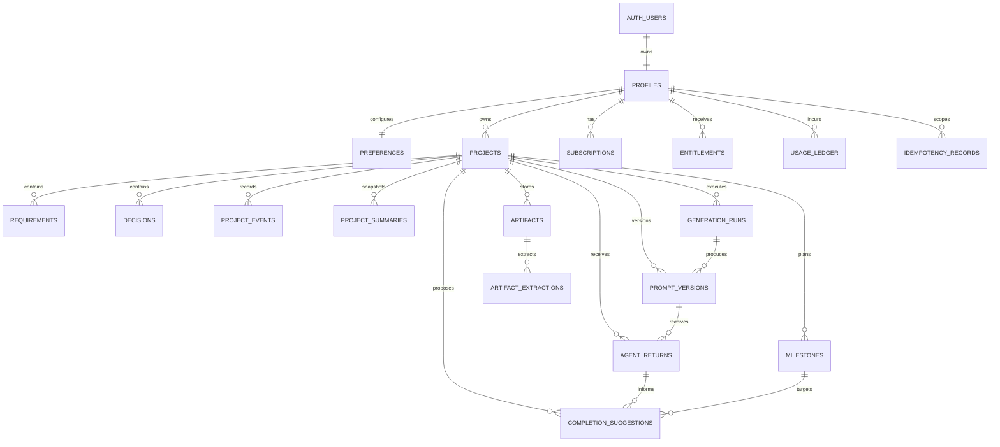

# Phase 3 — Supabase Data Platform and Ownership Model

**Status:** Implemented on `codex/phase-3-supabase-data-platform`
**Roadmap source:** `docs/UnseenPrompt – DEVELOPMENT_PLAN.md`
**Scope:** Phase 3 only
**Depends on:** Phase 1 runtime topology
**Unblocks:** Phases 4–17

## 1. Required outcome

Deliver a versioned Supabase schema that can persist every entity already named in the
development plan, enforce personal-account isolation at the database and Storage layers, preserve
immutable history, and prove retry-safe atomic project writes.

Phase 3 is complete only when:

- A fresh Supabase database applies every committed migration and deterministic seed without
  manual SQL.
- `anon` has no access to product data.
- An authenticated user can access only directly owned or project-derived records.
- Cross-project foreign-key substitution is rejected even when both projects have the same owner.
- Cross-user `SELECT`, `INSERT`, `UPDATE`, and `DELETE` attempts fail closed in pgTAP tests.
- `project_events` and `prompt_versions` cannot be updated in place.
- Deleting an individual immutable row is denied; future controlled project/account purge can
  remove it through a parent cascade.
- Retrying an atomic project write with the same key returns the original result and creates no
  duplicate event.
- Concurrent or stale project writes are rejected through optimistic version checks.
- A project projection update and its event either both commit or both roll back.
- The artifact bucket is private and another user cannot list, read, replace, or delete an object.
- Database lint, migration, seed, type-generation, and pgTAP checks are blocking CI gates.
- Staging and production migration procedures are documented and do not depend on editing an
  already-applied migration.

## 2. Repository-derived baseline

The executing agent must verify this baseline again before editing:

- The application is a single strict-TypeScript Next.js repository deployed through OpenNext to
  Cloudflare Workers.
- `supabase/config.toml` targets PostgreSQL 17 and enables migrations, seed execution, Auth, and
  Storage.
- CI already starts an isolated Supabase database and runs `pnpm test:db`.
- Local developer Macs are not required to run the Supabase Docker stack. Database validation
  remains a GitHub-hosted CI responsibility.
- The existing migration
  `supabase/migrations/20260729000100_waitlist.sql` is production data infrastructure. It must
  remain byte-for-byte unchanged.
- `waitlist_entries` is intentionally isolated from authenticated product access. Do not add
  product foreign keys, grants, policies, or seed rows to it.
- The production waitlist already uses server-only Supabase credentials. Do not rename or expose
  those values as part of Phase 3.
- `@supabase/supabase-js`, the Supabase CLI, pgTAP tests, and the database CI job already exist.
- Phase 4 authentication and application Supabase clients do not exist yet.

Before implementation, run and record:

1. `git status --short`
2. `git branch --show-current`
3. `git diff --stat`
4. `pnpm test:db` in CI, or confirm the current database job is green when local Docker is
   intentionally unavailable

Preserve all unrelated changes. Work on a `codex/phase-3-supabase-data-platform` branch or another
short-lived non-protected branch.

## 3. Locked implementation decisions

These decisions remove ambiguity for the executing agent.

### 3.1 Database and API shape

- Use `public` for product tables intended to be reachable through the Supabase Data API after
  grants and RLS allow access.
- Use a non-exposed `private` schema for ownership helpers and implementation-only functions.
- Keep the existing waitlist objects in `public`; their current revoke-only access model remains
  unchanged.
- Use UUID primary keys generated by `gen_random_uuid()`.
- Use `timestamptz` and UTC database timestamps.
- Use `text` plus named `CHECK` constraints for lifecycle/provider status values. Do not use
  PostgreSQL enums; later phases must be able to add states through additive migrations.
- Use `jsonb` only for bounded, schematically variable metadata. Core authorization, ownership,
  state, status, ordering, and linkage fields must be typed columns.
- Every `jsonb` value must be constrained to the expected top-level type and an explicit maximum
  byte size.
- Every user-controlled text field must have a non-empty and maximum-length constraint appropriate
  to its use.
- Do not store raw secrets, provider credentials, signed URLs, authentication tokens, hidden model
  reasoning, or full request/response logs.

### 3.2 Ownership

- `profiles.id` is the user identity and references `auth.users(id)`.
- Directly owned tables carry `owner_id`.
- Project-owned tables carry `project_id`; ownership is derived through `projects.owner_id`.
- Do not copy `owner_id` onto every project child. Avoid two ownership fields that can drift.
- Create `private.owns_project(uuid)` as a stable, security-definer helper with a fixed
  `search_path` and no dynamic SQL.
- Keep `private` outside the exposed Data API schemas. Revoke all broad schema/function access,
  then grant `authenticated` only the schema usage and exact helper execution required for policy
  evaluation. The helper returns only whether `auth.uid()` owns the supplied project.
- RLS policies call `(select private.owns_project(project_id))`.
- Index every direct `owner_id`, every child `project_id`, and every column used by an RLS helper
  or high-frequency foreign key.

### 3.3 Referential integrity

- Every project child exposes a unique `(project_id, id)` key in addition to its primary key.
- Any relationship between two project children uses a composite foreign key containing
  `project_id`.
- This rule applies to generation-run/prompt, prompt/agent-return, artifact/extraction,
  agent-return/completion-suggestion, supersession, and evidence-link relationships.
- A privileged application bug must not be able to attach a child from project A to project B.
- Use `ON DELETE CASCADE` from account to profile-owned data and from project to project-owned
  data, except where external billing identifiers require a later retention policy.
- Do not expose hard-delete behavior in application code during Phase 3.

### 3.4 Immutability and event history

- `project_events` is append-only. Grant authenticated users `SELECT` and controlled `INSERT`
  through the atomic RPC only; grant no direct `UPDATE` or `DELETE`.
- `prompt_versions` is immutable after insert. Grant no direct `UPDATE` or row-level `DELETE`.
- Add a `BEFORE UPDATE` trigger to both tables that raises a stable, non-sensitive error code.
- Parent project/account hard deletion may cascade immutable rows. This is not an event rewrite.
- Requirements, decisions, milestones, summaries, extraction attempts, and completion suggestions
  preserve history through new versions/status rows or explicit supersession fields rather than
  destructive replacement.
- Confirmed requirement and decision content is frozen by a trigger. A change creates a proposed
  successor that references the same-project predecessor and becomes confirmed only through a
  later controlled state change.

### 3.5 Atomic project writes

- `projects.state_version` is a positive `bigint` used for optimistic concurrency.
- `project_events.sequence_number` is monotonic and unique within a project.
- Implement two narrowly granted security-definer RPCs as the Phase 3 atomicity primitives:
  `public.create_project` and `public.commit_project_change`.
- Both RPCs derive identity only from `auth.uid()`, reject a null identity, manually verify project
  ownership before every protected write, use a fixed `search_path`, contain no dynamic SQL, and
  expose execution only to `authenticated`.
- Security-definer execution is required because direct writes to projects, events, and succeeded
  idempotency records stay revoked. It is not permission to accept caller-supplied ownership or
  bypass the explicit owner checks.
- `create_project` claims a lifecycle idempotency record, inserts the owner-scoped project, relies
  on the mandatory creation-event trigger, stores the created project resource reference, and
  resolves the sequence-one event when an identical request is retried.
- Direct authenticated project insert remains denied; creation goes through `create_project`.
- `create_project` accepts an idempotency key, request fingerprint, title, initial mode, and
  optional selected tool. Owner, initial `discovery` stage, version, event sequence, timestamps,
  project ID, and event ID are database-controlled.
- `commit_project_change` accepts:
  - `project_id`
  - `expected_state_version`
  - `idempotency_key`
  - `request_fingerprint`
  - `event_type`
  - bounded `event_payload`
  - the complete next projection fields allowed in Phase 3: title, mode, stage, selected tool,
    active milestone, archive timestamp, and blocker summary
- The RPC:
  1. Resolves the authenticated identity and rejects a missing identity.
  2. Locks the owned project row with `FOR UPDATE`.
  3. Claims or resolves the idempotency record.
  4. Rejects key reuse when the request fingerprint differs.
  5. Returns the prior event/result when the same successful request is retried.
  6. Compares `expected_state_version` with the locked row.
  7. Validates that the active milestone belongs to the same project.
  8. Writes the next event with `sequence_number = state_version + 1`.
  9. Updates the project projection and `state_version` in the same transaction.
  10. Marks the idempotency record succeeded and returns the new version and event ID.
- A database exception at any point must roll back the idempotency claim, event, and projection.
- Do not encode the Phase 6 transition graph in this function. Phase 6 will add deterministic
  allowed-transition rules around this primitive.
- Do not use the service role for normal owner writes. Invoke the command RPC with the
  authenticated user's JWT; the RPC performs the same owner check before its narrowly scoped
  privileged writes.

### 3.6 Idempotency

- Use one `idempotency_records` table for the scopes already committed in the roadmap:
  `generation`, `upload`, `workflow`, `lifecycle`, and `billing`.
- User operations have `owner_id`; system/billing operations may have a null owner.
- Enforce uniqueness with two partial unique indexes:
  - `(owner_id, scope, idempotency_key)` where `owner_id is not null`
  - `(scope, idempotency_key)` where `owner_id is null`
- Persist a one-way request fingerprint, status, stable resource reference, timestamps, and expiry.
- Do not persist a full response body, prompt, artifact content, provider secret, or webhook body.
- Key reuse with a different fingerprint is an error.
- `failed` records may be retried only under a policy defined by the owning later phase; Phase 3
  tests the storage and conflict semantics but does not invent retry timing.

### 3.7 Storage

- Create one private bucket named `project-artifacts`.
- Canonical object key:
  `<owner_uuid>/<project_uuid>/<artifact_uuid>/<sanitized_filename>`.
- `artifacts.object_path` is the canonical metadata reference and is unique.
- Store no signed or public URL in PostgreSQL.
- Phase 3 grants authenticated users read access only to objects whose owner path and Storage owner
  match the current user.
- Do not grant direct authenticated insert, update, upsert, or delete yet. Phase 10 will introduce
  bounded signed upload orchestration, metadata consistency, deletion, MIME verification, quotas,
  and workflow dispatch.
- Service-role access is server-only and must not be added to a client environment variable.

### 3.8 Environment topology

Use four isolated data realms:

| Realm       | Default implementation                                 | Data rule                      | Mutation source            |
| ----------- | ------------------------------------------------------ | ------------------------------ | -------------------------- |
| CI/PR       | Ephemeral local Supabase stack on GitHub-hosted runner | Synthetic seed only            | CI                         |
| Development | Persistent Supabase branch or separate project         | Synthetic data only            | Explicit migration job     |
| Staging     | Persistent Supabase branch or separate project         | Synthetic/staging data only    | Release workflow           |
| Production  | Existing production Supabase project                   | Real waitlist and product data | Protected release workflow |

Prefer persistent Supabase branches when the account supports them; otherwise use separate projects
with the same migrations. Do not couple the repository simultaneously to Supabase's automatic
GitHub production deployment and a custom `db push` workflow. The default for this repository is a
custom GitHub Actions migration gate because it must be ordered with the existing Cloudflare
release.

Ephemeral Supabase Preview Branches are optional in Phase 3. The existing isolated CI database is
the mandatory PR gate. Enabling preview branches must not auto-deploy a PR migration to production
or copy production data.

### 3.9 Storage-size budgets

Use `octet_length` for byte limits. These are database ceilings, not UI recommendations:

| Value class                                                                    |     Maximum |
| ------------------------------------------------------------------------------ | ----------: |
| Display name                                                                   |   120 bytes |
| Project/milestone title                                                        |   240 bytes |
| Status, type, provider, model, tool, locale, or time-zone identifier           |   255 bytes |
| Idempotency key, request/content hash, correlation label, or stable error code |   255 bytes |
| Original filename                                                              |   255 bytes |
| Storage object path                                                            | 1,024 bytes |
| Requirement/decision statement                                                 |      16 KiB |
| Rationale, blocker, or milestone description                                   |      32 KiB |
| Project summary text                                                           |      64 KiB |
| Event payload or ordinary metadata JSON                                        |      64 KiB |
| Action specification or acceptance-criteria JSON                               |     128 KiB |
| Prompt text or pasted agent return                                             |     256 KiB |
| Extracted or redacted artifact text per extraction attempt                     |     512 KiB |

- No Phase 3 PostgreSQL field may accept more than 512 KiB.
- Larger source material belongs in private Storage and is processed into bounded extractions in
  Phase 10.
- All byte limits require positive/non-empty checks where the field is not nullable.

## 4. Trust boundaries and invariants

| Boundary               | Trusted input                        | Untrusted input                       | Required enforcement                                                         |
| ---------------------- | ------------------------------------ | ------------------------------------- | ---------------------------------------------------------------------------- |
| Auth JWT → PostgreSQL  | Signed `sub` claim                   | Missing/expired JWT, user metadata    | `auth.uid()`, role-targeted RLS; never authorize from editable user metadata |
| Data API → tables      | Typed columns after constraints      | All request values                    | Grants, RLS, checks, foreign keys, size limits                               |
| Project → child rows   | `projects.owner_id`                  | Caller-supplied child IDs             | Derived ownership plus composite project foreign keys                        |
| RPC → event/projection | Locked project and validated request | Event payload and projection fields   | Ownership, idempotency, version check, one transaction                       |
| Storage API → object   | Auth owner and canonical path        | Bucket ID, object path, MIME metadata | Private bucket, RLS, path and owner checks                                   |
| Seed → non-production  | Fixed synthetic IDs and content      | Accidental production execution       | No secrets/real emails; release workflow never runs seed in production       |
| CI → remote Supabase   | Protected environment credentials    | PR code and fork context              | No remote credentials in PR jobs; environment protection                     |
| Cloudflare → Supabase  | User JWT for owner operations        | Service-role misuse                   | RLS by default; service role reserved for documented system jobs             |

Global invariants:

1. A project has exactly one owner.
2. A project child cannot change projects after insert.
3. Every project event has one project-local sequence number.
4. `projects.state_version` equals the latest committed project-event sequence.
5. An idempotency key identifies one request fingerprint in one scope/owner namespace.
6. Confirmed and proposed facts are distinguishable in columns, not inferred from prose.
7. Suggested milestone/completion state is separate from user-confirmed state.
8. Prompt text is versioned; it is never overwritten.
9. Agent claims, supplied evidence, user confirmation, and verification remain separate data.
10. Storage metadata never grants access by itself; Storage RLS is independently enforced.

## 5. Target relationship model



This is a relationship map, not permission to omit the composite `(project_id, id)` foreign-key
rule.

## 6. Schema contract

The executing agent may split migration files as described in section 7, but must implement this
logical contract.

### 6.1 Account and preference tables

#### `profiles`

Required fields:

- `id uuid primary key references auth.users(id) on delete cascade`
- `display_name text null`
- `locale text not null default 'en'`
- `time_zone text not null default 'UTC'`
- `onboarding_completed_at timestamptz null`
- `deletion_requested_at timestamptz null`
- `created_at`, `updated_at`

Constraints:

- Display name is trimmed, non-empty when present, and bounded.
- Locale and time-zone strings are bounded; Phase 4 performs canonical application validation.
- A user cannot insert or update a profile with an ID different from `auth.uid()`.

#### `preferences`

Required fields:

- `id uuid primary key`
- `owner_id uuid not null unique references profiles(id) on delete cascade`
- `skill_level text` constrained to `beginner`, `intermediate`, or `advanced`
- `preferred_stack_behavior text` constrained to `recommend`, `prefer_saved`, or `ask`
- `preferred_stack jsonb not null default '{}'`
- `coding_style jsonb not null default '{}'`
- `deployment_preference text null`
- `locale_override text null`
- `time_zone_override text null`
- `created_at`, `updated_at`

Constraints:

- Both JSON fields are objects and individually bounded to 16 KiB.
- Preference content is not authorization input.

### 6.2 Commercial foundation tables

These tables establish durable shapes only. Paddle synchronization, quota checks, catalog
configuration, checkout, and reconciliation remain Phase 15.

#### `subscriptions`

Required fields:

- `id`, `owner_id`
- `provider` constrained to `paddle`
- `external_customer_id`, `external_subscription_id`
- `status` constrained to Paddle's current `trialing`, `active`, `past_due`, `paused`, or
  `canceled`
- `effective_at`, `provider_occurred_at`
- `scheduled_change jsonb null`
- `canceled_at`, `created_at`, `updated_at`

Rules:

- External IDs are unique within provider when present.
- Users may read their own rows but cannot insert, update, or delete billing state.
- Scheduled change is an object and bounded.

#### `entitlements`

Required fields:

- `id`, `owner_id`
- `entitlement_key`
- `enabled boolean null`
- `limit_amount bigint null`
- `unit text null`
- `source`
- `valid_from`, `valid_until`
- `created_at`, `updated_at`

Rules:

- Exactly one of `enabled` or `limit_amount` is populated.
- Limits are non-negative.
- One active resolved record per owner/key/source interval is enforced to the practical extent
  possible without inventing Phase 15 catalog logic.
- Users have read-only access to their own entitlement rows.

#### `usage_ledger`

Required fields:

- `id`, `owner_id`, optional `project_id`
- `entitlement_key`
- `direction` constrained to `debit` or `credit`
- `quantity bigint not null check (quantity > 0)`
- `source_type`, `source_id`
- optional `idempotency_record_id`
- `period_start`, `period_end`, `occurred_at`, `created_at`
- bounded non-sensitive `metadata jsonb`

Rules:

- Append-only.
- Unique source reference prevents duplicate charge/refund entries.
- Users can read their own entries and cannot write ledger rows.
- A composite relationship ensures an optional project belongs to the ledger owner.

### 6.3 Project root

#### `projects`

Required fields:

- `id`, `owner_id`
- `title`
- `mode` constrained to `new_build`, `feature`, `bug`, `review`, `test`, `deploy`, `improve`
- `stage` constrained to `discovery`, `brief_confirmation`, `ready_for_prompt`,
  `prompt_active`, `awaiting_return`, `result_review`, `blocked`, `iteration`, `completed`,
  `archived`
- `selected_tool` null or constrained to `claude_code`, `codex`, `cursor`
- `active_milestone_id null`
- `blocker_summary null`
- `state_version bigint not null default 1`
- `last_activity_at`, `archived_at`, `deleted_at`, `created_at`, `updated_at`

Rules:

- Unique `(owner_id, id)` and `(id, owner_id)` keys support composite references.
- Active milestone uses a deferred composite foreign key back to `(project_id, id)` in
  `milestones`.
- Archive timestamp and archived stage must agree.
- A newly inserted project receives exactly one `project.created` event at sequence/version 1 in
  the same transaction.
- Direct owner reassignment is impossible.
- Direct authenticated insertion is denied; `create_project` is the only owner-facing creation
  path.
- Direct project updates must not bypass `commit_project_change`.

### 6.4 Confirmed project-state tables

#### `requirements`

- `id`, `project_id`
- `category`, `statement`, optional `rationale`
- `status`: `proposed`, `confirmed`, `rejected`, or `superseded`
- `source_event_id null`
- `supersedes_requirement_id null`
- `confirmed_at null`
- `created_at`, `updated_at`

Confirmed status requires `confirmed_at`; superseded status requires a same-project supersession
relationship. Do not overwrite confirmed statement text; create a successor.

#### `decisions`

- `id`, `project_id`
- stable `decision_key`, `decision`, optional `rationale`
- `status`: `proposed`, `confirmed`, `rejected`, or `superseded`
- `source_event_id null`
- `supersedes_decision_id null`
- `confirmed_at null`
- `created_at`, `updated_at`

The same immutability-by-supersession rule applies to confirmed decisions.

#### `milestones`

- `id`, `project_id`
- `position integer`
- `title`, optional `description`
- `suggested_status`
- `confirmed_status null`
- `confirmation_event_id null`
- `blocked_reason null`
- `created_at`, `updated_at`

Suggested and confirmed status remain separate. Enforce unique `(project_id, position)`.

#### `project_events`

- `id`, `project_id`
- `sequence_number bigint`
- `event_type`
- `actor_type`: `user`, `system`, `model`, `workflow`, or `billing`
- optional `actor_id`
- `idempotency_record_id null`
- `correlation_id uuid`
- bounded `payload jsonb`
- `created_at`

Enforce unique `(project_id, sequence_number)` and unique non-null idempotency linkage.

#### `project_summaries`

- `id`, `project_id`
- `summary_kind`
- `version integer`
- `based_on_event_sequence bigint`
- `summary_text`
- bounded `structured_facts jsonb`
- `status`: `current` or `superseded`
- `created_at`

Enforce unique `(project_id, summary_kind, version)` and at most one current summary per
project/kind with a partial unique index.

### 6.5 Generation and prompt tables

#### `generation_runs`

- `id`, `project_id`
- `operation_kind`
- `status`: `queued`, `running`, `succeeded`, `failed`, or `canceled`
- `project_state_version`
- optional provider-neutral `provider`, `model`
- optional `input_schema_version`, `output_schema_version`
- optional latency, input token, output token, retry count, estimated cost fields
- `correlation_id`
- `idempotency_record_id`
- stable `error_code null`
- `started_at`, `completed_at`, `created_at`

Do not store full provider request/response bodies. Phase 5 fills provider fields.

#### `prompt_versions`

- `id`, `project_id`, optional `generation_run_id`
- `tool`: `claude_code`, `codex`, or `cursor`
- `version integer`
- `source`: `generated` or `user_edit`
- `project_state_version`
- `action_specification jsonb`
- `prompt_text`
- `acceptance_criteria jsonb`
- optional `supersedes_prompt_version_id`
- `content_hash`
- `created_at`

Enforce unique `(project_id, tool, version)`, same-project references, bounded content, and an
update-rejecting trigger.

### 6.6 Returned evidence tables

#### `agent_returns`

- `id`, `project_id`, `prompt_version_id`
- `status`: `submitted`, `analyzing`, `analyzed`, `failed`, or `resolved`
- optional bounded `pasted_content`
- `content_hash`
- `idempotency_record_id`
- `submitted_at`, `resolved_at`, `created_at`

The prompt relationship must include `project_id`.

#### `artifacts`

- `id`, `project_id`
- optional `agent_return_id`
- `object_path`
- `original_filename`
- `media_type`
- `size_bytes`
- `content_hash`
- `status`: `pending`, `uploaded`, `processing`, `ready`, `failed`, `deleted`, or `purged`
- `created_at`, `deleted_at`, `purged_at`

Enforce non-negative bounded size, unique object path, and same-project return linkage. Phase 10
adds plan-specific limits and upload behavior.

#### `artifact_extractions`

- `id`, `project_id`, `artifact_id`
- `attempt integer`
- `status`: `queued`, `processing`, `succeeded`, `failed`, or `superseded`
- `extractor_version`
- optional bounded `extracted_text`, `redacted_text`
- `secrets_detected boolean`
- bounded `redaction_metadata jsonb`
- stable `error_code null`
- `started_at`, `completed_at`, `created_at`

Enforce unique `(project_id, artifact_id, attempt)`. Each retry is a new row.

#### `completion_suggestions`

- `id`, `project_id`, `agent_return_id`
- optional `milestone_id`
- `suggested_status`: `completed`, `needs_verification`, `blocked`, or `in_progress`
- `rationale`
- bounded `evidence_summary jsonb`
- `decision_status`: `pending`, `accepted`, or `rejected`
- optional `decision_event_id`
- `decided_at`, `created_at`

Acceptance/rejection requires `decided_at` and a same-project decision event. Pending suggestions
must not change milestone or project state.

### 6.7 Idempotency table

#### `idempotency_records`

- `id`
- optional `owner_id`, optional `project_id`
- `scope`
- `idempotency_key`
- `request_fingerprint`
- `status`: `in_progress`, `succeeded`, or `failed`
- optional `resource_type`, `resource_id`
- `created_at`, `completed_at`, `expires_at`

Rules:

- Project and owner, when both present, must match.
- Keys and fingerprints are bounded opaque values.
- Resource reference is metadata only; do not implement dynamic SQL from `resource_type`.
- Owner rows use owner RLS. Ownerless rows are inaccessible to `anon` and `authenticated`.
- Normal users cannot alter a succeeded record.

## 7. Migration and file plan

Never edit `20260729000100_waitlist.sql`. Generate real UTC timestamps when implementation begins
and preserve chronological order.

| Order | Planned file                                                        | Responsibility                                                                                                        |
| ----: | ------------------------------------------------------------------- | --------------------------------------------------------------------------------------------------------------------- |
|     1 | `supabase/migrations/<timestamp>_phase_3_account_foundation.sql`    | `private` schema, safe timestamp helper, profiles, preferences, direct grants/RLS                                     |
|     2 | `supabase/migrations/<timestamp>_phase_3_project_core.sql`          | projects, idempotency, requirements, decisions, milestones, events, summaries, ownership helper, constraints, indexes |
|     3 | `supabase/migrations/<timestamp>_phase_3_operations.sql`            | generation runs, prompts, returns, artifact metadata/extractions, suggestions                                         |
|     4 | `supabase/migrations/<timestamp>_phase_3_commercial_foundation.sql` | subscriptions, entitlements, usage ledger                                                                             |
|     5 | `supabase/migrations/<timestamp>_phase_3_atomic_project_writes.sql` | immutable triggers, project-create event, `create_project`, `commit_project_change`, exact execute grants             |
|     6 | `supabase/migrations/<timestamp>_phase_3_private_storage.sql`       | private bucket and Storage RLS policies                                                                               |
|     7 | `supabase/seed.sql`                                                 | deterministic synthetic profiles and projects for every lifecycle mode and skill level                                |
|     8 | `src/lib/supabase/database.types.ts`                                | committed generated database types; no handwritten edits                                                              |

If a circular relationship requires delayed foreign keys, create the two tables first and add the
constraint in the same migration before commit.

Every migration must:

- Be forward-only and additive.
- Enable RLS and establish grants in the same migration that creates an exposed table.
- Revoke broad defaults before adding narrow grants.
- Qualify object names.
- Give every security-definer function a fixed safe `search_path`.
- Revoke function execution from `public`, `anon`, and `authenticated`, then grant only the exact
  policy helpers or RPCs required by a role.
- Avoid `IF NOT EXISTS` for required Phase 3 objects unless rerun behavior is explicitly part of
  the migration. A naming collision should fail rather than silently produce a different schema.
- Include comments for non-obvious security and immutability decisions.

## 8. RLS and grant matrix

`Deny` means no grant and no permissive policy. Immutable/system writes occur only through their
own later-phase trusted path.

| Table group                                    | `anon` | Owner `SELECT` |                       Owner `INSERT` |                                Owner `UPDATE` | Owner `DELETE` |
| ---------------------------------------------- | ------ | -------------: | -----------------------------------: | --------------------------------------------: | -------------: |
| profiles                                       | Deny   |          Allow |                           Allow self |                      Allow self, immutable ID |           Deny |
| preferences                                    | Deny   |          Allow |                           Allow self |                   Allow self, immutable owner |           Deny |
| projects                                       | Deny   |          Allow |                             RPC only |                                      RPC only |           Deny |
| requirements, decisions, milestones, summaries | Deny   |  Allow derived |       Controlled path in later phase |                Controlled path in later phase |           Deny |
| project_events                                 | Deny   |  Allow derived |                             RPC only |                                          Deny |           Deny |
| generation_runs                                | Deny   |  Allow derived |       Controlled provider path later |                Controlled provider path later |           Deny |
| prompt_versions                                | Deny   |  Allow derived |     Controlled generation path later |                                          Deny |           Deny |
| agent_returns                                  | Deny   |  Allow derived |     Controlled submission path later |                Controlled analysis path later |           Deny |
| artifacts                                      | Deny   |  Allow derived | Metadata only in later Phase 10 path |              Allow state fields in later path |           Deny |
| artifact_extractions                           | Deny   |  Allow derived |               Trusted workflow later |                        Trusted workflow later |           Deny |
| completion_suggestions                         | Deny   |  Allow derived |               Trusted analysis later | Owner decision fields through controlled path |           Deny |
| subscriptions, entitlements                    | Deny   |   Allow direct |                                 Deny |                                          Deny |           Deny |
| usage_ledger                                   | Deny   |   Allow direct |                                 Deny |                                          Deny |           Deny |
| idempotency_records                            | Deny   |   Allow direct |                  Controlled RPC/path |                               Controlled path |           Deny |

Additional rules:

- Explicitly target policies `TO authenticated`.
- Use both `USING` and `WITH CHECK` for updates.
- Check that `auth.uid()` is non-null.
- Never authorize from `raw_user_meta_data`.
- Do not create a blanket authenticated policy or blanket grant across all tables.
- Views, if any become necessary, must use `security_invoker = true`; prefer no views in Phase 3.
- Test table privileges separately from RLS behavior.

## 9. Index plan

At minimum, add:

- B-tree index on every direct `owner_id`.
- B-tree index on every child `project_id`.
- `(owner_id, updated_at desc)` on projects.
- `(owner_id, archived_at, last_activity_at desc)` on projects.
- `(project_id, sequence_number desc)` unique on events.
- `(project_id, status)` on requirements, decisions, milestones, generation runs, artifacts, and
  suggestions where downstream queries filter by status.
- `(project_id, tool, version desc)` unique on prompt versions.
- Partial unique current-summary index.
- Partial idempotency uniqueness indexes described above.
- Unique provider/external subscription IDs where not null.
- Unique usage source reference.
- Unique artifact object path and `(project_id, artifact_id, attempt)`.

Do not add speculative full-text/vector indexes in Phase 3. Phase 14 search and later context
selection should add indexes against observed query contracts.

## 10. Deterministic seed contract

Create three synthetic Auth/profile identities:

- beginner
- intermediate
- advanced

Create seven deterministic projects covering:

- new build
- feature
- bug
- review
- test
- deploy
- improve

Each seeded project has:

- A deterministic UUID.
- A title containing no real customer information.
- At least one requirement, decision, and milestone.
- A valid creation event and matching `state_version`.
- A representative state without pretending later-phase AI/provider behavior is implemented.

Seed rules:

- Use reserved `.invalid` email domains.
- Store no passwords, OAuth tokens, provider keys, real names, or production identifiers.
- Make inserts idempotent.
- Keep the dataset small and deterministic.
- Do not seed `waitlist_entries`.
- Do not run seed in the production migration job.

## 11. Test implementation plan

Add these ordered pgTAP suites:

| File                                                                    | Required coverage                                                                               |
| ----------------------------------------------------------------------- | ----------------------------------------------------------------------------------------------- |
| `supabase/tests/database/00020_phase_3_schema.test.sql`                 | Tables, columns, constraints, RLS enabled, expected grants, indexes, FK delete actions          |
| `supabase/tests/database/00030_phase_3_direct_ownership_rls.test.sql`   | Profiles, preferences, projects, subscriptions, entitlements, usage, idempotency                |
| `supabase/tests/database/00040_phase_3_project_ownership_rls.test.sql`  | Every project-derived table under user A, user B, and unauthenticated contexts                  |
| `supabase/tests/database/00050_phase_3_integrity.test.sql`              | Same-project composite FKs, immutable owner/project IDs, checks, supersession, active milestone |
| `supabase/tests/database/00060_phase_3_events_and_idempotency.test.sql` | Creation event, atomic commit, rollback, stale version, duplicate retry, fingerprint conflict   |
| `supabase/tests/database/00070_phase_3_immutability.test.sql`           | Event/prompt update denial, direct delete denial, allowed parent cascade in controlled test     |
| `supabase/tests/database/00080_phase_3_storage_rls.test.sql`            | Private bucket, owner read, cross-user access denial, and no direct mutation grants             |
| `supabase/tests/database/00090_phase_3_seed.test.sql`                   | Three skill profiles, all seven modes, matching initial events/versions, no waitlist data       |

Test rules:

- Wrap each suite in `begin`/`rollback`.
- Insert deterministic `auth.users` fixtures as the database owner before switching roles.
- Exercise policies under `anon` and `authenticated`; superuser queries do not prove RLS.
- Set request JWT claims explicitly for user A and user B.
- Test all four CRUD operations, including ownership substitution through update payloads.
- Assert hidden rows return zero and forbidden writes raise an error or affect zero rows as
  appropriate.
- Test that a user cannot reference a child in another one of their own projects.
- Test the atomic RPC failure after event preparation and prove no partial row remains.
- Test duplicate calls both sequentially and with two database sessions if the CLI test harness can
  do so deterministically. If true concurrent pgTAP is impractical, add a focused integration test
  that opens two clients against the isolated CI database.
- Never use shared staging or production as a test target.

## 12. Type generation and CI gates

Add scripts with repository-consistent names:

- `db:lint`
- `db:types`
- `db:types:check`
- Preserve `test:db`

The generated type file is committed so Phase 4 can build typed clients without requiring local
Docker. CI regenerates it from the freshly migrated isolated database and fails on a diff.

Update `.github/workflows/ci.yml` database job in this order:

1. Install dependencies.
2. Start the isolated Supabase stack.
3. Reset/rebuild from committed migrations and seed.
4. Run database lint at error severity.
5. Run all pgTAP suites.
6. Regenerate database types and compare with the committed file.
7. Stop the stack in an `always()` step without backup.

PR jobs receive no staging or production Supabase credential. Forked PR code must never be able to
write a remote database.

## 13. Staging and production migration flow

Add the release flow only after protected GitHub environments contain the required credentials.
Do not put secret values in repository files, examples, logs, or command arguments that GitHub does
not mask.

Required environment-scoped values:

- Supabase access token
- Target project reference
- Database password when required by the CLI

The exact secret names should follow existing `STAGING_`/`PRODUCTION_` conventions and be
documented in `docs/development/environment-contract.md`.

Release order:

1. CI proves migrations from an empty database.
2. Generate and review a staging database push dry run.
3. Apply pending migrations to staging.
4. Run non-destructive staging schema/readiness assertions.
5. Deploy and smoke-test the staging Cloudflare Worker for the same commit.
6. Generate and review a production database push dry run.
7. Pass the protected production approval gate.
8. Confirm backup/PITR availability appropriate to the Supabase plan.
9. Apply the same already-tested migration set to production.
10. Verify migration history, expected tables, RLS state, and non-destructive health queries.
11. Upload/promote the production Worker for the same commit.
12. Run production smoke checks that do not expose or mutate user data.

Database deployment must precede application code that requires the new schema. Every migration
must be backward-compatible with the currently running Worker so a Worker rollback remains valid.

Do not automatically roll back a failed production database migration with destructive down SQL.
Stop deployment, preserve evidence, and ship a reviewed forward repair migration. Worker rollback
does not roll back PostgreSQL or Storage.

## 14. Agent work packages

Execute in order. Each package should be a focused PR or a clearly isolated commit unless the
repository owner requests one combined PR.

### P3-01 — Contract and security foundation

Files:

- This execution plan
- `docs/development/environment-contract.md`
- `supabase/migrations/<timestamp>_phase_3_account_foundation.sql`
- `supabase/tests/database/00020_phase_3_schema.test.sql`

Tasks:

- Reconfirm existing migration and CI behavior.
- Establish the private schema, safe function/default privilege posture, profiles, and preferences.
- Add direct-owner RLS tests.
- Do not add application Supabase clients.

Acceptance:

- Existing waitlist tests still pass.
- `anon` has no product access.
- User A cannot read or mutate user B profile/preferences.
- Missing JWT fails closed.

### P3-02 — Project ownership graph

Files:

- `..._phase_3_project_core.sql`
- direct and derived RLS tests
- integrity tests

Tasks:

- Implement projects, idempotency records, requirements, decisions, milestones, events, and
  summaries.
- Add derived ownership helper and all composite project FKs.
- Add initial project event behavior.

Acceptance:

- Cross-user CRUD is denied on every table.
- Cross-project child substitution fails.
- New project version and creation event agree.

### P3-03 — Operations, evidence, and commercial skeletons

Files:

- `..._phase_3_operations.sql`
- `..._phase_3_commercial_foundation.sql`
- schema/RLS/integrity tests

Tasks:

- Implement generation runs, prompts, returns, artifacts, extractions, suggestions, subscriptions,
  entitlements, and usage ledger.
- Apply the exact write restrictions from the matrix.

Acceptance:

- Every development-plan entity has a table.
- Same-project link constraints cover all child references.
- System-owned billing and ledger state is read-only to users.
- Prompt versions and usage rows cannot be rewritten.

### P3-04 — Atomic writes and immutability

Files:

- `..._phase_3_atomic_project_writes.sql`
- event/idempotency and immutability tests

Tasks:

- Implement immutable triggers, event sequencing, optimistic concurrency, idempotency conflict
  handling, `create_project`, and `commit_project_change`.
- Ensure no service-role dependency for owner writes.

Acceptance:

- Same-key retry returns the original event.
- Same key plus different fingerprint fails.
- A stale version fails.
- A forced failure produces no partial projection, event, or idempotency success.
- Event and prompt updates fail with stable non-sensitive errors.

### P3-05 — Private Storage

Files:

- `..._phase_3_private_storage.sql`
- Storage RLS tests

Tasks:

- Create the private bucket and owner policies.
- Enforce the canonical owner/project/artifact path.
- Leave direct object mutation disabled until Phase 10.

Acceptance:

- No public URL behavior exists.
- User A cannot list or access user B objects.
- An authenticated user cannot directly insert, update, upsert, or delete objects through the
  client role.
- Existing waitlist behavior is unaffected.

### P3-06 — Seed, generated types, and CI

Files:

- `supabase/seed.sql`
- `src/lib/supabase/database.types.ts`
- `package.json`
- `.github/workflows/ci.yml`
- tests

Tasks:

- Add deterministic seed fixtures.
- Generate and commit types.
- Add lint/type drift gates to the database CI job.

Acceptance:

- Empty reset + seed + lint + pgTAP + type drift check passes.
- Seed includes all modes and skill profiles and no waitlist rows.
- No generated type references a secret or contains fixture data.

### P3-07 — Remote topology and release integration

Files:

- `.github/workflows/deploy-release.yml`
- `docs/deployment/cloudflare-runbook.md`
- `docs/development/environment-contract.md`
- `README.md`

Tasks:

- Provision or select development, staging, and production targets.
- Configure protected environment credentials outside Git.
- Put staging/production database migration gates before their matching Worker deploys.
- Document forward-repair and recovery procedure.

Acceptance:

- Staging receives the exact migration set proven in CI.
- Production cannot run from a PR or without its protected environment gate.
- Production seed is never executed.
- Worker deployment is blocked when its database migration fails.
- Documentation names the operator-owned external prerequisites.

### P3-08 — Final verification and phase handoff

Tasks:

- Run the full repository quality suite applicable to SQL, TypeScript, Next.js, and Cloudflare.
- Review schema diffs, grants, policies, functions, and Storage policies manually.
- Verify staging RLS with two isolated synthetic Supabase Auth identities through the database/API
  test harness; Phase 3 does not add authentication UI.
- Update README status only after every Phase 3 gate passes.

Acceptance:

- All commands in section 15 pass with observed output.
- No critical/high authorization finding remains.
- Phase 4 can create authenticated clients using committed generated types without changing the
  ownership model.

## 15. Validation commands

Run the strongest feasible set and report exact outcomes:

```text
pnpm format:check
pnpm lint
pnpm typecheck
pnpm test:unit
pnpm build
pnpm cf:types:check
pnpm check:workers-deps
pnpm cf:build
pnpm test:cf-preview
pnpm db:lint
pnpm test:db
pnpm db:types:check
```

Database commands remain CI-only on developer Macs under the current repository policy. Do not
claim they passed from a local machine unless the isolated stack was actually run and its output
was observed.

## 16. Security review checklist

- [ ] Existing waitlist migration and access model are unchanged.
- [ ] No product table is reachable by `anon`.
- [ ] Every exposed product table has RLS enabled before deployment.
- [ ] Grants match the matrix; no blanket table/function grants exist.
- [ ] RLS uses signed identity, not editable user metadata.
- [ ] Every ownership and policy column is indexed.
- [ ] Security-definer functions have fixed `search_path`, no dynamic SQL, and only exact required
      execution grants.
- [ ] Owner and project IDs cannot be reassigned.
- [ ] Composite project FKs prevent cross-project linkage.
- [ ] Immutable rows cannot be updated or individually deleted.
- [ ] Event and projection writes are one transaction.
- [ ] Idempotency key/fingerprint conflicts fail closed.
- [ ] Ownerless system idempotency rows are invisible to users.
- [ ] Storage bucket is private; path and object owner are both checked.
- [ ] Direct artifact mutation is not opened before Phase 10 controls exist.
- [ ] Service credentials are absent from client bundles, logs, fixtures, and generated types.
- [ ] PR CI has no remote database credentials.
- [ ] Production migration is protected, forward-only, and ordered before dependent application
      deployment.

## 17. Explicit non-goals

Do not implement any of the following in Phase 3:

- Google OAuth, magic links, session middleware, onboarding, profile UI, or account deletion UI
  (Phase 4).
- Provider adapters, model calls, prompt composition, or usage charging (Phases 5 and 9).
- Full lifecycle transition rules or context compilation (Phase 6).
- Discovery, brief confirmation, prompt workspace, or result analysis UI (Phases 7–11).
- Signed upload APIs, extraction workflows, OCR, MIME sniffing, redaction, or file quotas
  (Phase 10).
- Project library search/export/delete UI (Phase 14).
- Paddle checkout, webhook processing, catalog sync, quota enforcement, or reconciliation
  (Phase 15).
- Vector search, embeddings, Realtime subscriptions, team/organization ownership, public sharing,
  GitHub integration, or repository access.

## 18. Stop conditions requiring owner input

The executing agent should continue autonomously except when one of these decisions is genuinely
unavailable:

- The existing production waitlist Supabase target cannot safely host additive product tables and a
  separate production project would require a second runtime data topology.
- Supabase Branching is unavailable and creating separate hosted development/staging projects would
  incur an unapproved cost.
- Protected GitHub environment credentials or production approval cannot be configured by the
  agent.
- An applied remote migration differs from the committed migration history.
- A required schema change would break the currently deployed waitlist Worker or require
  destructive production SQL.

Code, tests, and documentation can proceed without remote credentials. Remote provisioning and
production validation remain explicit incomplete gates until an authorized operator completes them.

## 19. Official implementation references

- [Supabase Row Level Security](https://supabase.com/docs/guides/database/postgres/row-level-security)
- [Supabase database testing](https://supabase.com/docs/guides/database/testing)
- [Supabase pgTAP testing](https://supabase.com/docs/guides/database/extensions/pgtap)
- [Supabase Storage access control](https://supabase.com/docs/guides/storage/security/access-control)
- [Supabase Branching](https://supabase.com/docs/guides/deployment/branching)
- [Supabase database migrations](https://supabase.com/docs/guides/deployment/database-migrations)
- [Paddle subscription resource](https://developer.paddle.com/api-reference/subscriptions/get-subscription)

These links are implementation references, not substitutes for the repository constraints and
locked decisions in this plan.

## 20. Copy-ready agent kickoff

```text
Execute Phase 3 for UnseenPrompt using
docs/architecture/phase-3-supabase-data-platform-execution-plan.md as the controlling specification.

Read AGENTS.md if present, the development/product plans, repository architecture docs,
CONTRIBUTING.md, SECURITY.md, the environment contract, current Supabase migrations/tests, and CI
workflows before editing. Recheck git status, branch, and existing diffs. Preserve unrelated work
and never edit supabase/migrations/20260729000100_waitlist.sql.

Execute P3-01 through P3-08 in order. Keep migrations additive and forward-only. Add RLS, grants,
constraints, and tests in the same change as each exposed table. Treat auth identity, Data API
input, JSON, object paths, provider metadata, and retries as hostile. Do not implement work assigned
to Phases 4+.

Run every feasible validation command from section 15 and report observed outcomes. Database tests
remain on the isolated CI Supabase stack under repository policy. Do not access or mutate staging
or production until the protected environment credentials, approval, target identity, dry run, and
backup/recovery gates in this plan are satisfied. If an external gate is unavailable, finish all
local code/tests/docs that do not require it and report the exact remaining gate.
```
