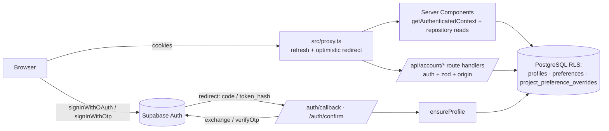

# Phase 4 — Authentication, Profile, and Basic Memory

**Status:** Implemented on feature branch — CI database and hosted staging auth gates pending
**Roadmap source:** `docs/UnseenPrompt – DEVELOPMENT_PLAN.md`
**Scope:** Phase 4 only
**Depends on:** Phase 2 design system and Phase 3 data platform (both complete on `main`)
**Unblocks:** Phases 5–17

> **For agentic workers:** Execute work packages P4-01 through P4-08 in order. Each package is
> independently reviewable and ends with observable acceptance checks. Use the copy-ready kickoff
> in section 16.

## 1. Required outcome

Deliver secure personal accounts through Supabase Auth (Google OAuth and email magic link),
server-side session enforcement for every protected surface, an onboarding flow that captures
explicit user-controlled preferences, profile and preference management, per-project preference
overrides that never mutate global preferences, sign-out, an account-deletion request flow, and
export preparation — all validated by app-layer and database-layer authorization tests.

Phase 4 is complete only when:

- A user can sign in with Google OAuth and with an email magic link in local, preview, and staging
  environments; production continues to serve only the coming-soon waitlist.
- Every protected page, route handler, and mutation validates the session server-side with
  `supabase.auth.getUser()`; no server code trusts a session read from cookies alone.
- A missing, expired, or tampered session is rejected with a stable error or redirect and never
  reaches profile, preference, or export data.
- First sign-in idempotently creates the user's `profiles` row; repeated sign-ins never duplicate
  or overwrite it.
- No profile or preference field is ever populated from OAuth provider metadata; every remembered
  value comes from an explicit user answer.
- Onboarding captures skill level, preferred stack behavior, coding style, deployment preference,
  locale, and time zone one question at a time, and completion is idempotent and retry-safe.
- Preferences persist in the existing Phase 3 `preferences` table and are readable for later
  phases through one typed repository.
- A per-project preference override row can exist without changing global preferences, and the
  effective-preferences resolver proves field-level precedence with provenance.
- Sign-out revokes the session and clears auth cookies.
- A deletion request stamps `profiles.deletion_requested_at`, is cancelable, and never deletes
  data in Phase 4 (purge execution is Phase 16).
- An authenticated user can produce an export payload containing only their own structured state.
- Cross-user access attempts (account switching, direct object access) fail closed in both the
  vitest authorization suite and the CI Supabase integration suite.
- `pnpm cf:build` and `pnpm test:cf-preview` pass with the new auth dependency and proxy in the
  Workers bundle.
- Existing waitlist behavior, environment values, and tests are byte-for-byte unaffected.

## 2. Repository-derived baseline

The executing agent must verify this baseline again before editing:

- Next.js 16 App Router, strict TypeScript, deployed through `@opennextjs/cloudflare` to
  Cloudflare Workers. `pnpm` with exact-pinned dependency versions.
- Layering: `src/domain` (pure logic, no framework imports) → `src/lib` (integrations) →
  `src/features` (UI) → `src/app` (routes). `src/config/<area>/{schema,server}.ts` is the
  environment-validation pattern (see `src/config/waitlist`). ESLint enforces import boundaries
  (`src/tooling/import-boundaries.test.ts`).
- Phase 3 is implemented: `public.profiles` and `public.preferences` exist with self-only RLS
  (`supabase/migrations/20260729183000_phase_3_account_foundation.sql`), the full project graph
  exists, `private.owns_project(uuid)` is the derived-ownership helper, and
  `src/lib/supabase/database.types.ts` is committed generated output (never hand-edited;
  regenerate with `pnpm db:types`).
- `profiles` columns: `id` (equals `auth.uid()`), `display_name` (≤120 bytes, trimmed non-empty
  when present), `locale` (default `'en'`, ≤255 bytes), `time_zone` (default `'UTC'`, ≤255
  bytes), `onboarding_completed_at`, `deletion_requested_at`, timestamps. Authenticated role has
  `SELECT`/`INSERT`/`UPDATE` on own row only; no `DELETE`.
- `preferences` columns: `id`, `owner_id` (unique, FK to profiles), `skill_level`
  (`beginner|intermediate|advanced`, NOT NULL), `preferred_stack_behavior`
  (`recommend|prefer_saved|ask`, NOT NULL), `preferred_stack` jsonb object ≤16 KiB, `coding_style`
  jsonb object ≤16 KiB, `deployment_preference` (nullable ≤255 bytes), `locale_override`,
  `time_zone_override`, timestamps. Because `skill_level` and `preferred_stack_behavior` are NOT
  NULL, the preferences row is created at onboarding completion, not at first sign-in.
- `projects` mutations flow only through the `create_project` and `commit_project_change` RPCs
  with a fixed Phase 3 field list. Phase 4 must not add columns to `projects` or modify either
  RPC.
- The production waitlist uses server-only `SUPABASE_URL` / `SUPABASE_SECRET_KEY` and Turnstile
  variables (`docs/development/environment-contract.md`). Do not rename, repurpose, or expose
  them. Never edit `supabase/migrations/20260729000100_waitlist.sql`.
- Core env schema lives in `src/config/env/schema.ts` (`APP_ENV`, `NEXT_PUBLIC_APP_URL`,
  `RELEASE_SHA`, `MAINTENANCE_MODE`). The `(product)` layout renders the app shell in
  non-production and returns children bare in production; `HomePage` serves the coming-soon
  landing when `APP_ENV === "production"`.
- Shell navigation (`src/components/shell/navigation.ts`) lists New Project (available),
  Projects, Profile, Usage (all `"soon"`).
- Local developer machines do not run the Supabase Docker stack. Database and Supabase-backed
  integration tests run in the CI `database` job (`.github/workflows/ci.yml`), which starts an
  isolated stack, resets from migrations + seed, runs `db:lint`, pgTAP (`test:db`), the
  `vitest.db.config.mts` integration suite (`test:db:concurrency`), and the generated-type drift
  check.
- Playwright e2e runs without any Supabase stack (`test:e2e`, `test:e2e:maintenance`,
  `test:e2e:production`).
- Workers dependency policy: `docs/development/workers-dependencies.md` — every new runtime
  dependency must pass `pnpm check:workers-deps`, `pnpm cf:build`, and `pnpm test:cf-preview`.

Before implementation, run and record:

1. `git status --short`
2. `git branch --show-current`
3. `git diff --stat`
4. Confirm the latest `main` CI run (Quality, Database, Cloudflare Preview) is green.

Preserve all unrelated changes. Work on a `codex/phase-4-authentication-profile-memory` branch or
another short-lived non-protected branch.

## 3. Locked implementation decisions

### 3.1 Auth library and session model

- Add `@supabase/ssr` as an exact-pinned runtime dependency (current stable at implementation
  time). It is pure JS and Workers-compatible; prove it through the mandatory dependency checks.
  Keep the existing `@supabase/supabase-js` version unless `@supabase/ssr` requires a compatible
  bump.
- Sessions are cookie-based via `@supabase/ssr` cookie adapters. Three client constructors, all
  typed with `Database` from `src/lib/supabase/database.types.ts`:
  - Browser client (`createBrowserClient`) — module-level singleton for client components.
  - Server client (`createServerClient` + Next `cookies()`) — created per request in Server
    Components, route handlers, and the account repository. Note `cookies()` is async in Next 16.
  - Proxy client — created inside the request/response cookie bridge used by `src/proxy.ts`.
- Authoritative identity is always `supabase.auth.getUser()` on the server (round-trips to
  Supabase Auth). `getSession()` may be used only for non-authoritative UI hints in the browser.
- PKCE flow for both OAuth and magic link (the `@supabase/ssr` default).
- Token refresh happens in `src/proxy.ts` (Next 16 name for middleware; if the installed Next
  version rejects `proxy.ts`, fall back to `src/middleware.ts` — verify against the running
  build, do not assume). The proxy is optimistic-redirect only; the data layer re-validates.
- The Worker never holds a Supabase service-role key for the product application in Phase 4. All
  owner operations run with the user's JWT under RLS. (The waitlist's server-only secret remains
  untouched and waitlist-scoped.)

### 3.2 Environment variables

Two new public values, validated in a new `src/config/supabase` module (waitlist pattern —
schema + accessor + tests). The core `src/config/env/schema.ts` is not modified.

| Variable                               | Visibility | Notes                                                      |
| -------------------------------------- | ---------- | ---------------------------------------------------------- |
| `NEXT_PUBLIC_SUPABASE_URL`             | Public     | App Supabase project URL for the current environment       |
| `NEXT_PUBLIC_SUPABASE_PUBLISHABLE_KEY` | Public     | Publishable (client) API key; RLS is the enforcement layer |

Rules:

- HTTPS required when `APP_ENV` is `staging` or `production`; HTTP allowed for `local`/`test`
  loopback.
- The publishable key must be non-empty and bounded (≤255 bytes). Never accept a value that
  starts with `sb_secret` — fail validation with a stable message so a pasted secret key cannot
  ship to a client bundle.
- These values are absent in production until launch phases enable the product surface; the
  production coming-soon path must not require them. All Phase 4 consumers live behind the
  product-surface gate (3.3), so missing production values are never read.
- Update `.env.example` with safe local defaults (`http://127.0.0.1:54321`,
  `sb_publishable_local_test_value_000000000000`), CI job env, and the environment-contract
  matrix in the same change.

### 3.3 Production gate

- Add `src/lib/security/product-surface.ts` exporting
  `isProductSurfaceEnabled(environment: AppEnvironment): boolean`, returning
  `environment.APP_ENV !== "production"` with a comment that a later release phase flips this to
  a launch flag.
- Every Phase 4 page calls it and renders `notFound()` when disabled; every Phase 4 route
  handler returns `404` JSON when disabled; `src/proxy.ts` returns `NextResponse.next()`
  immediately when disabled.
- Extend `tests/e2e/production-guard.spec.ts` to assert `/sign-in`, `/onboarding`, `/profile`,
  and `/api/account/profile` return 404 with `E2E_APP_ENV=production`.

### 3.4 Routes and files

App routes (route segments are kebab-case; groups do not affect URLs):

| Path                            | File                                                           | Access                         |
| ------------------------------- | -------------------------------------------------------------- | ------------------------------ |
| `/sign-in`                      | `src/app/(auth)/sign-in/page.tsx`                              | Anonymous; redirects if authed |
| `/auth/callback`                | `src/app/auth/callback/route.ts` (GET)                         | Anonymous (PKCE exchange)      |
| `/auth/confirm`                 | `src/app/auth/confirm/route.ts` (GET)                          | Anonymous (magic-link verify)  |
| `/auth/sign-out`                | `src/app/auth/sign-out/route.ts` (POST)                        | Authenticated                  |
| `/onboarding`                   | `src/app/(product)/onboarding/page.tsx`                        | Authenticated, pre-onboarding  |
| `/profile`                      | `src/app/(product)/profile/page.tsx`                           | Authenticated, onboarded       |
| `/api/account/onboarding`       | `src/app/api/account/onboarding/route.ts` (POST)               | Authenticated                  |
| `/api/account/profile`          | `src/app/api/account/profile/route.ts` (PATCH)                 | Authenticated                  |
| `/api/account/preferences`      | `src/app/api/account/preferences/route.ts` (PUT)               | Authenticated                  |
| `/api/account/deletion-request` | `src/app/api/account/deletion-request/route.ts` (POST, DELETE) | Authenticated                  |
| `/api/account/export`           | `src/app/api/account/export/route.ts` (GET)                    | Authenticated                  |

- `(auth)` gets its own minimal centered layout (`src/app/(auth)/layout.tsx`) using existing
  design tokens — no app shell, no navigation.
- `/onboarding` and `/profile` live under `(product)` and inherit the existing shell in
  non-production.
- Pages read data directly through the account repository in Server Components; mutations go
  through the `/api/account/*` route handlers (matches the waitlist route-handler pattern and its
  adjacent `route.test.ts` convention). No Server Actions in Phase 4 — one mutation style.
- Reads that gate rendering (`requireUser`, onboarding state) never run in client components.

### 3.5 Session enforcement layers

Defense in depth, in order:

1. **Proxy (optimistic):** `src/proxy.ts` with matcher
   `["/sign-in", "/onboarding", "/profile", "/api/account/:path*", "/auth/sign-out"]`. It
   refreshes tokens via the proxy client, redirects sessionless browsers from protected paths to
   `/sign-in?next=<path>`, and redirects authenticated users away from `/sign-in`. It never
   authorizes data access. The narrow matcher keeps waitlist, health, and static paths untouched.
2. **Data layer (authoritative):** `getAuthenticatedContext()` (section 6) is called at the top
   of every protected page and route handler. Pages redirect to `/sign-in`; API routes return
   `401` with `{ "error": { "code": "auth_required" } }`.
3. **Database:** Phase 3 RLS remains the final boundary; app code never uses a privileged key on
   behalf of a user.

Route-handler hardening:

- Mutations accept only their declared method; wrong methods return 405.
- All request bodies are zod-validated; failures return `422` with
  `{ "error": { "code": "validation_failed" } }` and no field echo of oversized content.
- Mutating handlers verify the `Origin` header matches `NEXT_PUBLIC_APP_URL` origin when an
  `Origin` header is present; mismatches return `403` `{ "error": { "code": "bad_origin" } }`.
- Request bodies are size-bounded before parse (reject > 64 KiB with `413`).
- Stable error codes for the phase: `auth_required`, `bad_origin`, `validation_failed`,
  `not_found`, `conflict`, `provider_error`. Never include Supabase error internals in responses.

### 3.6 Sign-in methods

**Google OAuth**

- Client calls `supabase.auth.signInWithOAuth({ provider: "google", options: { redirectTo:
`${origin}/auth/callback?next=<validated>` } })` from the sign-in page (browser client).
- `/auth/callback` exchanges the code (`exchangeCodeForSession`), calls `ensureProfile`, then
  redirects: to `/onboarding` when `onboarding_completed_at` is null, otherwise to the validated
  `next` value or `/`. Exchange failures redirect to `/sign-in?error=auth_callback_failed`
  (stable code in the query, no provider detail).
- Google client ID/secret and hosted redirect-URL allow-listing are operator-owned dashboard
  configuration for staging/production (section 14). Local Google sign-in is not required for
  Phase 4 tests; the magic-link path provides full local/CI coverage of the callback-adjacent
  logic.

**Email magic link**

- Client calls `supabase.auth.signInWithOtp({ email, options: { emailRedirectTo:
`${origin}/auth/callback` } })`. The UI confirms "check your email" without revealing whether
  the address has an account.
- Use the token-hash server-side verification pattern: customize the magic-link email template to
  link to `{{ .SiteURL }}/auth/confirm?token_hash={{ .TokenHash }}&type=email&next=<default>`.
  Local template lives at `supabase/templates/magic-link.html` and is wired in
  `supabase/config.toml` (`[auth.email.template.magiclink]` — verify the exact section name
  against the installed CLI's config reference). Hosted template configuration is an operator
  gate (section 14).
- `/auth/confirm` calls `verifyOtp({ type: "email", token_hash })`, then the same
  ensure-profile/redirect sequence as the OAuth callback. Invalid or expired tokens redirect to
  `/sign-in?error=magic_link_invalid`.
- Email input is validated with the same normalization rules as the waitlist domain
  (`src/domain/waitlist/email.ts` is reference, not a dependency — copy the semantics into
  `src/domain/account`, do not import across feature domains).

**Shared**

- Open-redirect guard: `resolveNextPath` (section 6) accepts only same-origin absolute paths —
  must start with exactly one `/`, no `\`, no `..` segment, no scheme or `//` prefix; everything
  else resolves to `/`. Pure function, unit-tested.
- Turnstile and additional rate limiting on auth endpoints are Phase 16 by roadmap. Supabase
  Auth's built-in rate limits remain configured in `supabase/config.toml`.
- Sign-out: POST-only, origin-checked, `supabase.auth.signOut()`, redirect `303` to `/sign-in`.
  The profile page exposes the sign-out control (P4-05).

### 3.7 Profile bootstrap and memory policy

- `ensureProfile(userId)` performs `insert ... on conflict (id) do nothing` semantics via the
  typed client (upsert with `ignoreDuplicates: true`) writing only `{ id: userId }`; database
  defaults supply locale `'en'` and time zone `'UTC'`. It never updates an existing row.
- **No provider metadata import.** Display name, locale, time zone, and every preference are set
  only from explicit user input during onboarding or profile editing. `raw_user_meta_data` is
  never read for product state and never used for authorization (Phase 3 rule).
- Basic memory = the explicit columns of `profiles` and `preferences`, nothing else. No implicit
  learning, no derived fields in Phase 4.

### 3.8 Onboarding

- One question per screen (global product constraint), keyboard-navigable, reduced-motion aware,
  built from existing primitives (`question-choice`, `form-field`, `progress`, `card`, `button`).
- Steps, in order (answers accumulate client-side; one POST at the end):
  1. `display_name` — optional text, trimmed, ≤120 bytes; empty means null.
  2. `skill_level` — `beginner | intermediate | advanced`.
  3. `preferred_stack_behavior` — `recommend | prefer_saved | ask`, with plain-language
     explanations.
  4. `preferred_stack` — shown only when the previous answer is `prefer_saved`; four optional
     bounded free-text fields: `frontend`, `backend`, `database`, `hosting` (each trimmed,
     ≤120 bytes). Otherwise `{}`.
  5. `coding_style` — three optional single-choice fields:
     `comments: minimal | standard | detailed`, `testing: test_first | tests_after | minimal`,
     `paradigm: functional | object_oriented | mixed`. Unanswered keys are omitted.
  6. `deployment_preference` — optional single choice:
     `cloudflare | vercel | traditional_server | undecided`; `undecided` stores null.
  7. `locale` — BCP-47 tag validated with `Intl.getCanonicalLocales`, default `en`.
  8. `time_zone` — IANA zone validated against `Intl.supportedValuesOf("timeZone")`, defaulted
     from the browser with explicit user confirmation.
- `POST /api/account/onboarding` validates the full answer set (zod schema in
  `src/domain/account/onboarding.ts`), then writes in this fixed order:
  1. Upsert `preferences` on `owner_id` conflict (update all preference fields).
  2. Update own `profiles` row: `display_name`, `locale`, `time_zone`, and set
     `onboarding_completed_at = now` only when currently null.
- The endpoint is idempotent: repeating the same POST after a partial failure converges (upsert
  then stamp). A cross-table SQL RPC is intentionally not added; the write order makes every
  partial state recoverable by retry, and both writes are owner-scoped under RLS.
- Authenticated users with null `onboarding_completed_at` are redirected server-side from
  `/profile` to `/onboarding`; onboarded users visiting `/onboarding` are redirected to
  `/profile`.

### 3.9 Profile and preference management

- `/profile` (Server Component) loads profile + preferences + deletion state through the account
  repository and renders: profile section (display name, locale, time zone), preferences section
  (all onboarding fields, editable with the same option sets), account section (sign-out,
  deletion request, export link).
- `PATCH /api/account/profile` accepts a partial `{ displayName?, locale?, timeZone? }`; PUT
  `/api/account/preferences` accepts the complete preference set (same schema as onboarding
  steps 2–6). Both re-validate with the shared domain schemas and return the updated record.
- Navigation: in `src/components/shell/navigation.ts`, Profile becomes
  `{ availability: "available", href: "/profile", active: false }`; New Project keeps `active`
  handling; Projects and Usage remain `"soon"`. Update shell tests and e2e accordingly.

### 3.10 Per-project preference overrides

- New additive migration `supabase/migrations/<timestamp>_phase_4_project_preference_overrides.sql`
  (real UTC timestamp at implementation; chronologically after all Phase 3 migrations):

  `public.project_preference_overrides`
  - `id uuid primary key default gen_random_uuid()`
  - `project_id uuid not null unique references public.projects (id) on delete cascade`
  - `unique (project_id, id)` (house composite-reference rule)
  - `skill_level text null` — same CHECK set as `preferences.skill_level`
  - `preferred_stack_behavior text null` — same CHECK set as global
  - `preferred_stack jsonb null` — object, ≤16 KiB when present
  - `coding_style jsonb null` — object, ≤16 KiB when present
  - `deployment_preference text null` — trimmed non-empty, ≤255 bytes when present
  - `created_at`, `updated_at` (+ `private.set_updated_at` trigger)
  - No locale/time-zone overrides at project level (those are account-level concerns).

- Grants/RLS follow the Phase 3 derived-ownership pattern exactly: revoke all, grant
  `SELECT`/`INSERT`/`UPDATE` to `authenticated`, policies `TO authenticated` with both `USING`
  and `WITH CHECK` on `(select private.owns_project(project_id))` plus non-null `auth.uid()`.
  No owner `DELETE` — clearing an override sets its fields to null (consistent with the Phase 3
  child-table matrix).
- Index `project_id` (the unique constraint provides it; keep the constraint as the index).
- pgTAP suite `supabase/tests/database/00100_phase_4_project_preference_overrides.test.sql`:
  schema/constraint assertions, cross-user CRUD denial under user A/user B/`anon`, cross-project
  substitution denial (user A cannot point an update at another of their own projects' row id),
  JSON type/size bounds, CHECK enforcement, delete denial.
- Regenerate and commit `src/lib/supabase/database.types.ts` (`pnpm db:types` in CI parity).
- Domain resolver (pure): `resolveEffectivePreferences(global, override)` returns every
  preference field with `{ value, source: "global" | "project" }`; a null/absent override field
  falls through to global. Unit tests cover all precedence combinations.
- Phase 4 ships the table, types, resolver, and repository accessors. Override editing UI arrives
  with the project surfaces (Phases 7/14); this is exactly the "overrides remain local" data
  guarantee the exit criteria require, provable by tests without project UI.

### 3.11 Deletion request and export preparation

- `POST /api/account/deletion-request` sets `deletion_requested_at = now` when null (repeat POST
  returns the existing timestamp — idempotent); `DELETE` clears it. UI uses the existing
  `alert-dialog` danger pattern with explicit copy: deletion is a request; data removal is
  executed by a later operational phase (16). No data is deleted in Phase 4.
- Export preparation defines the durable contract now, full export UX in Phase 14:
  - `AccountExportV1` (section 6) — schema-versioned JSON of the user's own structured state:
    profile, preferences, projects, requirements, decisions, milestones, project events, prompt
    versions, and project preference overrides. No signed URLs, no artifact binary content, no
    provider metadata, no other users' data.
  - `GET /api/account/export` streams it as `application/json` with
    `Content-Disposition: attachment; filename="unseenprompt-export.json"`. All reads run under
    the caller's JWT (RLS-scoped) via the typed client; the assembler additionally filters by the
    authenticated user id so a future RLS regression cannot silently widen the export.

### 3.12 Supabase local/CI auth configuration

`supabase/config.toml` changes (local stack only; hosted config is operator-owned):

- `[auth] site_url` is `"http://localhost:3000"` — it must match the local
  `NEXT_PUBLIC_APP_URL` origin, or the magic-link confirm sets its session cookie on a
  different loopback host than the post-confirm redirect; extend `additional_redirect_urls` with
  `"http://127.0.0.1:3000/auth/callback"` and `"http://localhost:3000/auth/callback"`.
- Wire the magic-link email template file (3.6).
- Do not enable `[auth.external.google]` locally — a partially configured provider would break
  the CI stack; Google is verified on staging (section 14).

## 4. Trust boundaries and invariants

| Boundary                       | Trusted input                          | Untrusted input                               | Required enforcement                                               |
| ------------------------------ | -------------------------------------- | --------------------------------------------- | ------------------------------------------------------------------ |
| Browser → proxy                | Nothing                                | Cookies, paths, `next` values                 | Optimistic-only redirects; no data authorization in proxy          |
| Cookies → server client        | Verified `getUser()` result            | Raw session cookie contents                   | `getUser()` before every protected read/write                      |
| OAuth/magic-link callback      | Supabase-verified code / token hash    | `code`, `token_hash`, `next`, `error` params  | Exchange/verify via SDK; `resolveNextPath`; stable error redirects |
| Client → `/api/account/*`      | Authenticated user id from `getUser()` | Body JSON, headers, method, origin            | Method allow-list, origin check, size bound, zod, RLS              |
| App → `profiles`/`preferences` | `auth.uid()`-scoped RLS                | Any id in a payload                           | Never accept a caller-supplied owner/user id; derive from session  |
| App → overrides table          | `private.owns_project`                 | `project_id` in payload                       | RLS derived ownership; repository verifies row ownership by read   |
| OAuth provider → product state | Nothing                                | `raw_user_meta_data`, provider profile fields | Never read provider metadata into product state                    |
| Export assembler → response    | RLS-scoped rows + explicit id filter   | Any request parameter                         | No parameters accepted; owner id from session only                 |

Global invariants:

1. Server identity comes only from `supabase.auth.getUser()`; cookies and client state are hints.
2. Profile creation is idempotent and never overwrites existing values.
3. Remembered state is explicit: every stored profile/preference value maps to a user action.
4. Global preferences are mutated only by onboarding completion or the preferences endpoint;
   project overrides never write to `preferences`.
5. Every Phase 4 mutation is owner-scoped and idempotent or safely retryable.
6. Production serves only the waitlist surface; no Phase 4 route leaks there.
7. The Worker bundle contains no Supabase secret key for the product application.
8. Auth failures produce stable codes; no Supabase/Google error internals reach clients or logs
   with user identifiers attached.

## 5. Architecture at a glance



## 6. Application contract

Exact names and shapes later phases and neighboring work packages rely on. All zod schemas live
in `src/domain/account` and are framework-free.

```ts
// src/config/supabase/schema.ts
export interface SupabasePublicEnvironment {
  readonly supabaseUrl: string;
  readonly supabasePublishableKey: string;
}
export function parseSupabasePublicEnvironment(
  values: Record<string, string | undefined>,
  appEnv: AppEnvironment["APP_ENV"],
): SupabasePublicEnvironment;

// src/lib/supabase/browser-client.ts
export function getSupabaseBrowserClient(): SupabaseClient<Database>;

// src/lib/supabase/server-client.ts
export async function createSupabaseServerClient(): Promise<SupabaseClient<Database>>;

// src/lib/supabase/require-user.ts
export interface AuthenticatedContext {
  readonly user: User; // from @supabase/supabase-js
  readonly supabase: SupabaseClient<Database>;
}
export async function getAuthenticatedContext(): Promise<AuthenticatedContext | null>;
// Pages: redirect(`/sign-in?next=…`) when null. API routes: 401 auth_required when null.

// src/domain/account/contracts.ts
export type SkillLevel = "beginner" | "intermediate" | "advanced";
export type PreferredStackBehavior = "recommend" | "prefer_saved" | "ask";
export interface PreferredStack {
  readonly frontend?: string;
  readonly backend?: string;
  readonly database?: string;
  readonly hosting?: string;
}
export interface CodingStyle {
  readonly comments?: "minimal" | "standard" | "detailed";
  readonly testing?: "test_first" | "tests_after" | "minimal";
  readonly paradigm?: "functional" | "object_oriented" | "mixed";
}
export type DeploymentPreference = "cloudflare" | "vercel" | "traditional_server";
export interface Profile {
  readonly id: string;
  readonly displayName: string | null;
  readonly locale: string;
  readonly timeZone: string;
  readonly onboardingCompletedAt: string | null;
  readonly deletionRequestedAt: string | null;
}
export interface Preferences {
  readonly skillLevel: SkillLevel;
  readonly preferredStackBehavior: PreferredStackBehavior;
  readonly preferredStack: PreferredStack;
  readonly codingStyle: CodingStyle;
  readonly deploymentPreference: DeploymentPreference | null;
}
export interface AccountRepository {
  ensureProfile(userId: string): Promise<void>;
  getProfile(userId: string): Promise<Profile | null>;
  updateProfile(userId: string, patch: ProfilePatch): Promise<Profile>;
  getPreferences(userId: string): Promise<Preferences | null>;
  completeOnboarding(userId: string, answers: OnboardingAnswers): Promise<void>;
  updatePreferences(userId: string, next: Preferences): Promise<Preferences>;
  requestDeletion(userId: string, now: Date): Promise<string>; // returns effective timestamp
  cancelDeletion(userId: string): Promise<void>;
  getProjectPreferenceOverride(projectId: string): Promise<ProjectPreferenceOverride | null>;
  buildAccountExport(userId: string): Promise<AccountExportV1>;
}

// src/domain/account/onboarding.ts
export interface OnboardingAnswers {
  readonly displayName: string | null;
  readonly skillLevel: SkillLevel;
  readonly preferredStackBehavior: PreferredStackBehavior;
  readonly preferredStack: PreferredStack;
  readonly codingStyle: CodingStyle;
  readonly deploymentPreference: DeploymentPreference | null;
  readonly locale: string;
  readonly timeZone: string;
}
export const onboardingAnswersSchema: z.ZodType<OnboardingAnswers>;
export const onboardingSteps: readonly OnboardingStep[]; // ordered step definitions for the UI

// src/domain/account/effective-preferences.ts
export interface ProjectPreferenceOverride {
  readonly skillLevel: SkillLevel | null;
  readonly preferredStackBehavior: PreferredStackBehavior | null;
  readonly preferredStack: PreferredStack | null;
  readonly codingStyle: CodingStyle | null;
  readonly deploymentPreference: DeploymentPreference | null;
}
export interface EffectiveField<T> {
  readonly value: T;
  readonly source: "global" | "project";
}
export interface EffectivePreferences {
  readonly skillLevel: EffectiveField<SkillLevel>;
  readonly preferredStackBehavior: EffectiveField<PreferredStackBehavior>;
  readonly preferredStack: EffectiveField<PreferredStack>;
  readonly codingStyle: EffectiveField<CodingStyle>;
  readonly deploymentPreference: EffectiveField<DeploymentPreference | null>;
}
export function resolveEffectivePreferences(
  global: Preferences,
  override: ProjectPreferenceOverride | null,
): EffectivePreferences;

// src/domain/account/redirect.ts
export function resolveNextPath(candidate: string | null | undefined): string; // "/" on any doubt

// src/domain/account/export.ts
export interface AccountExportV1 {
  readonly schema: "unseenprompt.account-export";
  readonly schemaVersion: 1;
  readonly generatedAt: string;
  readonly profile: Profile;
  readonly preferences: Preferences | null;
  readonly projects: readonly ProjectExport[]; // typed slices of Phase 3 rows, no artifact binaries
}

// src/lib/account/supabase-account-repository.ts
export function createSupabaseAccountRepository(
  client: SupabaseClient<Database>,
): AccountRepository;
```

Error envelope for every `/api/account/*` response:
`{ "error": { "code": "auth_required" | "bad_origin" | "validation_failed" | "not_found" | "conflict" | "provider_error" } }`.

## 7. Migration and file plan

| Order | File                                                                                                | Responsibility                                            |
| ----: | --------------------------------------------------------------------------------------------------- | --------------------------------------------------------- |
|     1 | `src/config/supabase/schema.ts` (+ `schema.test.ts`)                                                | Public Supabase env validation                            |
|     2 | `src/config/supabase/server.ts`, `src/config/supabase/public.ts`                                    | Server/browser accessors                                  |
|     3 | `src/lib/supabase/browser-client.ts`, `server-client.ts`, `proxy-session.ts`                        | Typed clients + proxy cookie bridge                       |
|     4 | `src/proxy.ts`                                                                                      | Token refresh + optimistic redirects (narrow matcher)     |
|     5 | `src/lib/supabase/require-user.ts`, `src/lib/security/product-surface.ts`                           | Authoritative auth + production gate                      |
|     6 | `src/domain/account/*` (contracts, onboarding, effective-preferences, redirect, export, email)      | Pure domain logic and schemas                             |
|     7 | `src/lib/account/supabase-account-repository.ts` (+ test)                                           | Typed data access under RLS                               |
|     8 | `src/app/(auth)/*`, `src/app/auth/*`                                                                | Sign-in page, callback, confirm, sign-out                 |
|     9 | `src/features/auth/*`, `src/features/account/*`                                                     | Sign-in panel, onboarding flow, profile/preferences forms |
|    10 | `src/app/(product)/onboarding/page.tsx`, `src/app/(product)/profile/page.tsx`                       | Protected pages                                           |
|    11 | `src/app/api/account/*/route.ts` (+ adjacent tests)                                                 | Mutations and export                                      |
|    12 | `supabase/migrations/<timestamp>_phase_4_project_preference_overrides.sql`                          | Overrides table, RLS, trigger                             |
|    13 | `supabase/tests/database/00100_phase_4_project_preference_overrides.test.sql`                       | pgTAP coverage                                            |
|    14 | `supabase/config.toml`, `supabase/templates/magic-link.html`                                        | Local auth redirect + email template                      |
|    15 | `src/lib/supabase/database.types.ts`                                                                | Regenerated committed types                               |
|    16 | `scripts/auth-authorization.integration.test.ts`                                                    | CI Supabase-stack authorization suite                     |
|    17 | `src/components/shell/navigation.ts` (+ shell tests)                                                | Profile nav item available                                |
|    18 | `tests/e2e/auth-surface.spec.ts`, `tests/e2e/production-guard.spec.ts`                              | Browser-level guards                                      |
|    19 | `.env.example`, `.github/workflows/ci.yml`, `docs/development/environment-contract.md`, `README.md` | Env, CI, docs                                             |

Migration rules are unchanged from Phase 3: forward-only, additive, RLS + grants in the same
migration, revoke-then-grant, qualified names, no `IF NOT EXISTS` for required objects, comments
on non-obvious security decisions. Never touch existing migrations.

## 8. Authorization test plan

### 8.1 Unit suite (vitest, no network)

Mock only the Supabase client boundary (typed fakes), never the domain logic.

| Area                          | Required cases                                                                                                                              |
| ----------------------------- | ------------------------------------------------------------------------------------------------------------------------------------------- |
| `require-user`                | No session → null; `getUser` error (expired/invalid token stub) → null; valid user → context                                                |
| Every `/api/account/*` route  | Missing session 401; wrong method 405; bad origin 403; oversized body 413; invalid body 422                                                 |
| Onboarding schema             | Every enum bound, byte bounds, locale/time-zone validation, `prefer_saved` stack requirement                                                |
| `resolveNextPath`             | `//evil`, `https://evil`, `/a/../b`, backslashes, empty, valid nested path                                                                  |
| `resolveEffectivePreferences` | Null override, partial override, full override — value and `source` per field                                                               |
| Repository                    | `ensureProfile` conflict-ignore; `completeOnboarding` write order and idempotent re-run; no caller-supplied owner id reaches a query filter |
| Callback/confirm handlers     | Exchange/verify failure → stable redirect; success → ensure-profile then onboarding-aware redirect                                          |
| Production gate               | All Phase 4 pages/handlers 404 when `APP_ENV=production`                                                                                    |

### 8.2 Integration suite (CI Supabase stack)

`scripts/auth-authorization.integration.test.ts`, included by the existing
`vitest.db.config.mts` glob, run in the CI `database` job after pgTAP. Configuration comes from
environment variables exported in CI via `supabase status -o env` (map the emitted names —
API URL, publishable/anon key, secret/service key — explicitly in the workflow step; do not
hardcode stack keys in the repository).

Required cases with two admin-created users A and B (service key is CI-local only):

1. Sign in as A using `auth.admin.generateLink({ type: "magiclink" })` + `verifyOtp` with the
   returned token hash (product-parity, no SMTP).
2. A's client reads own profile after `ensureProfile`; sees exactly one row.
3. A cannot `select` or `update` B's profile or preferences (zero rows / RLS error).
4. Account switching: A cannot insert a profile with `id = B`, nor preferences with
   `owner_id = B` (`WITH CHECK` failure).
5. Direct object access: A queries B's `project_preference_overrides` row by known UUID → zero
   rows; A cannot insert an override for B's seeded project.
6. Anonymous client (publishable key, no session) gets zero rows from every Phase 4 table.
7. A tampered `Authorization: Bearer <garbage>` and a structurally valid but wrongly signed JWT
   are rejected by the Data API (this is the executable "expired/invalid session" database-layer
   proof; true time-expiry is covered by the unit stubs).
8. Onboarding completion round-trip: `completeOnboarding` then re-read; second identical call
   converges without duplicate rows.

### 8.3 Browser suite (Playwright, no Supabase stack)

- `auth-surface.spec.ts`: unauthenticated `/profile` and `/onboarding` redirect to
  `/sign-in?next=…`; `/sign-in` renders both methods with accessible names; axe pass on sign-in;
  keyboard-only traversal of the sign-in panel.
- `production-guard.spec.ts` additions from 3.3.
- Full browser sign-in journeys against a live stack are Phase 17 end-to-end scope by roadmap;
  document this boundary in the spec file header.

## 9. CI and environment integration

- **Workflow env (all jobs):** add `NEXT_PUBLIC_SUPABASE_URL: http://127.0.0.1:54321` and
  `NEXT_PUBLIC_SUPABASE_PUBLISHABLE_KEY: sb_publishable_ci_dummy_000000000000` to the top-level
  `env` block so unit tests, e2e, `pnpm build`, and `pnpm cf:build` see validated values.
- **Database job:** after the existing `test:db:concurrency` step's stack is ready, export the
  stack's real URL/keys from `supabase status -o env` into `GITHUB_ENV`; the shared
  `vitest.db.config.mts` glob picks up the new auth integration file in the same run (keep
  `fileParallelism: false`).
- **Environment contract:** add a "Phase 4 application auth" section to
  `docs/development/environment-contract.md` documenting both variables per environment, that
  production values stay unset until launch, the Supabase Auth dashboard prerequisites (redirect
  URLs, Google provider, magic-link template, custom SMTP for staging/production), and that the
  waitlist variables are unchanged.
- **Wrangler/dry-runs:** extend the three `cf:dry-run:*` scripts with the two public variables so
  build-time inlining is exercised per environment.
- No new secrets enter PR CI. Google credentials and hosted Supabase configuration live only in
  dashboards/protected environments.

## 10. Agent work packages

Execute in order. Each package must leave `pnpm format:check && pnpm lint && pnpm typecheck &&
pnpm test:unit` green and be a reviewable commit.

### P4-01 — Environment and configuration foundation

Files: `src/config/supabase/schema.ts`, `schema.test.ts`, `server.ts`, `public.ts`;
`.env.example`; `.github/workflows/ci.yml`; `docs/development/environment-contract.md`;
`package.json` (dependency + dry-run scripts).

Tasks: add `@supabase/ssr` (exact pin, run the Workers dependency checklist); implement and test
the public Supabase env schema (HTTPS rule, secret-key rejection, bounds); wire CI env and docs.

Acceptance: schema tests cover valid local, valid staging HTTPS, HTTP-in-staging failure,
`sb_secret` rejection, missing values; `pnpm check:workers-deps` passes; existing suites
unaffected.

### P4-02 — Clients, proxy, and session enforcement

Files: `src/lib/supabase/browser-client.ts`, `server-client.ts`, `proxy-session.ts`,
`require-user.ts` (+ tests); `src/lib/security/product-surface.ts` (+ test); `src/proxy.ts`
(+ test).

Tasks: implement the three typed clients per 3.1; proxy with the narrow matcher, production
early-exit, refresh, and optimistic redirects; `getAuthenticatedContext` per section 6.

Acceptance: unit cases from 8.1 rows 1 and 8 pass; `pnpm cf:build` and `pnpm test:cf-preview`
pass with the proxy in the bundle; waitlist and health routes are provably outside the matcher.

### P4-03 — Sign-in, callbacks, and sign-out

Files: `src/app/(auth)/layout.tsx`, `src/app/(auth)/sign-in/page.tsx`;
`src/features/auth/sign-in-panel.tsx` (+ test); `src/app/auth/callback/route.ts`,
`src/app/auth/confirm/route.ts`, `src/app/auth/sign-out/route.ts` (+ adjacent tests);
`src/domain/account/redirect.ts` (+ test), `src/domain/account/email.ts` (+ test);
`supabase/config.toml`, `supabase/templates/magic-link.html`.

Tasks: implement both sign-in methods, PKCE callback, token-hash confirm, POST sign-out, the
open-redirect guard, and the local auth template/redirect config per 3.6 and 3.12.

Acceptance: unit cases from 8.1 rows for redirect and callback handlers pass; sign-in page
renders without network; error redirects use only stable codes.

### P4-04 — Profile bootstrap and onboarding

Files: `src/domain/account/contracts.ts`, `onboarding.ts` (+ tests);
`src/lib/account/supabase-account-repository.ts` (+ test);
`src/features/account/onboarding-flow.tsx` (+ test);
`src/app/(product)/onboarding/page.tsx`; `src/app/api/account/onboarding/route.ts` (+ test).

Tasks: implement `ensureProfile` (wired into both callbacks), the ordered one-question flow from
3.8, the answers schema, and the idempotent completion endpoint with the fixed write order.

Acceptance: onboarding schema and repository unit rows from 8.1 pass; completing onboarding twice
converges; un-onboarded users are redirected into `/onboarding`, onboarded users out of it.

### P4-05 — Profile and preference management

Files: `src/app/(product)/profile/page.tsx`; `src/features/account/profile-form.tsx`,
`preferences-form.tsx`, `sign-out-button.tsx` (+ tests);
`src/app/api/account/profile/route.ts`, `src/app/api/account/preferences/route.ts` (+ tests);
`src/components/shell/navigation.ts` (+ shell tests).

Tasks: profile page composition per 3.9, PATCH/PUT endpoints re-using the domain schemas, Profile
navigation entry, sign-out control.

Acceptance: endpoint unit rows from 8.1 pass; edits round-trip; global preferences are the only
table written; shell tests reflect Profile as available.

### P4-06 — Project preference overrides

Files: `supabase/migrations/<timestamp>_phase_4_project_preference_overrides.sql`;
`supabase/tests/database/00100_phase_4_project_preference_overrides.test.sql`;
`src/lib/supabase/database.types.ts` (regenerated);
`src/domain/account/effective-preferences.ts` (+ test); repository accessor.

Tasks: implement 3.10 exactly — table, constraints, RLS, trigger, pgTAP, regenerated types,
resolver with provenance.

Acceptance: pgTAP suite passes in the CI database job; resolver unit rows from 8.1 pass;
`pnpm db:types:check` shows no drift; no change to `preferences` rows in any override test.

### P4-07 — Deletion request and export preparation

Files: `src/domain/account/export.ts` (+ test);
`src/features/account/deletion-request-card.tsx` (+ test);
`src/app/api/account/deletion-request/route.ts`, `src/app/api/account/export/route.ts`
(+ tests); profile page integration.

Tasks: implement 3.11 — idempotent request/cancel, danger-dialog UX with honest copy, the
`AccountExportV1` assembler with explicit owner filtering, and the attachment endpoint.

Acceptance: repeat POST returns the original timestamp; cancel clears it; export contains only
caller-owned rows in unit tests with a two-user fake; no artifact binaries, URLs, or secrets in
the payload type.

### P4-08 — Authorization integration, browser guards, and handoff

Files: `scripts/auth-authorization.integration.test.ts`; `.github/workflows/ci.yml` (database
job step); `tests/e2e/auth-surface.spec.ts`; `tests/e2e/production-guard.spec.ts`; `README.md`;
this document's status line.

Tasks: implement the full 8.2 suite and CI wiring; implement 8.3; update README phase status;
run the complete validation set.

Acceptance: all commands in section 11 pass with observed output (database commands in CI); every
8.2 case is present and green; production guard covers all Phase 4 paths; no critical/high
finding remains from the section 12 checklist.

## 11. Validation commands

Run the strongest feasible set and report exact outcomes:

```text
pnpm format:check
pnpm lint
pnpm typecheck
pnpm test:unit
pnpm test:copy
pnpm test:e2e
pnpm test:e2e:maintenance
pnpm test:e2e:production
pnpm build
pnpm cf:types:check
pnpm check:workers-deps
pnpm cf:build
pnpm test:cf-preview
pnpm db:lint
pnpm test:db
pnpm test:db:concurrency
pnpm db:types:check
```

Database commands remain CI-only on developer Macs under repository policy. Do not claim they
passed locally unless the isolated stack actually ran and its output was observed.

## 12. Security review checklist

- [ ] Waitlist migrations, variables, routes, and tests are unchanged.
- [ ] No Supabase secret key for the product app exists in code, client bundles, `.env.example`,
      wrangler config, CI logs, or the Worker.
- [ ] The publishable-key schema rejects `sb_secret`-prefixed values.
- [ ] Every protected page and handler calls `getUser()`-backed `getAuthenticatedContext()`;
      no authorization decision reads `getSession()` alone or provider metadata.
- [ ] The proxy never authorizes data access and never runs on production paths.
- [ ] All Phase 4 surfaces 404 in production (page, API, and e2e-verified).
- [ ] `resolveNextPath` neutralizes protocol-relative, absolute-URL, backslash, and traversal
      inputs.
- [ ] Mutations are POST/PATCH/PUT/DELETE-only with origin checks and bounded bodies.
- [ ] No caller-supplied owner or user id reaches any query filter or insert payload.
- [ ] `ensureProfile` cannot overwrite an existing profile.
- [ ] Override writes cannot touch `preferences`; cross-user and cross-project attempts fail
      closed in pgTAP and integration tests.
- [ ] Export contains only the caller's rows and no signed URLs, secrets, or artifact content.
- [ ] Deletion request deletes nothing and is honestly labeled in UI copy.
- [ ] Auth error responses and redirects carry stable codes only; logs exclude emails paired
      with tokens or session identifiers.
- [ ] New migration is additive, RLS-enabled at creation, revoke-then-grant, and never edits
      prior migrations.
- [ ] PR CI still receives no remote Supabase credentials.

## 13. Explicit non-goals

Do not implement any of the following in Phase 4:

- Password, anonymous, MFA, passkey, or additional OAuth providers.
- Turnstile or Cloudflare rate limiting on auth paths (Phase 16 by roadmap; Supabase built-in
  limits only).
- Account deletion execution, purge workflows, or retention timers (Phase 16).
- Full export UI, project library, search, or history views (Phase 14).
- Project creation/editing UI, discovery, prompts, or any model call (Phases 5–9).
- Per-project override editing UI (arrives with project surfaces; Phase 4 ships data + resolver).
- Changes to `projects`, `create_project`, or `commit_project_change`.
- Enabling any production surface or configuring `unseenprompt.com` auth callbacks.
- Realtime subscriptions, teams, sharing, or repository access.

## 14. Stop conditions requiring owner input

Continue autonomously except when one of these is genuinely unavailable:

- Creating/locating the hosted development/staging Supabase projects (or branches) for auth, or
  their dashboard access, is not available to the agent.
- Google OAuth client credentials for staging cannot be created or stored in the dashboard.
- Hosted Supabase Auth configuration (redirect allow-list, magic-link template, custom SMTP)
  cannot be applied by the agent.
- A required `@supabase/ssr` capability fails on the Workers runtime in `test:cf-preview` and
  would force an architecture change.
- The Next 16 proxy/middleware filename behaves differently under OpenNext than documented and
  session refresh cannot be verified in preview.

Code, tests, and documentation proceed without hosted credentials; remote auth verification on
staging remains an explicit incomplete gate until an authorized operator completes it.

## 15. Official implementation references

- [Supabase Auth with Next.js App Router (@supabase/ssr)](https://supabase.com/docs/guides/auth/server-side/nextjs)
- [Supabase server-side auth overview](https://supabase.com/docs/guides/auth/server-side)
- [Supabase Google OAuth setup](https://supabase.com/docs/guides/auth/social-login/auth-google)
- [Supabase magic link / email OTP](https://supabase.com/docs/guides/auth/auth-email-passwordless)
- [Supabase redirect URLs](https://supabase.com/docs/guides/auth/redirect-urls)
- [Supabase local email templates](https://supabase.com/docs/guides/local-development/customizing-email-templates)
- [Next.js proxy (middleware) reference](https://nextjs.org/docs/app/api-reference/file-conventions/proxy)
- [OpenNext Cloudflare adapter](https://opennext.js.org/cloudflare)

These are implementation references, not substitutes for the locked decisions in this plan.

## 16. Copy-ready agent kickoff

```text
Execute Phase 4 for UnseenPrompt using
docs/architecture/phase-4-authentication-profile-memory-execution-plan.md as the controlling
specification.

Read AGENTS.md if present, the development/product plans, docs/architecture/*, CONTRIBUTING.md,
SECURITY.md, docs/development/environment-contract.md, docs/development/workers-dependencies.md,
docs/conventions/naming.md, current Supabase migrations/tests, src/config, src/lib/supabase, and
the CI workflows before editing. Recheck git status, branch, and existing diffs. Preserve
unrelated work; never edit existing migrations or waitlist code, variables, or tests.

Execute P4-01 through P4-08 in order on a codex/phase-4-authentication-profile-memory branch.
Derive identity only from supabase.auth.getUser() on the server; never from cookies alone or
provider metadata. Keep every Phase 4 surface out of production behind the product-surface gate.
Treat callback parameters, request bodies, redirect targets, and all client input as hostile.
Do not implement work assigned to Phases 5+ (model gateway, project UI, billing, Turnstile,
purge execution, export UI).

Run every feasible validation command from section 11 and report observed outcomes. Database and
integration suites run on the isolated CI Supabase stack under repository policy. Hosted Supabase
Auth configuration (redirect URLs, Google provider, magic-link template, SMTP) is an operator
gate: finish all code, tests, and docs that do not require it and report the exact remaining
gates.
```
