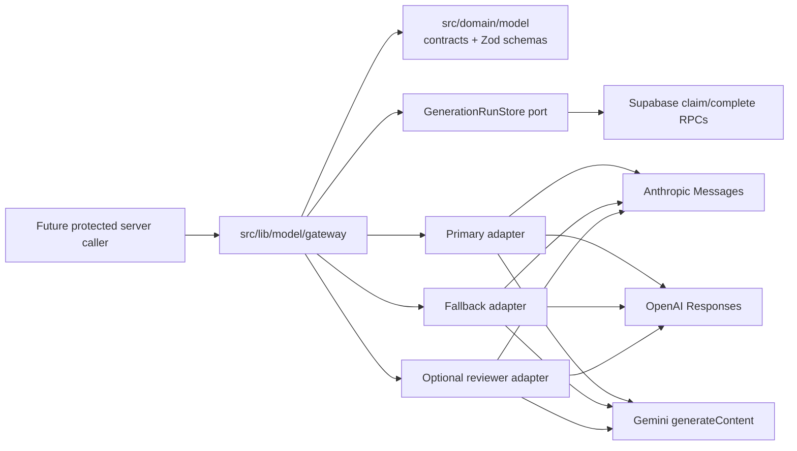

# Phase 5 — Typed Model Gateway and Provider Contracts

**Status:** Controlling execution plan — implementation and generated types complete; isolated DB CI complete; live-provider operator verification pending
**Roadmap source:** `docs/UnseenPrompt – DEVELOPMENT_PLAN.md`
**Scope:** Phase 5 only
**Depends on:** Phase 1 Cloudflare runtime and Phase 3 data platform
**Unblocks:** Phases 6–17

> **For implementation workers:** Execute P5-01 through P5-09 in order except where a package is
> explicitly marked parallel-safe. Each package is independently reviewable and ends with
> observable acceptance checks. Use the package-specific copy-ready instructions in section 23.

## 1. Required outcome

Deliver one server-only, provider-neutral model gateway that can call Anthropic, OpenAI, or the
Gemini Developer API through the same typed contract; validate every output before returning it;
perform at most one structured repair; use one bounded fallback route; optionally run one bounded
reviewer pass; and persist safe generation metadata without persisting prompts or raw provider
payloads.

Phase 5 is complete only when:

- All nine Phase 5 output contracts have a versioned runtime schema and provider-compatible JSON
  Schema projection.
- Anthropic, OpenAI, and Gemini adapters pass the same provider contract suite with injected
  `fetch` and no network access in unit tests.
- Provider payloads remain `unknown` until adapter envelope parsing and gateway output validation
  succeed.
- No malformed, refused, truncated, or schema-invalid output is returned as project-usable data.
- The entire execution performs no more than three production calls, including transport retries,
  repair, and fallback; an enabled reviewer may add exactly one non-retried call.
- There is at most one structured repair attempt across the complete execution, not one per
  provider.
- Every call receives an `AbortSignal`, a per-attempt timeout, and the remaining total deadline.
- Errors outside the gateway use stable provider-neutral codes and never expose provider bodies,
  prompts, output, credentials, or user/project content.
- Provider, model, aggregate provider latency, reported tokens, estimated cost, transport retry
  count, validation result, and opaque correlation UUID are persisted in `generation_runs`.
- Generation-run claim/completion is owner-scoped and idempotent; duplicate or concurrent claims
  do not trigger another provider call.
- Next.js, OpenNext, and a local Cloudflare Worker preview prove runtime compatibility.
- Phase 6+ state, UI, uploads, prompt orchestration, billing, and lifecycle behavior remain absent.

## 2. Repository-derived baseline

The implementing worker must reconfirm this baseline before editing:

- The repository is one strict-TypeScript Next.js 16 application deployed through OpenNext to
  Cloudflare Workers.
- Layer direction is `src/domain` (pure contracts and deterministic validation) → `src/lib`
  (technical adapters) → `src/features` → `src/app`; `src/config` owns validated environment
  access. ESLint enforces these boundaries.
- Provider-specific types must not enter `src/domain`. Provider clients and wire payloads belong
  only under `src/lib/model`.
- Server secret accessors use `import "server-only"`; real `.env*` and `.dev.vars*` files are
  ignored.
- Runtime dependencies are exact-pinned. Workers admission requires unit tests, Next build,
  `pnpm check:workers-deps`, OpenNext build, and Worker preview.
- Zod `4.4.3` is already an exact-pinned runtime dependency and provides the runtime-validation
  foundation. No provider SDK is currently installed.
- `generation_runs` already stores operation/status, project state version, provider/model, input
  and output schema versions, latency, input/output tokens, retry count, estimated cost,
  correlation UUID, idempotency linkage, stable error code, and timestamps.
- `generation_runs` does **not** store a validation result, per-attempt history, prompts, outputs,
  or raw provider bodies.
- Authenticated users can select owned generation runs but cannot insert or update them. Phase 3
  explicitly deferred those mutations to a controlled provider path.
- `idempotency_records` already has the `generation` scope and owner-scoped uniqueness, but no
  generation claim RPC exists and `generation_runs.idempotency_record_id` is not unique.
- Product requests use the authenticated user's Supabase JWT under RLS. Do not repurpose the
  production waitlist service secret or introduce it into the product gateway.
- Database tests and generated-type drift run only in the isolated CI Supabase job under current
  repository policy. Shared staging and production are never test targets.
- Production continues to serve only the waitlist. Phase 5 adds no application route or public
  product surface.

## 3. Confirmed requirements and explicit assumptions

### 3.1 Confirmed requirements

1. Anthropic, OpenAI, and Gemini are supported behind one contract.
2. All provider output is untrusted and must pass deterministic runtime validation.
3. The Phase 5 schemas are: intent detection, discovery sufficiency, clarification question,
   project delta, stack recommendation, action specification, evidence analysis, completion
   suggestion, and risk flags.
4. Exactly one structured repair may occur for malformed or schema-invalid output.
5. Primary failure may use one controlled fallback while preserving the exact output contract.
6. Primary, fallback, and reviewer routes are server configuration.
7. All provider calls support cancellation and a total deadline.
8. Retry, repair, fallback, and reviewer budgets must not multiply.
9. Safe usage and validation metadata is durable; sensitive content is not ordinarily logged or
   persisted.
10. No model proposal mutates project state in Phase 5.

### 3.2 Explicit assumptions

- Phase 5 is infrastructure-only. There is no app route that invokes the gateway yet.
- Callers provide a project ID, positive project-state version, idempotency key, operation/schema
  ID, system instruction, and model input. A future phase supplies compiled context.
- Provider model identifiers are opaque operator configuration. They are not hard-coded because
  model catalogs and capabilities are version-sensitive.
- Provider-reported usage is the only token source. Missing usage remains `null`; it is never
  guessed.
- Estimated cost is deterministic from provider-reported tokens and operator-configured
  per-route rates. It is an estimate, not billing authority.
- A direct caller can invoke the owner-scoped generation metadata RPC for its own project, but the
  RPC never triggers a provider call or writes project state/usage ledger. Later billing must not
  trust client-supplied generation metadata as charge authority.
- A duplicate successful claim cannot replay model output because Phase 5 deliberately does not
  persist output. It returns a stable replay-unavailable result and makes no provider call. Phase 6
  must atomically persist any output it needs to replay.

## 4. Scope and non-goals

### 4.1 In scope

- Provider-neutral model request, validated response, usage, error, deadline, retry, repair,
  fallback, reviewer, and diagnostic metadata contracts.
- Nine versioned output schemas and their common provider JSON Schema projection.
- Server-only configuration for provider credentials, routes, deadlines, output limits, and
  route-specific cost rates.
- Direct REST/fetch adapters for Anthropic Messages, OpenAI Responses, and Gemini
  `generateContent`.
- Gateway orchestration and safe diagnostic logger port.
- Additive `generation_runs` validation metadata and narrow generation claim/completion RPCs.
- A Supabase generation-run repository adapter using an authenticated client.
- Unit, provider-contract, persistence-contract, pgTAP, privacy, and Workers compatibility tests.

### 4.2 Non-goals

- Project-state transitions, Context Compiler, project projection, confirmation flows (Phase 6).
- Home composer, intent UI, adaptive discovery UI (Phase 7).
- Brief/stack confirmation UI (Phase 8).
- Prompt composition, Claude Code/Codex/Cursor adapters, prompt versions (Phase 9).
- Uploads, files, extraction, OCR, or secret redaction pipelines (Phase 10).
- Returned-result intake and state progression (Phase 11).
- Usage charging, quotas, entitlements, Paddle, or ledger writes (Phase 15).
- Sentry/PostHog integration, platform rate limiting, provider-key provisioning, or production
  rollout (Phase 16+ or operator work).
- Streaming, tools/function calling, web search, citations, provider files, prompt caching, batch
  APIs, embeddings, images, audio, or chain-of-thought.

## 5. Architecture and dependency direction



Dependency rules:

- `src/domain/model/**` may import Zod and other domain modules only. It contains no provider enum,
  SDK type, fetch type, environment read, Supabase type, or framework import.
- `src/config/model/**` contains pure parsing plus a server-only accessor. It does not import
  `src/lib`.
- `src/lib/model/**` may import domain contracts and config types. Provider wire types remain
  local to each adapter file.
- `src/lib/model/providers/**` uses fixed HTTPS endpoints; no caller-controlled base URL is
  accepted.
- `src/lib/model/supabase-generation-run-store.ts` is the only Supabase persistence adapter for
  the gateway. The orchestration depends on its neutral port, not Supabase directly.
- No Phase 5 module is imported by client components.

## 6. Provider-neutral application contract

The exact implementation may refine names during P5-02, but these shapes and semantics are locked.

```ts
export type ModelOperation =
  | "intent_detection"
  | "discovery_sufficiency"
  | "clarification_question"
  | "project_delta"
  | "stack_recommendation"
  | "action_specification"
  | "evidence_analysis"
  | "completion_suggestion"
  | "risk_flags";

export interface ModelGatewayRequest<T> {
  readonly projectId: string;
  readonly projectStateVersion: number;
  readonly idempotencyKey: string;
  readonly operation: ModelOperation;
  readonly schema: ModelOutputSchema<T>;
  readonly systemInstruction: string;
  readonly input: string;
  readonly reviewPolicy: "none" | "best_effort" | "required";
  readonly signal?: AbortSignal;
  readonly deadlineMs?: number;
}

export interface ValidatedModelResponse<T> {
  readonly data: T;
  readonly metadata: ModelExecutionMetadata;
}

export interface ModelUsage {
  readonly inputTokens: number | null;
  readonly outputTokens: number | null;
  readonly totalTokens: number | null;
}

export type ModelValidationResult = "passed" | "repaired" | "reviewed" | "failed";
```

Rules:

- `data` exists only after Zod validation succeeds and durable completion metadata succeeds.
- Input strings are bounded by bytes before any provider call. The initial Phase 5 ceiling is
  256 KiB combined for system instruction and input; future Context Compiler budgets may be lower.
- `deadlineMs` may only reduce, never enlarge, the configured total deadline.
- The gateway generates or validates an opaque UUID correlation ID. It never encodes user,
  project, prompt, email, model output, or file content.
- The request fingerprint is SHA-256 over a deterministic, length-delimited representation of
  operation, schema ID/version, project/state version, and sensitive input. Only the hex digest is
  persisted.

## 7. Provider capability boundary

The common gateway supports only the intersection needed by Phase 5:

| Capability                         | Phase 5 rule                                                 |
| ---------------------------------- | ------------------------------------------------------------ |
| Non-streaming text input           | Required                                                     |
| Root-object structured JSON output | Required                                                     |
| JSON Schema envelope               | Adapter-specific envelope, common schema projection          |
| Usage tokens                       | Normalize reported input/output/total; retain no raw payload |
| Cancellation                       | Required `AbortSignal` on every fetch                        |
| Provider tools/search/files        | Forbidden                                                    |
| Streaming                          | Deferred                                                     |
| Provider conversation state        | Forbidden; OpenAI `store: false`                             |
| Hidden reasoning                   | Never requested, parsed, persisted, or logged                |
| Custom base URL                    | Forbidden in Phase 5                                         |

Provider envelopes:

| Provider  | Endpoint and structured-output envelope                                                                                                                                                                  |
| --------- | -------------------------------------------------------------------------------------------------------------------------------------------------------------------------------------------------------- |
| Anthropic | `POST https://api.anthropic.com/v1/messages`; `anthropic-version: 2023-06-01`; `output_config.format = { type: "json_schema", schema }`                                                                  |
| OpenAI    | `POST https://api.openai.com/v1/responses`; `text.format = { type: "json_schema", name, schema, strict: true }`; provider-safe `name = <operation>_v<version>`; `store: false`                           |
| Gemini    | `POST https://generativelanguage.googleapis.com/v1beta/models/{encodedModel}:generateContent`; `x-goog-api-key`; `generationConfig.responseMimeType = "application/json"`; `responseJsonSchema = schema` |

The Gemini adapter uses `generateContent` consistently. It must not mix the separate preview
Interactions API request shape into the same adapter.

## 8. Runtime schemas and schema-version strategy

- Schema namespace: `unseenprompt.model-output.<operation>`.
- Initial schema version: integer `1`, serialized to persistence as `<namespace>.v1`.
- Gateway request metadata uses the fixed input-contract version
  `unseenprompt.model-gateway-request.v1`; it is distinct from the operation-specific output schema
  version and is persisted on every generation claim.
- The registry key is the operation; request operation and schema operation must match.
- Runtime Zod schema is authoritative. Provider JSON Schema is a deterministic projection to the
  documented common subset.
- Every root is a strict object. Every provider-visible property is required. Optional semantics
  use an empty array, empty string where explicitly allowed, or an explicit boolean; Phase 5 avoids
  nullable unions and root unions for cross-provider compatibility.
- Every object projects `additionalProperties: false`.
- Provider schema projection may remove provider-unsupported validation-only string keywords such
  as `minLength`, `maxLength`, or `format`, but may not remove properties, required fields, enum
  values, array item schemas, or object closure. Zod re-enforces all runtime bounds.
- A schema-compatibility auditor runs in tests for every registry entry and rejects unsupported or
  shape-changing keywords before an adapter call.
- Schema changes are additive new versions. Never alter a released version in place.
- Callers must explicitly migrate to a new schema version. Fallback and reviewer calls receive the
  exact same schema object/version as the primary.

## 9. Structured-output contracts

All strings are trimmed and bounded at runtime. Rationale fields mean concise decision evidence,
not hidden reasoning or chain-of-thought.

### 9.1 `intent_detection.v1`

- `mode`: `new_build | feature | bug | review | test | deploy | improve`
- `confidence`: finite number from 0 through 1
- `rationale`: concise user-visible basis
- `detectedLanguage`: BCP-47-like language label or `undetermined`

### 9.2 `discovery_sufficiency.v1`

- `isSufficient`: boolean
- `confidence`: 0 through 1
- `missingFacts`: bounded array of explicit missing fact names
- `rationale`: concise explanation

### 9.3 `clarification_question.v1`

- `question`: exactly one question
- `rationale`: why this is the highest-value missing fact
- `suggestedAnswers`: bounded array of `{ label, value }`
- `allowsFreeText`: boolean

### 9.4 `project_delta.v1`

- `summary`: concise proposal summary
- `requirementProposals`: bounded array of `{ action, reference, statement, rationale }`
- `decisionProposals`: bounded array of `{ action, reference, statement, rationale }`
- `milestoneProposals`: bounded array of `{ action, reference, title, rationale }`
- `unresolvedConflicts`: bounded array of strings

`action` is `add | revise | remove`. Empty `reference` is allowed only for `add`; runtime
refinement enforces this. This schema proposes changes only; it does not apply them.

### 9.5 `stack_recommendation.v1`

- `recommendation`: `{ frontend, backend, database, hosting }`
- `rationale`: bounded array of decision statements
- `alternatives`: bounded array of `{ name, whenToChoose, tradeoffs }`
- `risks`: bounded array of strings

### 9.6 `action_specification.v1`

- `purpose`, `context`, `task`, `expectedResult`: bounded strings
- `boundaries`: bounded array of strings
- `acceptanceCriteria`: bounded array of strings
- `verification`: bounded array of strings
- `riskFlags`: bounded array of risk-flag identifiers

This defines the neutral data contract only. Phase 9 owns prompt composition and coding-tool
wording.

### 9.7 `evidence_analysis.v1`

- `claimedChanges`, `evidenceSupplied`, `missingEvidence`, `errors`, `blockers`: bounded arrays
- `testResults`: bounded array of `{ name, status, evidence }`, where status is
  `passed | failed | not_run | unclear`
- `summary`: concise evidence assessment

Claims and supplied evidence remain separate. The schema cannot mark work verified.

### 9.8 `completion_suggestion.v1`

- `suggestedStatus`: `completed | needs_verification | blocked | in_progress`
- `confidence`: 0 through 1
- `rationale`: concise evidence-linked basis
- `requiredVerification`: bounded array of strings

This is a suggestion only. It cannot update milestones or lifecycle stage.

### 9.9 `risk_flags.v1`

- `risks`: bounded array of `{ id, category, severity, description, mitigation }`
- category: `security | privacy | data_integrity | destructive_action | cost | reliability | scope`
- severity: `low | medium | high | critical`

Risk IDs are model-proposed local labels, not correlation identifiers and not authorization data.

## 10. Provider adapter interface

Provider adapters live in `src/lib/model` because their output is still untrusted.

```ts
interface ProviderAdapterRequest {
  readonly model: string;
  readonly systemInstruction: string;
  readonly input: string;
  readonly outputSchema: ProviderJsonSchema;
  readonly outputSchemaName: string;
  readonly maxOutputTokens: number;
  readonly correlationId: string;
  readonly signal: AbortSignal;
}

interface ProviderAdapterResult {
  readonly value: unknown;
  readonly usage: ModelUsage;
  readonly resolvedModel: string;
  readonly requestId: string | null;
}

interface ProviderAdapter {
  readonly providerId: "anthropic" | "openai" | "gemini";
  generate(request: ProviderAdapterRequest): Promise<ProviderAdapterResult>;
}
```

`outputSchemaName` is a provider-safe wire label, not the durable schema identity. The gateway
derives it deterministically as `<operation>_v<version>` and requires the OpenAI grammar
`[A-Za-z0-9_-]{1,64}`. The full dotted `schemaVersion` remains authoritative for fingerprinting,
persistence, fallback equivalence, and schema migrations.

Adapter rules:

- Inject `fetch` for tests; production defaults to global `fetch`.
- Use a fixed provider origin and encoded model path segment where applicable.
- Put keys in headers, never URLs. Never echo a key in an error.
- Read response text with a 1 MiB maximum before JSON parsing.
- Parse provider envelopes with local Zod schemas from `unknown`.
- Convert refusal, safety block, truncation, incomplete output, missing content, malformed envelope,
  and non-2xx status to the stable error taxonomy.
- Anthropic accepts only `end_turn` and `stop_sequence` as successful terminal stop reasons;
  `max_tokens` and `model_context_window_exceeded` are truncation, while tool, paused, null, and
  unknown reasons fail closed.
- Gemini HTTP 429 / `RESOURCE_EXHAUSTED` maps to `rate_limited` without parsing its untrusted error
  body; current Gemini guidance treats this as retryable and does not provide a reliable
  billing-versus-throughput distinction for the Developer API response.
- For the Phase 5 text-based structured-output APIs, return the exactly-one candidate text as
  `unknown` without parsing its JSON. The gateway owns candidate JSON parsing so malformed candidate
  text remains available in memory for the one permitted bounded repair attempt. Gateway Zod
  validation remains mandatory.
- Do not retry inside an adapter.

## 11. Routing and call-budget policy

Configuration contains one primary route, one fallback route with a different provider, and an
optional reviewer route. A route is `{ provider, model, inputCostRate, outputCostRate }`.

### 11.1 Production path budget

- Absolute production-call budget: **3**.
- Primary initial call consumes one.
- At most one transport retry across the entire execution consumes one.
- At most one structured repair across the entire execution consumes one.
- Fallback is entered at most once and each fallback call consumes one.
- The gateway stops when the shared budget is exhausted. It does not reserve calls speculatively.

Representative maximum paths:

| Path                                                                              | Calls |
| --------------------------------------------------------------------------------- | ----: |
| Primary succeeds                                                                  |     1 |
| Primary transient failure → retry succeeds                                        |     2 |
| Primary malformed → repair succeeds                                               |     2 |
| Primary malformed → repair fails → fallback                                       |     3 |
| Primary transient failure → retry fails → fallback                                |     3 |
| Primary non-retryable but fallback-eligible failure → fallback malformed → repair |     3 |

### 11.2 Reviewer budget

- Reviewer is called only after a production candidate passes runtime validation.
- Reviewer receives the original instruction/input plus the validated candidate and must return the
  same schema.
- Reviewer has exactly one call, no retry, no repair, and no fallback.
- `best_effort`: invalid/failed reviewer leaves the original validated candidate intact and records
  safe reviewer metadata.
- `required`: invalid/failed reviewer makes the gateway fail closed and withhold the candidate.
- Absolute provider-call maximum including reviewer: **4**.

## 12. Error taxonomy

Stable public codes:

| Code                             | Retry/fallback rule                                       |
| -------------------------------- | --------------------------------------------------------- |
| `aborted`                        | Never retry/fallback                                      |
| `deadline_exceeded`              | Never retry/fallback                                      |
| `attempt_timeout`                | Retry/fallback only if total deadline and budget remain   |
| `authentication_failed`          | Never retry/fallback; configuration/operator error        |
| `permission_denied`              | Never retry/fallback                                      |
| `billing_or_quota_exhausted`     | Never automatic retry                                     |
| `rate_limited`                   | Retry once after bounded `Retry-After`, else fallback     |
| `provider_unavailable`           | Retry once with bounded backoff, else fallback            |
| `invalid_provider_request`       | Never retry/fallback                                      |
| `model_not_found`                | Never retry/fallback                                      |
| `content_refused`                | Never retry/fallback; do not route around safety          |
| `output_truncated`               | Fallback if budget remains; no repair of known truncation |
| `invalid_output`                 | One repair, then fallback if budget remains               |
| `configuration_error`            | No provider call when detectable before execution         |
| `idempotency_conflict`           | No provider call                                          |
| `idempotency_in_progress`        | No provider call                                          |
| `idempotency_replay_unavailable` | No provider call                                          |
| `persistence_failed`             | Withhold output; no new provider call                     |
| `provider_error`                 | Unknown fail-closed error; no blind retry                 |

`ModelGatewayError` exposes code, retryability, correlation ID, and optional safe HTTP status. Raw
provider messages/bodies and rejected model output are never included.

## 13. AbortSignal, deadline, timeout, and retry rules

- Configured total deadline default: 30,000 ms; allowed 1,000–120,000 ms.
- Configured per-attempt timeout default: 12,000 ms; allowed 500–60,000 ms and never greater than
  total deadline.
- Caller `deadlineMs`, when present, can only shorten the configured total.
- Each call signal combines caller cancellation, the remaining total deadline, and the per-attempt
  timeout. The exact signal passed to `fetch` is mandatory.
- Retry delay is abortable and counts against the total deadline. Parse `Retry-After` as seconds or
  HTTP date, clamp it to 2,000 ms, and use bounded exponential backoff otherwise (250 ms once).
- A retry is allowed only for `attempt_timeout`, `rate_limited`, or `provider_unavailable`.
- Provider SDK retries do not exist because Phase 5 uses direct fetch.
- Cancellation may not stop provider-side processing or cost after request acceptance. The gateway
  records cancellation and never assumes the provider was uncharged.
- Completion persistence is attempted before returning. An unknown persistence outcome may retry
  the idempotent completion RPC once; it never repeats a provider call.

## 14. Exactly-one structured repair

- Repair is eligible only when provider content exists but JSON parsing or runtime schema
  validation fails.
- Refusal, safety block, authentication error, quota exhaustion, explicit truncation, abort, and
  deadline failure are not repairable.
- The repair prompt contains the rejected candidate and a bounded, path-only summary of validation
  issues. It excludes stack traces, Zod internals, secrets, and logs.
- Repair uses the same provider route and exact same output schema/version as the failed candidate.
- One boolean execution guard prevents a second repair after fallback or reviewer routing.
- Repaired output passes fresh JSON parse and full Zod validation. Failure remains `invalid_output`.

## 15. Usage, cost, latency, validation, and correlation metadata

In-memory execution metadata includes safe per-call records:

- provider, configured model, resolved model when reported
- call kind: `primary | transport_retry | repair | fallback | reviewer`
- latency milliseconds
- reported input/output/total tokens
- estimated cost micros when usage and configured rates are available
- stable outcome code and validation outcome
- provider request ID when present and safely bounded

Durable `generation_runs` stores aggregate values:

- `provider`/`model`: route that produced the final returned candidate
- `latency_ms`: sum of provider-call wall latency, not database/orchestration time
- `input_tokens`/`output_tokens`: sum of all reported call usage, including repair/fallback/reviewer
- `estimated_cost_micros`: ceiling of route-specific reported-token estimates, summed across calls;
  `null` if any required usage/rate is unavailable
- `retry_count`: transport retries only
- `validation_result`: `not_attempted | passed | repaired | reviewed | failed`
- `correlation_id`: one opaque UUID per logical run
- `error_code`: stable gateway code only

Provider-specific cache/reasoning token details are not persisted in Phase 5. Do not store raw
usage payloads merely to preserve those fields.

## 16. `generation_runs` integration and additive migration decision

An additive migration **is required** for two repository-proven gaps:

1. The roadmap explicitly requires a recorded validation result, but no such column exists.
2. Authenticated code has no controlled generation claim/completion path, and broad service-role
   use would violate the product ownership boundary.

The migration must:

- Add `validation_result text not null default 'not_attempted'` constrained to
  `not_attempted | passed | repaired | reviewed | failed`.
- Add a partial unique index on non-null `generation_runs.idempotency_record_id`.
- Prevent application/direct updates to `project_id`, `project_state_version`, `operation_kind`,
  schema versions, idempotency linkage, correlation ID, and created timestamp after insert. Preserve
  the historical `idempotency_record_id ON DELETE SET NULL` referential action only when a nested FK
  trigger clears the linkage after the referenced idempotency row no longer exists; this avoids
  blocking existing project-delete cascades while rejecting direct clearing or reassignment.
- Add `claim_generation_run(...)` as a fixed-search-path security-definer RPC deriving owner from
  `auth.uid()`, checking project ownership/current state version, claiming a `generation`
  idempotency record, and creating one running generation row atomically.
- Add `complete_generation_run(...)` as a fixed-search-path security-definer RPC deriving owner,
  locking the owned running row, validating terminal field combinations, completing the linked
  idempotency record, and being idempotent for an identical repeated completion.
- Revoke function execution from `public`/`anon`; grant only exact execution to `authenticated`
  and `service_role`.
- Never grant direct authenticated insert/update/delete on either table.
- Return stable non-sensitive SQL errors for missing auth, ownership/state mismatch, key/fingerprint
  conflict, in-progress duplicate, terminal duplicate, and completion conflict.
- Never accept or store prompt, output, raw provider payload, API key, request headers, or a full
  response body.

No historical migration is edited. `usage_ledger` is unchanged.

## 17. Idempotency and concurrency behavior

1. The gateway computes a request fingerprint and calls `claim_generation_run` before a provider.
2. The RPC derives the owner, verifies owned project and exact state version, and atomically claims
   `(owner, generation, idempotencyKey)`.
3. A new claim returns run ID/correlation ID and permits provider work.
4. Same key plus different fingerprint fails `idempotency_conflict`.
5. Same key/fingerprint while in progress returns `idempotency_in_progress`; no provider call.
6. Same key/fingerprint after terminal success returns `idempotency_replay_unavailable`; no
   provider call because Phase 5 stores no output.
7. Same key/fingerprint after terminal failure returns its stable terminal code; no provider call.
   An explicit new logical attempt requires a new idempotency key.
8. Completion and idempotency terminal update are one database transaction.
9. Gateway output is withheld until terminal completion succeeds.

Horizontally scaled Workers therefore cannot duplicate a call for the same logical key. A Worker
crash can leave a run in progress; Phase 5 reports it for operator reconciliation and does not
silently reclaim it. Automated stale-run reconciliation belongs to Phase 16 because it requires an
operational retention/lease policy.

## 18. Logging, redaction, and secret boundaries

- Provider keys are read only by `src/config/model/server.ts` and passed directly to server-only
  adapters.
- No key uses a `NEXT_PUBLIC_` name or enters `.env.example`, client code, fixtures, snapshots,
  generated artifacts, error messages, URLs, or logs.
- Ordinary diagnostic events are allowlisted structures containing only event name, correlation
  UUID, provider, model, attempt kind/number, duration, safe status, stable code, retry count,
  validation result, and boolean routing flags.
- Prompts, system instructions, model output, repair input, uploaded files, extracted project
  content, emails, project titles, user IDs, project IDs, raw provider bodies, raw headers, and
  stack traces are forbidden in ordinary logs.
- Default logger is no-op. Callers inject an allowlisted logger; adapters do not call `console`.
- Tests use synthetic content and assert sentinel secrets/prompts never appear in serialized
  diagnostics or errors.
- Do not request or store chain-of-thought. Rationale fields are concise user-visible evidence.

## 19. Trust boundaries and abuse cases

| Boundary                            | Untrusted input                                           | Enforcement                                                                      |
| ----------------------------------- | --------------------------------------------------------- | -------------------------------------------------------------------------------- |
| Future server caller → gateway      | project ID/version, key, strings, schema choice, deadline | Runtime bounds, registry identity match, UUID/key rules, fingerprint             |
| Config → adapter                    | provider/model/key/rates/timeouts                         | Server-only Zod parse, route/key pairing, fixed providers/endpoints              |
| Gateway → provider                  | sensitive prompt/context                                  | HTTPS fixed origins, header credentials, total deadline, no tools/files          |
| Provider → adapter                  | status, headers, JSON/body                                | Size bound, envelope Zod, stable mapping, no raw error exposure                  |
| Adapter → gateway                   | `unknown` candidate                                       | Full operation Zod parse and deterministic refinements                           |
| Gateway → repair/reviewer           | rejected/validated candidate                              | Same schema, single-call guards, no logging                                      |
| Gateway → database RPC              | identifiers and safe metadata                             | Auth-derived owner, RLS-equivalent owner check, constraints, transaction         |
| Authenticated caller → metadata RPC | forged usage/provider/cost                                | Own project only; never triggers model/state/billing; later billing distrusts it |

Required abuse tests include oversized input/output, schema mismatch, malicious extra keys,
prototype-shaped JSON keys, invalid/encoded model path, secret-like error bodies, forged project
ownership, concurrent same-key claims, same key/different fingerprint, cancellation during backoff,
Retry-After inflation, refusal fallback bypass, and multiplicative-retry attempts.

## 20. Cloudflare Workers compatibility

- Use global `fetch`, `Request`, `Response`, `AbortController`, `AbortSignal`, `TextEncoder`, Web
  Crypto SHA-256, and `crypto.randomUUID()` only.
- No filesystem, native addons, child processes, Node sockets, long-lived connections, or dynamic
  code generation.
- Every provider call is one Worker subrequest and is counted by the gateway budget.
- Use non-streaming responses with a 1 MiB response bound.
- No `serverExternalPackages` entry is needed.
- Mandatory gates: Next build, Workers dependency check, OpenNext build, and local Wrangler preview.
- `nodejs_compat` is not treated as permission to add arbitrary Node-only libraries.

## 21. Dependency choices and current API verification

### 21.1 Selected dependencies

- **Zod `4.4.3`**: already exact-pinned; runtime schemas, provider-envelope parsing, and JSON Schema
  projection. No new validation dependency.
- **Platform fetch/Abort/Web Crypto**: supplied by Cloudflare Workers and Node 24 test runtime. No
  package or lockfile change.
- **No provider SDKs in Phase 5.** Direct REST makes retries, deadlines, response bounds, and error
  mapping explicit and minimizes Worker bundle/runtime risk.

### 21.2 Evaluated but not selected

Versions verified on 2026-08-02 were `@anthropic-ai/sdk@0.115.0`, `openai@7.3.0`, and
`@google/genai@2.15.0`. They are not selected because Phase 5 needs only one non-streaming endpoint
per provider and SDK defaults can introduce hidden retries/timeouts. Reconsider only through a
separate dependency-admission change with exact pins and all Worker gates.

### 21.3 Official sources

- Anthropic structured outputs: <https://platform.claude.com/docs/en/build-with-claude/structured-outputs>
- Anthropic Messages/errors/rate limits: <https://platform.claude.com/docs/en/api/messages>,
  <https://platform.claude.com/docs/en/api/errors>,
  <https://platform.claude.com/docs/en/api/rate-limits>
- OpenAI structured outputs/Responses: <https://developers.openai.com/api/docs/guides/structured-outputs>,
  <https://platform.openai.com/docs/api-reference/responses>
- OpenAI error guidance: <https://developers.openai.com/api/docs/guides/error-codes>
- Gemini structured outputs/generateContent: <https://ai.google.dev/gemini-api/docs/structured-output>,
  <https://ai.google.dev/api/generate-content>
- Gemini troubleshooting/rate limits: <https://ai.google.dev/gemini-api/docs/troubleshooting>,
  <https://ai.google.dev/gemini-api/docs/rate-limits>
- Cloudflare fetch/runtime limits: <https://developers.cloudflare.com/workers/runtime-apis/request/>,
  <https://developers.cloudflare.com/workers/platform/limits/>

Provider behavior is version-sensitive. Reverify these sources whenever endpoint shapes, schema
projection, or adapters change.

## 22. Test strategy and provider contract suite

### 22.1 Domain/schema tests

- Valid representative object for all nine schemas.
- Missing/extra keys, wrong enum/type, non-finite confidence, oversize strings/arrays.
- Every registry schema has unique ID/version, root object, full required list, closed objects, and
  common-dialect-compatible JSON Schema.
- Runtime schema remains stricter than or equal to provider projection.

### 22.2 Shared provider contract suite

Each adapter factory runs the same cases with provider-specific synthetic envelopes:

- Valid JSON → `unknown` value + normalized usage/model/request ID.
- HTTP auth, permission, not-found/model, rate limit, quota, transient 5xx, and unknown error.
- Malformed error body never leaks.
- Refusal/safety, truncation/incomplete, missing content, invalid JSON, oversized response.
- Exact request endpoint, auth header, schema envelope, max tokens, and supplied AbortSignal.
- No retry and exactly one fetch call per adapter invocation.
- Sentinel key/prompt/output absent from thrown errors and diagnostics.

### 22.3 Gateway tests

- Primary success; transport retry; one repair; fallback; reviewer policies.
- Same schema identity on primary, repair, fallback, and reviewer.
- Three-call production ceiling and four-call absolute ceiling under adversarial failures.
- One repair globally, one transport retry globally, one fallback entry globally.
- No fallback around refusal/auth/configuration/deterministic invalid request.
- Cancellation before claim, during provider fetch, during backoff, and before reviewer.
- Total deadline cannot be extended by caller or retry-after.
- Output withheld on validation or persistence failure.
- Aggregate usage/cost/latency/retry/validation metadata is deterministic.
- Safe logger serialization contains no sentinel sensitive content.

### 22.4 Persistence tests

- pgTAP: column/constraint/index/grants/function ownership/search path.
- User A can claim/complete own project; user B and anon cannot.
- Direct authenticated insert/update/delete remains denied.
- Same key/fingerprint duplicate and same key/different fingerprint behavior.
- Concurrent claims create one idempotency record and one run.
- Stale project-state version fails before a run is created.
- Immutable generation identity fields cannot change.
- Terminal field combinations and idempotent repeated completion.
- Vitest store adapter maps RPC shapes/errors without including sensitive fields.

Database tests run in isolated CI only unless an explicitly isolated local stack is available.

## 23. Ordered work packages and copy-ready instructions

Every worker must read this document, report initial Git state, preserve unrelated/concurrent work,
edit only owned files, add tests with behavior, run focused checks, and return file/command evidence.

### P5-01 — Architecture plan (primary architect owned)

Files:

- `docs/architecture/phase-5-typed-model-gateway-execution-plan.md`

Acceptance:

- Every required architecture topic is explicit.
- Official current provider behavior and dependency decisions are cited.
- No application code is implemented in this package.

### P5-02 — Provider-neutral contracts and schemas

Files owned:

- `src/domain/model/contracts.ts`
- `src/domain/model/schemas.ts`
- `src/domain/model/json-schema.ts`
- adjacent tests under `src/domain/model`

Instructions:

```text
Implement P5-02 only. Define the provider-neutral request/response/usage/error/metadata contracts,
all nine strict v1 Zod output schemas, the versioned registry, and deterministic common JSON Schema
projection/auditor from sections 6, 8, and 9. Provider names, fetch, config, Supabase, SDK, and
framework types must not enter src/domain. Add exhaustive adjacent tests, including every schema
and projection invariant. Do not implement adapters, orchestration, persistence, or Phase 6 state.
Run pnpm test:unit -- src/domain/model and pnpm typecheck.
```

### P5-03 — Server configuration and environment contract

Files owned:

- `src/config/model/schema.ts`
- `src/config/model/schema.test.ts`
- `src/config/model/server.ts`
- `.env.example`
- `.dev.vars.example`
- `docs/development/environment-contract.md`

Instructions:

```text
Implement P5-03 only. Add a pure strict parser and server-only accessor for provider keys; primary,
fallback, optional reviewer routes; model IDs; route-specific cost rates; total/attempt deadlines;
and max output tokens. Require a key for each referenced provider, reject a same-provider fallback,
validate paired reviewer fields, never echo rejected secret values, and keep all keys non-public.
Document operator-owned protected secrets and safe non-secret local/test configuration. Do not edit
Wrangler hosted settings, CI secrets, app routes, adapters, or Phase 6+. Run the focused schema test,
pnpm lint, and pnpm typecheck.
```

### P5-04 — Shared server infrastructure

Files owned:

- `src/lib/model/provider.ts`
- `src/lib/model/errors.ts`
- `src/lib/model/http.ts`
- `src/lib/model/cost.ts`
- `src/lib/model/diagnostics.ts`
- adjacent tests for these files

Instructions:

```text
Implement P5-04 only. Add server-only provider adapter/route interfaces, stable error mapping helpers,
bounded response parsing, retry-after parsing, cost aggregation, and an allowlisted no-op-by-default
diagnostic logger. Use injected fetch/clock where needed. No provider-specific adapter, gateway state
machine, Supabase, SDK, console logging, or Phase 6 behavior. Test oversized bodies, redaction,
numeric overflow, and stable codes. Run focused tests, lint, and typecheck.
```

### P5-05A/B/C — Provider adapters (parallel-safe after P5-04)

Files owned:

- P5-05A: `src/lib/model/providers/anthropic.ts` and test
- P5-05B: `src/lib/model/providers/openai.ts` and test
- P5-05C: `src/lib/model/providers/gemini.ts` and test

Instructions for each worker:

```text
Implement only the assigned P5-05 provider adapter using direct injected fetch and the fixed official
endpoint/envelope in section 7. Keep all wire schemas/types local, parse responses from unknown,
return the candidate as unknown, normalize safe usage/model/request ID, pass the supplied AbortSignal,
and perform no retries/logging. Map refusal, truncation, quota/auth/rate/transient errors to section 12
without exposing provider messages or bodies. Add focused request/response/security tests. Do not edit
shared files, other providers, config, gateway, persistence, package.json, or Phase 6+. Run the focused
test, lint for owned files via repository lint, and typecheck.
```

### P5-06 — Gateway orchestration

Files owned:

- `src/lib/model/generation-run-store.ts`
- `src/lib/model/gateway.ts`
- `src/lib/model/gateway.test.ts`
- `src/lib/model/deadline.ts`
- `src/lib/model/deadline.test.ts`

Instructions:

```text
Implement P5-06 only. Define the neutral GenerationRunStore claim/completion port, then build the
gateway state machine exactly from sections 11–15: claim before call,
three production calls maximum, one transport retry globally, one repair globally, fallback once,
optional one-shot reviewer, common schema identity, combined cancellation/deadline signals, abortable
bounded backoff, deterministic validation, safe aggregate metadata, and completion before returning
data. Keep the port persistence-technology-neutral and use fakes in tests. Exhaustively test call
ceilings and fail-closed output. Do not implement provider adapters, Supabase, routes, UI, or Phase 6+.
Run focused tests, lint, and typecheck.
```

### P5-07 — Additive generation persistence migration

Files owned:

- one new `supabase/migrations/<UTC>_phase_5_generation_runs.sql`
- `supabase/tests/database/00110_phase_5_generation_runs.test.sql`
- `src/lib/supabase/database.types.ts` only through repository-approved generation

Instructions:

```text
Implement P5-07 only. Add the validation_result column, identity immutability, one-run-per-idempotency
index, and owner-derived claim/complete RPCs from sections 16–17. Use a real UTC migration name; never
edit historical migrations. Revoke-then-grant, fixed search_path, no dynamic SQL, no prompt/output/raw
payload parameters, and stable errors. Add pgTAP coverage for grants, ownership, conflicts, stale state,
immutability, terminal combinations, and idempotent completion. Regenerate database.types.ts only from
an isolated repository-approved database; if unavailable, do not claim generation and report the CI
type gate explicitly. Do not touch usage_ledger or Phase 6+. Run non-DB local checks plus database gates
only where policy permits.
```

### P5-08 — Supabase generation-run store

Files owned:

- `src/lib/model/supabase-generation-run-store.ts`
- adjacent tests

Instructions:

```text
Implement P5-08 only. Implement the accepted neutral claim/complete port as a server-only adapter over
an injected authenticated Supabase client calling only the Phase 5 RPCs. Validate RPC data from unknown, map stable
database errors, never accept owner ID, never use a service-role/waitlist secret, and never persist
sensitive input/output. Add typed fake-client tests for every claim/terminal result and unknown network
outcome. Do not add app routes, provider calls, direct table grants, billing, or Phase 6+. Run focused
tests, lint, and typecheck.
```

### P5-09 — Integrated contract/security handoff

Files owned:

- `src/lib/model/provider-contract.test.ts`
- `src/tooling/import-boundaries.test.ts` (Phase 5 assertions only)
- `README.md` (status/docs link only after gates)
- documentation corrections required by actual implementation

Instructions:

```text
Implement P5-09 only after P5-02 through P5-08 pass review. Add one shared provider contract suite and
static security/import checks proving server-only provider config/adapters and absence of forbidden
logging/secret/public imports. Do not duplicate provider-specific unit tests or implement features.
Update README Phase status only if local non-database gates pass; state database/remote gates honestly.
Run the full feasible Phase 5 validation set and report exact output.
```

## 24. Acceptance criteria and validation commands

Package acceptance is not based on worker claims. The primary architect reviews actual diffs and
observed command output after every package.

Focused checks are followed by:

```text
pnpm format:check
pnpm lint
pnpm typecheck
pnpm test:unit
pnpm build
pnpm cf:types:check
pnpm check:workers-deps
pnpm cf:build
pnpm test:cf-preview
```

Database gates, isolated CI only under repository policy:

```text
pnpm db:lint
pnpm test:db
pnpm test:db:concurrency
pnpm db:types:check
```

The provider contract suite also has an operator-only live probe. It is deliberately excluded from
unit/CI runs because it requires real provider credentials and incurs external cost:

```text
# Set GEMINI_API_KEY, OPENAI_API_KEY, and ANTHROPIC_API_KEY only in ignored .dev.vars.
pnpm test:live:providers
```

The probe calls the existing Gemini, OpenAI, and Anthropic adapters sequentially exactly once each
with the fixed models, one synthetic closed `{ok:boolean}` schema, a 512-token output cap, and a
30-second `AbortSignal` timeout. It performs no retry, gateway orchestration, database mutation, or
raw candidate/key/body logging. The live-provider gate remains pending until an operator observes a
successful run; isolated database CI is already complete.

Do not claim a gate passed unless its output was observed. Do not run database checks against shared
development, staging, or production.

## 25. Failure modes and recovery

| Failure                         | Behavior/recovery                                                          |
| ------------------------------- | -------------------------------------------------------------------------- |
| Missing/invalid config          | Fail before claim/provider; stable configuration error                     |
| Claim conflict/in progress      | No provider call; caller resolves key/request state                        |
| Provider transient              | One bounded retry or fallback within shared budget                         |
| Provider auth/model/config      | Fail fast; operator corrects configuration                                 |
| Refusal/safety block            | Fail closed; no fallback around safety                                     |
| Malformed/schema-invalid output | One repair globally, then fallback if budget remains                       |
| Explicit truncation             | No repair; fallback if eligible/budgeted                                   |
| Reviewer best-effort failure    | Keep original validated candidate; record safe metadata                    |
| Reviewer required failure       | Withhold candidate and fail closed                                         |
| Caller abort/deadline           | Abort active fetch/backoff; best-effort canceled completion                |
| Completion persistence unknown  | Retry idempotent completion once; withhold output on failure               |
| Worker crash after claim        | Run remains in progress; operator reconciliation; no auto reclaim          |
| Provider behavior/schema drift  | Contract tests fail; update adapter/new schema version                     |
| Cost-rate drift                 | Operator updates server route rates; historical estimates remain unchanged |

No automatic database down migration or destructive cleanup is part of recovery.

## 26. Security review checklist

- [ ] No provider SDK or unreviewed runtime dependency was added.
- [ ] Provider credentials are server-only and absent from public variables, logs, fixtures,
      snapshots, generated files, URLs, and errors.
- [ ] Provider-specific types are absent from `src/domain`.
- [ ] All nine schemas are strict, bounded, versioned, and in the common provider subset.
- [ ] Every provider response begins as `unknown` and passes runtime validation before use.
- [ ] No refusal, truncation, invalid output, or reviewer failure leaks unvalidated data.
- [ ] Exactly one repair, one transport retry, one fallback entry, three production calls, and four
      absolute calls are mechanically enforced and adversarially tested.
- [ ] Every fetch receives the derived AbortSignal and fixed HTTPS origin.
- [ ] Retry-After is parsed/clamped and counts against the total deadline.
- [ ] Adapters have no internal retry or `console` logging.
- [ ] Diagnostics contain allowlisted metadata only; sentinel prompt/key/output tests pass.
- [ ] Correlation identifiers are UUIDs and encode no content.
- [ ] OpenAI uses `store: false`; no provider conversation/file/tool state is used.
- [ ] Repair/reviewer prompts are not persisted or logged.
- [ ] The additive migration does not edit historical migrations or broaden direct table grants.
- [ ] RPCs derive identity from `auth.uid()`, verify ownership/state, use fixed `search_path`, and
      contain no dynamic SQL.
- [ ] Same-key concurrency creates at most one run and provider authorization token.
- [ ] Completion metadata constraints reject inconsistent success/failure states.
- [ ] `usage_ledger`, waitlist, auth, production gate, and Supabase ownership behavior are unchanged.
- [ ] No Phase 6+ state mutation, UI, upload, prompt-generation, or billing behavior exists.
- [ ] Next, OpenNext, dependency, and Worker preview gates pass.

## 27. Explicit Phase 6+ exclusions

The following must not appear in the Phase 5 diff:

- project-state engine, lifecycle transition graph, project projection writes, event application
- context compilation, summarization, vector retrieval, or token-selection policy
- new project/discovery/brief/prompt/result UI or app routes that invoke models
- prompt text/version creation or coding-tool-specific prompt adapters
- artifact upload/extraction/redaction/workflows
- completion acceptance/rejection or milestone update
- billing/usage-ledger/entitlement mutation
- production product enablement, provider dashboard configuration, deployment, push, or merge

Schemas named for later consumers are contracts only and do not authorize implementing those
consumers.

## 28. Stop conditions requiring owner input

Continue autonomously except when one of these materially changes security, cost, data integrity,
or the public contract:

- A current provider no longer offers structured output compatible with the common root-object
  schema subset and supporting it would require provider-specific domain contracts.
- Direct REST is incompatible with Cloudflare Workers and remediation requires a new SDK/runtime
  dependency or compatibility flag.
- The owner requires output replay for duplicate successful idempotency keys in Phase 5; that
  requires a durable validated-output/state contract currently assigned to Phase 6.
- A safe generation persistence path requires a broad service-role key in the product Worker or
  hosted database/provider configuration not authorized by this phase.
- The additive migration conflicts with applied remote history or would require destructive SQL.
- Provider price configuration cannot be operator-owned and a hard-coded price catalog would
  become a billing/public contract.
- Database types cannot be generated/verified in an isolated environment; finish non-DB work and
  report the exact CI gate rather than targeting shared infrastructure.
- Any implementation would expose production product routes, credentials, or user content.

Remote provider credentials, hosted provider settings, and staging live calls are operator gates.
All code/tests/docs that do not need them should still be completed.
