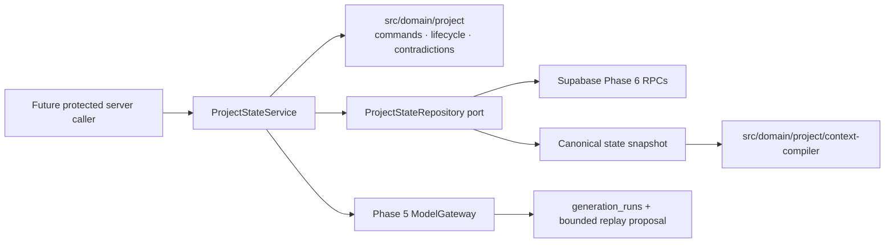
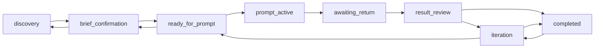

# Phase 6 — Project State Engine and Context Compiler

**Status:** P6-01 through P6-08 implementation and independent-review corrections complete in source; isolated database/type-generation CI pending

As of 2026-08-03, P6-01 through P6-08 source implementation and review corrections are complete.
Local non-DB validation gates passed; the isolated CI-only `db:lint`, `test:db`,
`test:db:concurrency`, and `db:types:check` gates remain pending. Generated database types were
deliberately not hand-edited, and the Phase 5 live-provider probe remains operator-only.
**Roadmap source:** `docs/UnseenPrompt – DEVELOPMENT_PLAN.md`

**Scope:** Phase 6 only

**Depends on:** Phase 3 data platform and Phase 5 typed model gateway
**Unblocks:** Phases 7–17

> Execute P6-01 through P6-08 in order except where a package is explicitly marked parallel-safe.
> This document is the controlling specification. Repository migrations and tests are authoritative
> when an older planning document describes a shape that was not implemented.

## 1. Required outcome and exit criteria

Deliver a deterministic, owner-scoped project-state engine; one atomic database command boundary for
projection, normalized state, event, and idempotency writes; safe persistence/replay of validated Phase
5 project proposals; and a provider-neutral Context Compiler that never silently drops confirmed
invariants.

Phase 6 is complete when:

- Legal lifecycle transitions and their preconditions are explicit, pure, and exhaustively tested.
- Invalid or stale commands fail closed with stable codes and no partial writes.
- Every authenticated state-changing command derives owner and actor from `auth.uid()`, claims one
  owner-scoped lifecycle idempotency key, locks the project, writes one event, increments
  `projects.state_version` by one, and commits all normalized/projection writes in one transaction.
- Duplicate successful commands return the original event/version result; a reused key with a
  different fingerprint fails.
- Requirements and decisions preserve proposed, confirmed, rejected, and superseded history;
  confirmed content is never edited in place.
- Model output can create proposals/suggestions only. Only an authenticated user command can confirm
  them or advance lifecycle truth.
- Suggested and confirmed milestone status remain separate and every confirmed status is attributable
  to a user event.
- A validated `project_delta.v1` survives a state-persistence failure and can be replayed with no
  second provider call.
- Deterministic contradictions are reported before mutation and conflicting changes require explicit
  user supersession/reconfirmation.
- Context output ordering, exact UTF-8 byte measurement, labelled token heuristic, optional-section
  omission, and overflow errors are deterministic.
- Mandatory confirmed content is either present in full or compilation fails with
  `confirmed_invariants_exceed_budget`.
- Existing Phase 3–5 behavior and production gating remain intact, except that the unrestricted Phase
  3 `commit_project_change` authenticated grant is retired in favor of the Phase 6 command RPC.
- No Phase 7+ UI, discovery, prompt generation, upload/evidence processing, billing, deployment, or
  production enablement is introduced.

## 2. Repository-derived baseline

The pre-Phase 6 repository baseline was:

- `projects` already constrains seven modes, ten stages, positive `state_version`, archive timestamp
  agreement, selected tool, active milestone, and blocker summary.
- `requirements` and `decisions` already distinguish proposed/confirmed/rejected/superseded states and
  freeze confirmed content, but controlled mutation functions do not exist.
- `milestones` separates `suggested_status` from nullable `confirmed_status`, but confirmation-event
  consistency is not yet enforced by a controlled command.
- `project_events` is append-only, project-sequenced, and bounded, but `event_type` is free text,
  actor attribution is weak, and historical payloads are not sufficient for full state replay.
- `project_summaries` is versioned with at most one current row per kind; it is not an authority over
  confirmed normalized facts.
- `create_project` and `commit_project_change` provide owner-derived lifecycle idempotency and
  optimistic concurrency. The latter changes only projection plus event and accepts free-form event
  data; it cannot be composed with child writes without partial-state risk.
- Phase 5 claims a generation before provider execution, validates output, and atomically completes
  metadata/idempotency. A duplicate success returns `idempotency_replay_unavailable` because no output
  is persisted.
- `project_delta.v1` is strict and bounded, but lacks requirement category and decision key on `add`;
  it therefore cannot create semantically keyed confirmed facts without a later user command.
- `resolveEffectivePreferences` is the canonical field-level precedence resolver: a non-null project
  override wins; otherwise the global value wins; every field includes `global|project` provenance.
- Application layering is `src/domain` pure rules → `src/lib` technical adapters/application services
  → `src/features` → `src/app`. Phase 6 adds no route or UI.
- Database validation and type generation run only against the isolated CI Supabase stack. Shared
  development, staging, and production are never test targets.
- Production continues to expose only the waitlist. The Phase 5 live-provider probe remains an
  operator-only pending gate and is unrelated to Phase 6 local acceptance.

## 3. Confirmed requirements and explicit assumptions

### 3.1 Confirmed requirements

1. Canonical modes are `new_build`, `feature`, `bug`, `review`, `test`, `deploy`, and `improve`.
2. Canonical stages are `discovery`, `brief_confirmation`, `ready_for_prompt`, `prompt_active`,
   `awaiting_return`, `result_review`, `blocked`, `iteration`, `completed`, and `archived`.
3. Models propose; deterministic code validates; authenticated users confirm.
4. Every successful command is owner-scoped, idempotent, concurrency-safe, and atomically recorded.
5. Confirmed requirements/decisions are immutable and change only through a successor.
6. Suggested milestone state never becomes confirmed state implicitly.
7. Confirmed decisions remain in compiled context or compilation fails.
8. Arbitrary natural-language contradiction detection is not claimed.

### 3.2 Explicit assumptions resolved by this plan

- Normalized state tables plus the current `projects` projection are canonical. Events are an
  immutable audit/explanation log. Complete event replay is not required in Phase 6.
- All seven modes share one transition graph. Product documents provide no evidence for mode-specific
  edges; mode-specific workflows remain Phases 12–13.
- A mode change is an explicit authenticated user command allowed in any non-archived stage. It does
  not erase requirements, decisions, milestones, summaries, or stage.
- Blocking and archiving are interrupt states. Two additive projection fields preserve exact resume
  targets: `blocked_from_stage` and `archived_from_stage`.
- A project archived while blocked retains both fields: restore returns it to `blocked`; a later
  unblock returns it to `blocked_from_stage`.
- Current summaries are useful bounded context, never confirmed truth. A stale summary remains
  eligible only when its `based_on_event_sequence <= state_version`; compiler output exposes that
  sequence.
- Phase 6 does not manufacture recent evidence. The compiler accepts an empty evidence list until
  Phases 10–11 provide bounded, trusted metadata.
- Exact provider tokenization is unavailable by design. Phase 6 uses an explicitly labelled
  deterministic heuristic and never calls it an exact or provider-safe token count. The exact UTF-8
  byte ceiling is the authoritative provider-neutral safety budget.

## 4. Scope and Phase 7+ non-goals

### 4.1 In scope

- Pure lifecycle, command, event, entity-state, contradiction, and context contracts.
- Additive constraints/columns and narrowly granted owner-facing RPCs.
- Requirements, decisions, milestones, summaries, projection, events, and idempotency in one command
  transaction.
- Bounded validated `project_delta.v1` persistence/replay integration.
- Supabase project-state repository and provider-neutral application service.
- Unit, property, pgTAP, integration, concurrency, privacy, and Workers compatibility tests.

### 4.2 Explicit non-goals

- Home Composer, intent UI, adaptive discovery, brief/stack UI, prompt generation, coding-tool
  adapters, uploads, extraction, evidence analysis, return intake, completion-suggestion UI, project
  library/history UI, billing, quotas, deployment, hosted configuration, production enablement, direct
  repository/IDE access, teams, vector search, embeddings, or autonomous execution.
- Semantic contradiction classification beyond a future model-assisted proposal.
- Rebuilding normalized state by replaying all historical events.
- Creating prompt versions or verified evidence labels.
- Automated stale generation-run recovery; Phase 16 owns lease/reconciliation policy.

## 5. Domain architecture and dependency direction



- `src/domain/project/**` imports only domain modules and Zod. It contains no Supabase, provider,
  fetch, framework, environment, or server-only dependency.
- `src/lib/project/**` is server-only, implements the repository/application ports, validates all
  unknown database payloads, and maps SQL errors to the stable domain taxonomy.
- `src/lib/model/**` remains provider-neutral server infrastructure. The Phase 6 change adds only the
  bounded project-delta replay seam.
- No client component imports `src/lib/project`, `src/lib/model`, or model server configuration.

## 6. Canonical project-state model

`ProjectStateV1` contains:

- projection: id, mode, stage, stateVersion, selectedTool, activeMilestoneId, blockerSummary,
  blockedFromStage, archivedFromStage, archivedAt;
- requirements: immutable rows with status and successor lineage;
- decisions: immutable rows with stable `decisionKey`, status, and successor lineage;
- milestones: ordered suggestions plus separately confirmed status;
- current summaries: at most one row per kind, versioned and based on an event sequence;
- effective preferences with per-field provenance;
- optional bounded recent-evidence descriptors supplied by later phases.

Canonical truth rules:

1. Current projection and normalized rows are authoritative.
2. An event explains a committed command but is not queried to reconstruct missing canonical rows.
3. `projects.state_version` equals the latest Phase 6 event sequence after every command.
4. Exactly one Phase 6 event is appended for one successful logical command.
5. Direct authenticated writes to canonical child tables remain revoked.
6. Existing historical rows remain valid; Phase 6 constraints apply additively and controlled RPCs
   close future mutation paths.

## 7. Lifecycle graph and preconditions

### 7.1 Normal progression edges



No other normal edge is legal. A same-stage transition is not a state change and fails
`invalid_transition`; retry is expressed by idempotency, not a no-op event.

### 7.2 Interrupt edges

- `block`: any normal stage except `completed` → `blocked`; record the prior stage in
  `blocked_from_stage`; require a non-empty blocker summary. Blocking never confirms a model claim.
- `unblock`: `blocked` → exactly `blocked_from_stage`; require an explicit user command; clear
  `blocker_summary` and `blocked_from_stage`.
- `archive`: any non-archived stage, including `blocked` and `completed`, → `archived`; record the
  prior stage in `archived_from_stage` and set database time `archived_at`.
- `restore`: `archived` → exactly `archived_from_stage`; clear `archived_from_stage` and
  `archived_at`. If the target is `blocked`, retain its blocker fields.
- No command other than `restore` mutates an archived project.

### 7.3 Transition preconditions

- Every transition requires authenticated user confirmation, exact expected state version, and a
  fresh or replayable lifecycle idempotency key.
- `brief_confirmation → ready_for_prompt` requires at least one confirmed requirement, no pending
  deterministic conflict targeting confirmed state, and no blocker summary. Phase 8 may add stricter
  readiness rules; Phase 6 does not invent stack completeness.
- `ready_for_prompt → prompt_active` requires a selected tool and active milestone. It does not create
  a prompt; Phase 9 owns prompt versions.
- `prompt_active → awaiting_return` requires no blocker.
- `awaiting_return → result_review` records only lifecycle position; it does not claim evidence was
  analyzed or verified.
- `result_review|iteration → completed` requires no blocker and every existing milestone to have
  `confirmed_status = completed`. With zero milestones, completion fails
  `completion_precondition_failed`.
- `completed → iteration` is the only completion resume edge and requires explicit user confirmation.
- `iteration → ready_for_prompt` requires an active milestone that is not confirmed completed.
- Mode changes require explicit user confirmation and preserve stage/state. There are no model-driven
  or mode-specific transition shortcuts.

## 8. Project command model and stable errors

All commands are strict versioned objects with common fields:

```ts
interface ProjectCommandEnvelopeV1<C> {
  readonly schema: "unseenprompt.project-command";
  readonly schemaVersion: 1;
  readonly projectId: string;
  readonly expectedStateVersion: number;
  readonly idempotencyKey: string;
  readonly command: C;
}
```

User command variants:

- `transition_stage`, `block_project`, `unblock_project`, `archive_project`, `restore_project`;
- `change_mode`, `set_active_milestone`;
- `confirm_requirement`, `reject_requirement`, `supersede_requirement`;
- `confirm_decision`, `reject_decision`, `supersede_decision`;
- `confirm_milestone_status`;
- `replace_summary` (user-attributed bounded summary; never changes confirmed truth).

Model proposal ingestion is separate: `apply_validated_project_delta` accepts only a generation-run
ID and expected version. The generation-run ID is the stable apply-once identity; the caller cannot
supply proposal JSON, owner, actor, event, fingerprint, or lifecycle key. SQL loads the persisted
validated proposal and creates proposed/suggested rows only.

Before repository invocation, `canonicalizeProjectCommandV1` serializes the already parsed command by
sorting object keys lexicographically by UTF-16 code units, preserving array order, and using JSON
primitive serialization; schemas reject non-finite numbers and unsupported values. The application
computes lowercase SHA-256 over the UTF-8 canonical bytes. Only this digest crosses the RPC boundary.
PostgreSQL uses it for same-key comparison and does not attempt a second canonicalization.

Stable application codes:

| Code                                 | Meaning                                                      |
| ------------------------------------ | ------------------------------------------------------------ |
| `auth_required`                      | No verified user identity                                    |
| `validation_failed`                  | Strict command/input validation failed                       |
| `project_not_found`                  | Project absent or not owned; do not disclose which           |
| `stale_state_version`                | Expected projection version differs                          |
| `idempotency_conflict`               | Key reused for a different fingerprint/project/command       |
| `idempotency_in_progress`            | Identical command is still executing                         |
| `invalid_transition`                 | Edge is not in the graph                                     |
| `transition_precondition_failed`     | Required project facts are absent                            |
| `completion_precondition_failed`     | Milestones/blockers prevent completion                       |
| `confirmation_required`              | Attempt would create confirmed truth without a user command  |
| `entity_not_found`                   | Target entity is absent or not in the project                |
| `entity_state_conflict`              | Target status cannot accept the command                      |
| `supersession_conflict`              | Successor/predecessor lineage is invalid or already resolved |
| `decision_key_conflict`              | Active confirmed decision already owns the key               |
| `proposal_not_replayable`            | Run has no bounded validated Phase 6 proposal                |
| `proposal_schema_mismatch`           | Run is not successful `project_delta.v1`                     |
| `proposal_conflict`                  | Stored delta cannot map safely to current normalized state   |
| `proposal_already_applied`           | Reserved for inconsistent duplicate-application state        |
| `resume_target_unavailable`          | Legacy interrupt row has no safe resume target               |
| `confirmed_invariants_exceed_budget` | Mandatory context alone exceeds a hard budget                |
| `context_budget_invalid`             | Budget is non-positive or above code-owned ceilings          |
| `persistence_failed`                 | Safe database result cannot be established                   |

Errors never include SQL/provider messages, project content, prompts, proposal text, or user IDs.

## 9. Requirements, decisions, milestones, and summaries

### 9.1 Requirement lifecycle

- Model ingestion maps `add` to a `proposed` row with reserved category `model_proposal`. It maps
  `revise` only when `reference` is a UUID for one active confirmed requirement, creating a proposed
  successor linked through `supersedes_requirement_id`. A later authenticated confirmation must supply
  the final category.
- `remove` has no safe representation in the four-state requirement model. A delta containing it fails
  `proposal_conflict` without normalized/event/projection mutation. Confirmed truth is retired only by
  an explicit user-created successor, never deletion.
- `confirm_requirement` accepts one proposed row and a final category, freezes its content, sets
  `confirmed_at` from database time, and links the confirmation event. If the proposal references an
  active confirmed predecessor, the same command also marks that predecessor superseded.
- `reject_requirement` moves only `proposed → rejected`.
- `supersede_requirement` is the direct-user form: it creates a new confirmed successor from explicit
  user content and moves exactly one current confirmed predecessor to `superseded`. The predecessor
  content is not edited. The successor references the predecessor; no branching or cycles are allowed.
- A proposed revision/removal references a UUID predecessor. Unknown, cross-project, rejected, or
  already superseded references fail closed.

### 9.2 Decision lifecycle

- Model ingestion maps `add` to a proposed row with a reserved unique key
  `proposal:<generation-run-uuid>:<zero-based-index>`. It maps `revise` only when `reference` is a UUID
  for one active confirmed decision, reusing its decision key and linking the predecessor. A model
  `remove` fails `proposal_conflict` without state mutation.
- `confirm_decision` requires a canonical user decision key and fails if another active confirmed row
  has it. Canonical keys are trimmed, Unicode-NFC-normalized, lower-case ASCII identifiers matching
  `[a-z0-9]+(?:[._-][a-z0-9]+)*` and at most 255 UTF-8 bytes. If the proposal references an active
  confirmed predecessor, confirmation supersedes it in the same command.
- `reject_decision` moves only `proposed → rejected`.
- `supersede_decision` is the direct-user form. It creates a new confirmed successor, marks one
  confirmed predecessor superseded, and requires the same canonical key unless the command explicitly
  supplies an unoccupied replacement key. The event records old/new row IDs and keys.
- Reconfirmation is never an in-place status toggle on old content.

### 9.3 Milestones

- Model ingestion maps milestone `add` to the next deterministic position with title,
  rationale-derived description, and `suggested_status = pending` (the v1 delta has no status). It maps
  `revise` only to title/description of an existing same-project milestone and leaves both status
  columns unchanged. `remove` fails `proposal_conflict`. It never sets `confirmed_status` or
  `confirmation_event_id`.
- `confirm_milestone_status` is user-only, accepts a closed status enum, writes the same command event,
  and links `confirmation_event_id` to it in the same transaction.
- A completed milestone may receive a later confirmed non-completed status only through another
  explicit user command; history remains in events.
- `set_active_milestone` accepts only a milestone in the same project.

### 9.4 Summaries

- `replace_summary` inserts version `max+1`, supersedes the previous current row of the same kind, and
  uses the command's new event sequence as `based_on_event_sequence`.
- Summary text/structured facts are bounded by existing database limits. They may summarize but may
  not override normalized confirmed rows.
- Compiler selection uses current summaries only and exposes their source sequence/version.

## 10. Event vocabulary, payload versions, and actors

Add `project_events.event_schema_version integer not null default 1` with a positive constraint.
Phase 6 event types are closed at the domain/RPC boundary:

- `project.mode_changed`
- `project.stage_transitioned`, `project.blocked`, `project.unblocked`, `project.completed`
- `project.archived`, `project.restored`
- `project.delta_proposed`
- `requirement.confirmed`, `requirement.rejected`, `requirement.superseded`
- `decision.confirmed`, `decision.rejected`, `decision.superseded`
- `milestone.activated`, `milestone.deactivated`, `milestone.status_confirmed`
- `project.summary_replaced`

Every payload is a strict object. Exact v1 fields are:

- mode/stage/block/unblock/archive/restore/complete: `schemaVersion`, `from`, `to` as applicable;
- delta proposed: `schemaVersion`, `generationRunId`, and ordered arrays of created/updated entity IDs;
- requirement/decision confirm/reject/supersede: `schemaVersion`, `entityId`, optional
  `predecessorId`, and before/after status;
- milestone activate/deactivate/status confirm: `schemaVersion`, nullable `previousMilestoneId`,
  nullable `milestoneId`, and before/after status where applicable;
- summary replacement: `schemaVersion`, `summaryId`, `summaryKind`, `version`.

No payload contains full requirement, decision, summary, blocker, prompt, or proposal content. Events
are therefore intentionally insufficient for complete replay.

Actor rules:

- User-command RPCs always write `actor_type = user`, `actor_id = auth.uid()`.
- Validated delta ingestion writes `actor_type = user`, `actor_id = auth.uid()`, and links the immutable
  generation run in its payload/application row. This means "the authenticated user applied a stored
  model-shaped proposal"; it does not attest that a provider originated the bytes. Phase 5 owner-facing
  metadata RPCs are not a server attestation boundary.
- `system`, `workflow`, and `billing` actor types are reserved for future separately granted RPCs; the
  Phase 6 authenticated command path cannot emit them. `model` is likewise reserved until a trusted
  server-only provenance path exists.
- Caller-supplied owner IDs, actor IDs, actor types, event types, correlation IDs, and timestamps are
  forbidden.

## 11. Atomicity, optimistic concurrency, and idempotency

### 11.1 Transaction boundary

The canonical read boundary is the single-statement, owner-scoped
`get_project_state_snapshot_v1(projectId)` RPC. It assembles the projection, normalized children,
preferences, overrides, summaries, and the currently empty evidence section in one statement; no
caller-supplied owner or cross-tenant identifier can widen it.

Use one additive `execute_project_command_v1` RPC for user commands and one exact
`apply_validated_project_delta_v1(projectId, generationRunId, expectedStateVersion)` RPC for proposal
ingestion. The user-command function:

1. Resolves `auth.uid()` and fails closed if absent.
2. Locks the owned project row `FOR UPDATE` without revealing cross-user existence.
3. Claims an owner/project `lifecycle` idempotency record and validates a SHA-256 request fingerprint.
4. Returns the original event/version when the identical successful command is retried.
5. Checks `expected_state_version` against the locked projection.
6. Validates the exact command/event schema and all referenced same-project rows.
7. Applies every normalized child/projection mutation.
8. Appends exactly one event at `state_version + 1` with database-derived actor/time.
9. Updates projection fields and `state_version` to that same sequence.
10. Marks idempotency succeeded with the event resource and returns the committed result.

The proposal-ingestion function instead uses a new `project_delta_applications` row whose
`generation_run_id` is unique and whose same-project event reference records the committed result. It
locks project and generation rows, checks the run's project/state/schema/status, returns the original
event/version when that run was already applied, then validates current version before mutation. A
lost response therefore cannot be reapplied with a different lifecycle key. A previously applied
proposal replays its receipt even after archival; a new unapplied proposal against an archived project
fails `invalid_transition` without mutation. Any other conflict, including a non-empty model
`unresolvedConflicts` array or unsupported/remove/reference action, returns `proposal_conflict` with no
application row, event, normalized row, or projection increment.

`project_delta_applications` has `id`, `project_id`, unique `generation_run_id`, unique non-null
`event_id`, `applied_state_version`, and `created_at`, with same-project composite foreign keys to the
generation run and event. It is owner-readable through derived RLS and writable only inside the RPC.
The stored generation run remains the proposal body; the application row is an apply-once receipt.

Any exception rolls back claim, normalized mutation, event, projection, and idempotency completion.
The RPC uses a fixed `search_path`, no dynamic SQL, revoke-then-grant, and exact `authenticated`
execution only.

### 11.2 Controlled migration strategy

- Never edit a historical migration.
- Add columns/constraints/indexes and new RPCs in one new Phase 6 migration.
- Revoke `authenticated` execution on Phase 3 `commit_project_change` after the Phase 6 RPC exists;
  retain the function for historical migration compatibility and privileged repair only. `create_project`
  remains the owner-facing creation primitive.
- Direct child/project writes remain revoked. No service-role key is introduced to application code.
- Add partial unique indexes for one active confirmed decision per `(project_id, decision_key)` and
  one unsuperseded confirmed lineage head where representable.
- Tighten future controlled writes through RPC validation rather than invalidating historical seed
  rows with destructive rewrites.
- Add `blocked_from_stage` and `archived_from_stage` with closed normal-stage checks and relational
  constraints: block requires blocker plus a non-interrupt origin; archive requires an origin;
  non-interrupt rows clear both fields except that archived-from-blocked retains `blocked_from_stage`.
  Before adding validated constraints, the migration must fail with
  `phase_6_resume_backfill_required` if any existing `blocked` or `archived` project exists. It must not
  invent a resume target. The owner may then supply an explicit forward repair/backfill migration.
- Before adding milestone invariants, the migration likewise fails with
  `phase_6_milestone_confirmation_backfill_required` if existing confirmation-event or blocked-reason
  metadata is inconsistent. The resulting checks require confirmation status and event to be paired,
  and require `blocked_reason` exactly when confirmed status is `blocked`.
- P6-03 owns necessary expectation updates to existing Phase 3/5 pgTAP files that call RPCs whose
  authenticated grants are intentionally retired; it must preserve their historical behavior tests
  under an appropriate privileged test role and add explicit authenticated-revocation assertions.

## 12. Phase 5 validated-output persistence and replay

### 12.1 Smallest secure persistence contract

Add nullable columns to `generation_runs`:

- `validated_project_delta_text text`
- `validated_project_delta_hash text`

Constraints require both-or-neither, valid root-object JSON, a 64 KiB UTF-8 text ceiling, SHA-256 hex
hash, and allow them only for `operation_kind = project_delta`, output schema
`unseenprompt.model-output.project_delta.v1`, `status = succeeded`, and successful validation result.
No other model output is persisted in Phase 6.

The gateway serializes the already validated delta with the same canonical JSON algorithm used for
command values and passes that exact text. PostgreSQL stores the exact text and computes
`encode(digest(convert_to(text, 'UTF8'), 'sha256'), 'hex')` itself; callers never submit the stored
hash. Replay recomputes SHA-256 over the returned exact UTF-8 text before JSON parse/Zod validation.
The migration verifies `pgcrypto` availability already required by Supabase before exposing v2.

The stored value is the already schema-validated structured delta only. Never store system/user
prompts, raw provider bodies, refusal text, repair prompts, unrestricted candidate output,
chain-of-thought, credentials, headers, files, or context strings.

### 12.2 Versioned generation RPCs

- Add `claim_generation_run_v2` and `complete_generation_run_v2`; do not create ambiguous overloaded
  PostgREST functions.
- Revoke authenticated/service execution on v1 claim/complete after v2 is available; keep historical
  functions in place.
- `claim_generation_run_v2` keeps the v1 arguments. Its row is a discriminated union: `claim_status =
running` returns run/correlation/project-version/operation/input-schema/output-schema; `claim_status
= replayed` additionally returns provider, model, latency, input/output tokens, retry count,
  estimated cost, validation result, exact delta text, and hash. Fields not applicable to a variant are
  null and checked by the repository schema.
- `complete_generation_run_v2` keeps all v1 completion arguments and adds nullable
  `p_validated_project_delta_text`. It returns the existing terminal metadata plus stored text/hash for
  successful project deltas. SQL performs exact strict v1 key/type/action/array/string/reference bounds
  before storing; arbitrary JSON does not pass merely because it is an object.
- The neutral `GenerationRunClaim` becomes `RunningGenerationRunClaim |
ReplayedProjectDeltaGenerationRunClaim`. `ModelExecutionMetadata` adds `replayed: boolean`; original
  executions keep call records and `false`, replayed executions use durable aggregate metadata,
  `calls: []`, and `true` because per-call records were intentionally never persisted.
- A new claim returns `running`. A duplicate successful `project_delta.v1` with stored output returns
  `replayed` plus bounded terminal metadata and the proposal. Other successful operations retain
  `idempotency_replay_unavailable`.
- The application service derives a logical fingerprint from immutable project/input/schema/review
  identity and compiler limits for same-key lost-response replay. The gateway folds it into the
  persisted SHA-256 request fingerprint; the raw logical fingerprint and logical input are never
  stored in the idempotency record.
- `generation_runs.project_state_version` is durable source metadata. A historical replay is allowed
  only for an explicit logical fingerprint, preserves that source version in model metadata, passes it
  to the apply binding, and returns `compilerMetadata = null` when the replay source is older than the
  freshly compiled snapshot.
- Successful project-delta completion requires the validated proposal and hash in the same transaction
  as generation terminal metadata and generation-idempotency success.
- The gateway validates replayed JSON again with the exact registered schema and verifies its hash
  before returning it. A mismatch fails `persistence_failed` and makes no provider call.
- `apply_validated_project_delta_v1` copies safely mappable proposal meaning into normalized
  proposed/suggested rows
  atomically with the project event. If that transaction fails, retrying the same generation key
  returns the persisted proposal without another provider call, then the lifecycle command can retry.

This is retry-safe rather than one cross-RPC transaction: provider completion and project-state commit
are separate transactions, but durable validated output bridges them without proposal loss or duplicate
provider charge.

## 13. Contradiction detection and reconfirmation

Deterministic detector inputs are canonical state, command/proposal, and expected version. It reports
closed conflict kinds:

- `stale_state`: proposal generation version differs from current project version;
- `decision_key_conflict`: an add/confirm targets an occupied active decision key;
- `supersession_conflict`: missing predecessor, cross-project reference, wrong state, already
  superseded predecessor, branching successor, or cycle attempt;
- `incompatible_transition`: requested edge/preconditions fail;
- `requirement_reference_conflict` or `milestone_reference_conflict`: revise/remove reference is
  missing, cross-project, or not active.

Conflict results are deterministic data, never confirmed state. The bounded generation proposal is
already durable; a blocking conflict makes apply fail with no project event/version/normalized
mutation. Resolution requires a later explicit user command with the current version.

`project_delta.unresolvedConflicts` is untrusted model prose and is shown only as proposal metadata; it
does not replace deterministic checks. Arbitrary semantic conflict between natural-language statements
is out of scope. A future model-assisted semantic detector must use the Phase 5 gateway, return a
proposal, and require user confirmation.

## 14. Repository and application-service contracts

```ts
interface ProjectStateRepository {
  getSnapshot(projectId: string): Promise<ProjectStateSnapshotV1>;
  execute(command: ProjectCommandEnvelopeV1<ProjectCommandV1>): Promise<ProjectCommitResultV1>;
  applyValidatedDelta(input: ApplyValidatedDeltaV1): Promise<ProjectCommitResultV1>;
}

interface ProjectStateService {
  execute(command: ProjectCommandEnvelopeV1<ProjectCommandV1>): Promise<ProjectCommitResultV1>;
  proposeDelta(input: ProposeProjectDeltaInputV1): Promise<ProjectCommitResultV1>;
  compileContext(input: CompileProjectContextRequestV1): Promise<CompiledProjectContextV1>;
}
```

Repository rules:

- Accept no owner/actor ID and use only an authenticated Supabase client.
- Use exact column allowlists/RPC names, validate all `unknown` JSON/rows, and map only stable errors.
- Load project, normalized rows, global preferences, project overrides, current summaries, and optional
  evidence under RLS. Re-run `resolveEffectivePreferences`; do not duplicate precedence logic.
- Never log content or raw provider/PostgREST errors.

The application service owns sequencing: compile/fingerprint → gateway proposal → bounded replay-safe
generation completion → apply stored proposal. It does not merge these into a client-visible mutation
route in Phase 6.

## 15. Context Compiler contract

### 15.1 Input

`ProjectContextInputV1` contains only validated canonical values:

- project mode, stage, state version, selected tool, blocker summary;
- all active confirmed requirements;
- all active confirmed decisions;
- active milestone when present;
- effective preferences with field provenance;
- current summaries with kind/version/based-on sequence;
- optional recent evidence descriptors with ID, kind, bounded summary, occurred-at, and evidence label.

The compiler performs no database access, model call, summarization, tokenization, or semantic ranking.

### 15.2 Output

`CompiledProjectContextV1` contains:

- `schema = unseenprompt.project-context`, `schemaVersion = 1`;
- deterministic provider-neutral `context` text serialized as canonical JSON with fixed top-level keys
  in section order and `null`/empty arrays preserved;
- exact `utf8Bytes`;
- `estimatedTokens` with `estimator = utf8_bytes_divided_by_4_ceiling_v1`;
- included entity IDs and explicitly omitted optional entity IDs/reasons;
- source `projectStateVersion` and summary/evidence boundaries.

### 15.3 Deterministic ordering

Sections are emitted in this order:

1. project identity-free header: mode, stage, state version, selected tool;
2. confirmed requirements sorted by normalized category, confirmation timestamp, UUID;
3. confirmed decisions sorted by normalized decision key, confirmation timestamp, UUID;
4. active milestone;
5. effective preferences in fixed field order: skill level, stack behavior, stack, coding style,
   deployment preference; each includes provenance;
6. current summaries sorted by summary kind then descending version then UUID;
7. recent evidence sorted by occurred-at descending then UUID, capped at 20 input entries;
8. unresolved blocker.

Strings are normalized to LF line endings. The compiler constructs fixed-key plain records and uses
the canonical sorted-key JSON serializer defined in section 8; no pretty-print whitespace is emitted.
Database return order, locale collation, object insertion order, and provider do not affect output.

## 16. Budget and retention policy

Code-owned default hard limits:

- `maxUtf8Bytes = 65_536`;
- `maxEstimatedTokens = 16_384`;
- callers may reduce but never enlarge either code-owned default.

Byte count is exact `TextEncoder().encode(context).byteLength`. Estimated tokens are exactly
`ceil(utf8Bytes / 4)` under the named estimator. This is a deterministic planning heuristic, not an
exact count, conservative bound, or provider safety guarantee. The exact byte ceiling remains the
authoritative provider-neutral bound; both configured checks must pass.

Mandatory set, never truncated or omitted:

- mode, stage, state version;
- every active confirmed requirement in full;
- every active confirmed decision in full;
- active milestone in full when present;
- unresolved blocker in full when present.

If the canonical mandatory rendering alone exceeds either hard limit, fail
`confirmed_invariants_exceed_budget` with safe numeric fields (`requiredUtf8Bytes`,
`requiredEstimatedTokens`, configured limits). Do not return partial context.

Optional selection is whole-record and deterministic; no string is sliced:

1. effective preferences;
2. current summaries;
3. recent evidence.

Add each record in canonical order only if both budgets remain satisfied. Record every omission with
a stable selector and `budget_exceeded`: `preference:<field-name>` for preference fields, the summary
UUID/kind for summaries, and the evidence UUID/kind for evidence. This makes retention explicit rather
than silent. Confirmed normalized facts always outrank summaries/evidence, and summaries never
substitute for them.

## 17. Trust boundaries and security invariants

| Boundary                   | Untrusted input                            | Enforcement                                           |
| -------------------------- | ------------------------------------------ | ----------------------------------------------------- |
| Caller → domain            | command JSON, IDs, versions, keys, budgets | strict Zod, byte bounds, closed enums                 |
| Caller → RPC               | project/entity IDs, fingerprint, command   | auth-derived owner/actor, row lock, SQL validation    |
| Provider → gateway         | candidate output                           | exact Phase 5 schema/runtime validation               |
| Gateway → generation store | validated delta + safe metadata            | project-delta-only DB constraints/hash                |
| Generation → state RPC     | stored proposal                            | owned run, schema/version/status/state-version checks |
| Database → repository      | rows/JSON/RPC envelopes                    | runtime validation and safe error mapping             |
| State → compiler           | text and ordering fields                   | canonical sorting/escaping, exact byte measurement    |

Security invariants:

- Caller owner IDs and privileged actor identities are impossible to submit.
- Model/system/workflow/billing actors cannot be impersonated through the user command RPC.
- Cross-user and cross-project entity references fail without existence disclosure.
- No prompt, provider body, chain-of-thought, credential, raw error, private artifact, or unrestricted
  model output is stored or logged.
- Successful output is returned only after durable generation persistence; confirmed state is returned
  only after the atomic project transaction.
- Production surfaces and hosted services remain unchanged.

## 18. Failure modes, retries, and recovery

| Failure                                          | Behavior                                                                  |
| ------------------------------------------------ | ------------------------------------------------------------------------- |
| Validation/transition/conflict                   | Fail before mutation with stable code                                     |
| Stale expected version                           | Transaction rolls back; caller reloads state and issues a new command/key |
| Same key, same completed request                 | Return original event/version with `replayed: true`                       |
| Same key, different request                      | `idempotency_conflict`; no mutation                                       |
| Database exception mid-command                   | Entire transaction rolls back                                             |
| Provider succeeds, generation completion unknown | Retry idempotent v2 completion once; never provider                       |
| State apply fails after generation success       | Replay stored delta; retry state apply without provider                   |
| Stored proposal hash/schema mismatch             | `persistence_failed`; no provider/state call                              |
| Compiler mandatory overflow                      | Actionable stable failure; no incomplete context/generation               |
| Optional context overflow                        | Whole optional records omitted and reported deterministically             |
| Worker crash with running generation             | Existing operator reconciliation; no Phase 6 auto reclaim                 |

No destructive down migration or automatic data cleanup is a recovery mechanism.

## 19. Test strategy

### 19.1 Unit and property tests

- Every legal/illegal lifecycle edge, interrupt/restore nesting, mode invariance, and precondition.
- Strict command/event schemas, byte bounds, unknown keys, UUIDs, fingerprints, and stable error maps.
- Requirement/decision status matrices, immutable successors, unique decision keys, and cycle/branch
  rejection.
- Milestone suggestion/confirmation separation and completion gate.
- Deterministic conflict classification.
- Context ordering independent of input permutations (property test with deterministic seeded shuffles).
- UTF-8 multibyte accounting, estimate math, exact-limit acceptance, one-byte overflow, whole-record
  omission, and mandatory overflow failure.
- Preference precedence/provenance and stale/current summary boundaries.
- Replayed proposal hash/schema revalidation and no provider call.

### 19.2 pgTAP and integration tests

- Additive columns, constraints, indexes, RLS/grants, fixed search paths, and exact RPC privileges.
- `00120_phase_6_project_state.test.sql` contains 183 planned pgTAP assertions for the Phase 6
  migration, RPCs, replay, authorization, constraints, and rollback paths.
- Old `commit_project_change` and v1 generation RPCs are no longer executable by authenticated.
- User A/user B/anon authorization for both Phase 6 RPCs and all child rows.
- Every command writes normalized rows + one event + projection/version + idempotency atomically.
- Forced failure proves no partial normalized/event/projection/idempotency write.
- Stale versions and invalid transitions create nothing.
- Duplicate success replays original event; fingerprint conflicts fail.
- Concurrent same-version different commands: one commits, one fails stale with contiguous sequence.
- Concurrent same-key proposal generation/ingestion: one provider authorization/run and one state event.
- Successful project-delta output is bounded/replayable; other operations remain replay-unavailable.
- Actor/owner spoof fields are absent or rejected.

Database suites run only in isolated CI. The two-session harness uses a randomized owner identity,
rejects every non-loopback/non-54322/non-`/postgres` connection target before connecting, avoids
credential/URL output, and observes lock waits rather than relying on long sleeps. It covers stale
commands, same-key command replay, and same-key project-delta claim/apply races.

Independent P6-08 review covered security/authorization, state and concurrency, context retention and
strict compiled parsing, and test gaps. Corrections include the single-statement snapshot boundary,
exact project/run/version apply binding, logical lost-response replay without raw fingerprint storage,
durable source-version handling, archived-delta rules, milestone preflight/constraints, canonical
context duplicate/order checks, fail-closed metadata/document parsing, and the true two-session
generation/apply race assertions. Database execution remains an isolated-CI gate, not a local claim.

## 20. Ordered work packages and file ownership

Every worker is fresh `luna_worker`, must state that other agents may be editing concurrently, preserve
all unrelated changes, own only listed files, write tests with behavior, and report commands/output.

Final handoff status as of 2026-08-03: P6-01 through P6-08 implementation and review corrections
are complete in source. Local non-DB gates passed; isolated database and generated-type gates remain
CI-only and pending.

### P6-01 — Pure project-state contracts and lifecycle

Owned files: `src/domain/project/contracts.ts`, `commands.ts`, `events.ts`, `lifecycle.ts`,
`contradictions.ts`, and adjacent tests.

Acceptance: exact graph/preconditions/error taxonomy; strict schemas; deterministic conflict rules;
no infrastructure imports; focused tests + typecheck pass.

### P6-02 — Context Compiler (after P6-01)

Owned files: `src/domain/project/context.ts`, `context-compiler.ts`, and adjacent tests.

Acceptance: exact ordering/budgets/mandatory overflow/omission metadata; permutation/property tests;
preference provenance retained; no tokenizer/provider/database dependency.

### P6-03 — Additive database state/replay migration

Owned files: one new `supabase/migrations/<UTC>_phase_6_project_state.sql`,
`supabase/tests/database/00120_phase_6_project_state.test.sql`, RPC-grant expectation updates in
`00060_phase_3_events_and_idempotency.test.sql` and `00110_phase_5_generation_runs.test.sql`, and
DB-specific fixture amendments only.

Acceptance: exact v2 generation replay union, database-computed exact-text hash, apply-once generation
relation, both state RPCs, revocations, strict resume constraints/preflight, atomic
child/projection/event writes, and actor derivation; no historical migration edit. Database execution
remains CI-only.

### P6-04 — Generation replay integration (after P6-01 and P6-03 contract freeze)

Owned files: `src/lib/model/generation-run-store.ts`, `gateway.ts`,
`supabase-generation-run-store.ts`, and their adjacent tests only.

Acceptance: project-delta-only persistence/replay; replay revalidation/hash; zero provider calls on
duplicate success; other operations unchanged; focused model tests/typecheck pass.

### P6-05 — Supabase project repository (parallel-safe with P6-04)

Owned files: `src/lib/project/project-state-repository.ts`,
`supabase-project-state-repository.ts`, and adjacent tests.

Acceptance: exact RPC/column allowlists, no owner/actor parameters, unknown data revalidation,
preference resolver reuse, safe errors, snapshot ordering independent of PostgREST.

### P6-06 — Application service (after P6-02, P6-04, P6-05)

Owned files: `src/lib/project/project-state-service.ts` and adjacent tests.

Acceptance: compile → gateway → stored-proposal apply sequencing, retry behavior, no route/UI, no
content logs, fakes prove persistence failure never repeats provider work.

### P6-07 — Concurrency, static security, generated types, and handoff

Owned files: `scripts/project-state-concurrency.integration.test.ts`, Phase 6 assertions in
`src/tooling/import-boundaries.test.ts`, generated `src/lib/supabase/database.types.ts` only through
repository-approved isolated generation, `README.md`, and status corrections in this plan.

Acceptance: two-session races covered; server-only/import checks; README honest; type generation is
observed in isolated CI or explicitly reported pending without hand-editing generated output.

### P6-08 — Independent review and final correction

Fresh reviewers inspect security/authorization, state/concurrency, compiler retention, and test gaps.
Findings are severity-ordered with file evidence. Fixes return to bounded fresh workers owning only the
affected files. Final architect reviews actual diffs and reruns relevant gates.

## 21. Validation commands and observed status

Observed locally on 2026-08-03 (all commands emitted the existing Node `22.23.1` versus required
`>=24 <25` warning): format, lint, typecheck, build, Cloudflare types, Worker dependency checks,
Cloudflare build, and preview passed; unit passed with 110 files/1031 tests; copy passed with 1;
end-to-end passed with 44 passed/20 skipped; maintenance passed with 4; production passed with 32.
The preview command exited 0 and its assertions passed, but Wrangler logged a shutdown `ERROR` after
completion. These are local non-DB results only.

Local strongest feasible set:

```text
pnpm format:check
pnpm lint
pnpm typecheck
pnpm test:unit
pnpm test:copy
pnpm test:e2e
pnpm test:e2e:maintenance
pnpm test:e2e:production
pnpm build
pnpm cf:types:check
pnpm check:workers-deps
pnpm cf:build
pnpm test:cf-preview
```

Isolated database CI only:

```text
pnpm db:lint
pnpm test:db
pnpm test:db:concurrency
pnpm db:types:check
```

Never run database tests against shared staging/production and never claim a gate passed without
observed output. `pnpm db:lint`, `pnpm test:db`, `pnpm test:db:concurrency`, and
`pnpm db:types:check` remain pending in isolated CI; generated database types were deliberately not
hand-edited. The operator-only `pnpm test:live:providers` remains pending and is not run in Phase 6.

## 22. Security review checklist

P6-08 source review and local static checks reviewed the following items. Checked items describe
source/review evidence; isolated database execution remains pending and is not implied.

- [x] Identity and actor are derived; no owner/actor parameters exist.
- [x] Old unrestricted project commit and v1 generation RPC grants are retired.
- [x] Both Phase 6 RPCs use fixed `search_path`, no dynamic SQL, exact grants, and row locks.
- [x] State version, event sequence, normalized mutations, and idempotency complete atomically.
- [x] Cross-project references use composite checks/FKs and fail closed.
- [x] Confirmed content is never edited; successor lineage cannot branch or cycle.
- [x] Model output can only create proposals/suggestions.
- [x] Milestone confirmations and lifecycle progression are user-attributed.
- [x] Stored model data is only bounded validated `project_delta.v1` plus hash.
- [x] Replay validates schema/hash and makes no provider call.
- [x] Context never silently loses mandatory confirmed content.
- [x] Diagnostics/errors contain no content, prompts, raw errors, IDs, or credentials.
- [x] No shared/hosted data or production surface was changed.

## 23. Stop conditions requiring owner input

Continue autonomously except when:

- Existing applied remote migration history conflicts with the additive migration or would require
  destructive SQL.
- A required constraint would invalidate real hosted rows and safe data repair requires owner policy.
- The owner requires full event-sourced reconstruction rather than the canonical normalized model.
- Output replay must cover operations beyond bounded `project_delta.v1`, materially expanding private
  data retention.
- A safe implementation would require a service-role key in the product Worker.
- Database generated types remain pending the isolated CI gate; never use shared infrastructure or
  hand-edit the generated output.
- A Workers failure would require a new runtime dependency/compatibility flag.

## 24. Copy-ready luna_worker instructions

### P6-01

```text
Implement P6-01 only from the Phase 6 controlling plan. Own src/domain/project/contracts.ts,
commands.ts, events.ts, lifecycle.ts, contradictions.ts and adjacent tests. Other agents may be
working concurrently; do not revert their or user changes. Implement the exact graph, strict command
and event contracts, stable errors, status/supersession rules, and deterministic conflicts. Write tests
before/with behavior. Do not import infrastructure/model providers or implement compiler, SQL,
repository, UI, or Phase 7+. Run focused tests, lint, and typecheck; report file and command evidence.
```

### P6-02

```text
Implement P6-02 only. Own src/domain/project/context.ts, context-compiler.ts and adjacent tests. Other
agents may be working concurrently; preserve all work. Implement exact canonical ordering, UTF-8 byte
count, named bytes/4-ceiling estimate, mandatory invariant retention/failure, whole optional-record
selection and omission metadata. Add deterministic permutation/property and multibyte boundary tests.
No database, provider tokenizer/model, summaries generation, evidence ingestion, UI, or Phase 7+.
```

### P6-03

```text
Implement P6-03 only. Own one additive Phase 6 migration, 00120 pgTAP, and the narrow v1 RPC-grant
expectation updates in existing 00060/00110 pgTAP suites. Other agents may be working concurrently;
never edit historical migrations or revert changes. Implement exact v2 running/replayed claim rows,
exact-text database-computed project-delta hashes, strict v1 JSON validation, apply-once
project_delta_applications, resume-field preflight/constraints, execute_project_command_v1 and
apply_validated_project_delta_v1 with auth-derived user actors, locking, idempotency,
expected-version checks, atomic normalized/event/projection writes, and exact revocations/grants. Add
forced-rollback, RLS, spoofing, replay, stale, transition, unsupported-action and confirmation tests.
Do not run local/shared DB services; report CI-only gates honestly. Do not implement app code.
```

### P6-04

```text
Implement P6-04 only after the Phase 6 domain/SQL interfaces are stable. Own only the three listed
src/lib/model files and adjacent tests. Other agents may be working concurrently; preserve all work.
Extend the neutral store/gateway/Supabase adapter for bounded project_delta.v1 completion and replay.
Revalidate replayed JSON and hash; duplicate success must make zero provider calls; other operations
remain replay-unavailable. Never persist prompts/raw provider output or log content. No state RPC,
repository, routes, UI, billing, or Phase 7+. Run focused model tests, lint, typecheck.
```

### P6-05

```text
Implement P6-05 only. Own src/lib/project/project-state-repository.ts,
supabase-project-state-repository.ts and adjacent tests. Other agents may be working concurrently;
do not revert user/agent work. Implement exact server-only repository contracts using authenticated
Supabase RPCs and explicit read columns, runtime-validate unknown results, reuse the effective
preference resolver, accept no owner/actor IDs, and map only stable safe errors. Do not implement
gateway changes, SQL, routes/UI, or Phase 7+. Run focused tests, lint, typecheck.
```

### P6-06

```text
Implement P6-06 only. Own src/lib/project/project-state-service.ts and adjacent tests. Other agents may
be working concurrently; preserve their changes. Compose project snapshot/context compilation,
Phase 5 gateway project-delta generation, replay-safe persistence, and atomic stored-delta application.
Use ports/fakes; prove state-apply retry does not issue a second provider call and failures leak no
content. Do not add routes/UI, prompt generation, uploads, billing, or Phase 7+. Run focused tests,
lint, typecheck.
```

### P6-07

```text
Implement P6-07 only after prior packages pass review. Own the Phase 6 concurrency integration file,
Phase 6 import/security assertions, README/status corrections, and generated database types only if
they are produced by the repository-approved isolated generator. Other agents may be working
concurrently; preserve all work. Add true two-session stale/same-key/event-sequence races and static
server-only/no-secret checks. Never target shared databases or hand-edit generated types. Run all
feasible gates and report exact observed results and CI-only gates.
```

### Independent reviewer

```text
Read the Phase 6 controlling plan and inspect actual diffs/tests in your assigned review area only.
Do not modify files. Other agents may be working concurrently. Return findings in severity order with
exact file/line evidence, exploit/failure scenario, impact, minimal remediation, and missing validation.
Do not trust summaries or claim unrun tests. Explicitly state when no issue was found in scope.
```
