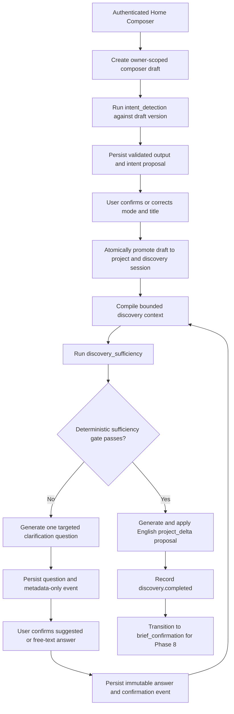

# Phase 7 — Home Composer, Intent Routing, and Adaptive Discovery

**Status:** Architecture and agent-execution plan ready; implementation not started

**Roadmap source:** `docs/UnseenPrompt – DEVELOPMENT_PLAN.md`

**Scope:** Phase 7 only

**Depends on:** Phase 2 design system and application shell, Phase 5 typed model gateway, and Phase 6
project-state engine and Context Compiler

**Unblocks:** Phase 8 brief confirmation and stack recommendation

> Execute P7-01 through P7-10 in dependency order except where a package is explicitly marked
> parallel-safe. Use fresh `luna_worker` agents only. Every worker must own only its listed files,
> preserve concurrent user/agent changes, and report observed validation output. This document is the
> controlling Phase 7 specification; existing migrations and implemented Phase 5/6 contracts remain
> authoritative where older planning prose differs.

## 1. Required outcome and exit criteria

Deliver an authenticated, owner-scoped flow that turns a multilingual natural-language request into
sufficient, durable discovery context without a fixed questionnaire. The system proposes an intent,
allows the user to confirm or correct it, asks one adaptive question at a time, resumes without
repeating confirmed questions, and hands Phase 8 a bounded English project-state proposal.

Phase 7 is complete when:

- The Home Composer accepts bounded multilingual text and creates an owner-scoped composer draft.
- Intent detection returns one supported lifecycle mode, confidence, a concise rationale, and detected
  language through the Phase 5 gateway.
- The user explicitly confirms or corrects the mode before a canonical project is created.
- Every supported mode can reach a sufficient-state proposal from representative fixtures.
- Discovery evaluates all confirmed answers and asks exactly one highest-value question at a time.
- Question count is adaptive. A safety/cost ceiling may block further model calls, but it never marks
  a project sufficient merely because a count was reached.
- A persisted active question is returned on resume without a provider call.
- A confirmed question fingerprint is never shown again after interruption or resume.
- Questions, rationales, answers, answer corrections, sufficiency assessments, abandonment, resume,
  and completion are durable and owner-scoped.
- A model assessment cannot advance discovery without passing the code-owned sufficiency policy.
- Multilingual source text remains intact, while the proposal handed to Phase 8 contains clear English
  project facts.
- Duplicate successful intent, sufficiency, question, and project-delta operations replay their stored
  validated output with zero second provider calls.
- Stale, conflicting, malformed, unauthorized, or cross-owner operations fail with stable safe errors
  and no partial state.
- Provider failures expose retryable product states without leaking prompts, answers, model output,
  provider bodies, credentials, or private identifiers into ordinary logs.
- Production continues to serve the coming-soon waitlist; Phase 7 does not enable the product surface
  in production.

## 2. Repository-derived baseline

The repository before Phase 7 has these relevant capabilities and gaps:

- The non-production home route renders a static `ProductPreview`; production renders the coming-soon
  waitlist. There is no functional composer or discovery route.
- Middleware protects sign-in, onboarding, profile, account APIs, and sign-out, but does not protect
  `/` or future project discovery routes. Authoritative pages and APIs already revalidate sessions
  through `getAuthenticatedContext()`.
- Phase 5 defines strict `intent_detection.v1`, `discovery_sufficiency.v1`, and
  `clarification_question.v1` schemas, including bounded rationales, confidence, detected language,
  suggested answers, free-text support, and an exactly-one-question constraint.
- The Phase 5 gateway requires a project ID and positive project-state version for every request.
- Phase 5 generation persistence records safe execution metadata for all operations but cannot replay
  successful non-project-delta output.
- Phase 6 persists and replays validated `project_delta.v1`, but intent, sufficiency, and clarification
  output remain replay-unavailable.
- Project creation already requires a title and one of seven modes, which creates a bootstrap conflict:
  automatic intent detection is required before the correct mode is known.
- Phase 6 exposes only `getSnapshot`, `execute`, and `applyValidatedDelta`; no discovery repository,
  session model, or question/answer persistence boundary exists.
- Phase 6 project events are closed, metadata-only, append-only, project-sequenced, and user-attributed.
  They do not accept discovery event types or content-bearing question/answer payloads.
- The canonical Phase 6 context contains confirmed requirements, decisions, milestones, preferences,
  summaries, and optional evidence. It does not contain discovery turns.
- Existing API conventions provide production gating, server-authoritative authentication,
  same-origin mutation checks, bounded streaming JSON parsing, strict Zod validation, no-store
  responses, and safe error envelopes.
- Existing `QuestionChoice`, form, textarea, alert, confirmation, skeleton, and shell primitives can be
  reused, while feature orchestration belongs in `src/features/discovery`.
- Database changes are forward-only and tested in isolated CI. Generated database types must never be
  hand-edited.

## 3. Scope and non-goals

### 3.1 In scope

- Authenticated, multilingual Home Composer in non-production environments.
- Owner-scoped pre-project composer drafts.
- Intent detection, confidence, rationale, detected-language display, and mode correction.
- Atomic promotion from a confirmed composer draft into a canonical project and discovery session.
- Pure discovery contracts, state transitions, fact taxonomy, sufficiency policy, context compiler,
  duplicate-question policy, and bounded content rules.
- Durable validated-output replay for Phase 7 model operations.
- Owner-scoped discovery sessions, assessments, questions, answers, and successor-based corrections.
- Metadata-only discovery events integrated with project state versioning.
- Adaptive sufficiency/question orchestration and explicit abandonment/resume.
- Final English `project_delta.v1` proposal and transition to `brief_confirmation`.
- Unit, schema, route, accessibility, pgTAP, concurrency, E2E, privacy, and Workers validation.

### 3.2 Explicit non-goals

- Confirming requirements, decisions, brief content, or a technology stack; Phase 8 owns confirmation.
- Prompt orchestration or tool-specific prompt output; Phase 9 owns it.
- Accepting, uploading, extracting, scanning, OCR-processing, or sending file bytes to a model; Phase 10
  owns private artifact intake.
- Full Feature, Bug, Review, Test, Deploy, or Improve mode-specific workflows; Phases 12–13 own their
  specialized behavior. Phase 7 supplies generic routing and discovery readiness for all seven modes.
- Billing, quotas beyond a local Phase 7 safety/cost ceiling, analytics, launch flags, or production
  enablement.
- Provider SDK adoption, model fine-tuning, hidden chain-of-thought, or storage of raw provider bodies.
- Direct repository, IDE, local-machine, autonomous-agent, or team functionality.

## 4. Controlling architecture decisions

### 4.1 Pre-project composer draft

Add an owner-scoped `composer_drafts` aggregate. The initial request and intent proposal belong to the
draft. A project is created only after the user confirms or corrects the mode and confirms an editable
title.

This avoids:

- a fake default mode;
- a nullable or sentinel `projects.mode` that weakens Phase 6 invariants;
- model calls against fabricated project state;
- partially created projects with an incorrect canonical mode;
- treating model classification as user-confirmed truth.

The default title shown to the user is derived deterministically from the first non-empty request line,
Unicode-normalized, whitespace-collapsed, and truncated at a valid UTF-8 boundary below the existing
240-byte project-title ceiling. It is editable before promotion. The title is not added to the released
`intent_detection.v1` schema.

### 4.2 Typed model execution subject

The gateway currently assumes every execution targets a project. Introduce a typed subject:

```ts
export type ModelExecutionSubject =
  | {
      readonly kind: "composer_draft";
      readonly id: string;
      readonly version: number;
    }
  | {
      readonly kind: "project";
      readonly id: string;
      readonly version: number;
    };
```

Rules:

- `intent_detection` may target a composer draft.
- Every other Phase 7 operation targets a canonical project.
- Existing Phase 5/6 project calls remain backward-compatible through the project variant.
- Claim persistence validates exact owner, target kind, target ID, and target version before any
  provider call.
- Subject kind, ID, version, operation, schema version, system instruction, input, and review policy
  participate in the canonical request fingerprint.

### 4.3 Durable validated discovery output

Add a `generation_outputs` table or an equivalent normalized output relation keyed one-to-one to a
successful generation run. It stores only canonical validated JSON text and a database-computed SHA-256
hash for this allowlist:

- `unseenprompt.model-output.intent_detection.v1`
- `unseenprompt.model-output.discovery_sufficiency.v1`
- `unseenprompt.model-output.clarification_question.v1`

The existing Phase 6 `validated_project_delta_text/hash` path remains unchanged until a separate
migration deliberately unifies it. Phase 7 must not silently replace the proven project-delta apply
contract.

The database validates exact keys, enums, scalar types, array bounds, text bounds, and schema-operation
agreement before storing output. A successful duplicate claim reconstructs the validated response from
the stored output and performs zero provider calls. Hash or schema disagreement fails closed as
`persistence_failed`.

### 4.4 Discovery is durable context, not confirmed project truth

Questions and confirmed answers live in discovery tables. They do not become confirmed requirements or
decisions during Phase 7. When discovery becomes sufficient, the service compiles the discovery history
and asks `project_delta.v1` to create proposed English requirements. Phase 8 reviews and confirms them.

This preserves the controlling rule:

> Models propose. Users confirm canonical truth.

### 4.5 Metadata-only project events

Extend the project event vocabulary with:

- `discovery.started`
- `discovery.sufficiency_assessed`
- `discovery.question_proposed`
- `discovery.answer_confirmed`
- `discovery.answer_superseded`
- `discovery.abandoned`
- `discovery.resumed`
- `discovery.completed`

Payloads contain only schema version, entity IDs, generation-run ID where applicable, before/after
status, and basis/applied state versions. They never contain initial request text, question text,
rationale, suggested answers, answer text, project title, prompts, or model output.

Every successful discovery mutation:

1. derives the owner and user actor from `auth.uid()`;
2. locks the owned project row;
3. checks the expected project state version;
4. claims and validates a lifecycle idempotency key;
5. applies normalized discovery changes;
6. appends exactly one project event;
7. increments `projects.state_version` to the event sequence;
8. commits atomically.

Generated questions and assessments use `actor_type = user` because the authenticated owner initiated
and accepted the stored operation. Their rows retain `generation_run_id` provenance; Phase 7 does not
claim a privileged provider-attested `model` actor.

### 4.6 Advisory model sufficiency plus deterministic policy

The model may identify missing context, but it cannot advance the lifecycle by itself. The application
accepts a sufficient assessment only when all conditions hold:

- `isSufficient` is `true`;
- `confidence >= 0.80`;
- `missingFacts` is empty after exact mode-specific allowlist validation;
- the session contains at least one confirmed user input;
- there is no active unanswered question;
- the generation run and assessment use the current project state version;
- the session is active and the project stage is `discovery`;
- the turn safety/cost ceiling has not produced a manual-resolution block.

If the assessment is insufficient, the code chooses the highest-priority missing fact key, excluding
already confirmed question fingerprints, and requests one question for that key. Unknown or duplicate
keys fail validation. A low-confidence assessment with no missing keys uses a reserved
`clarify_scope` fallback key and remains insufficient.

The default safety ceiling is 12 confirmed discovery turns. Reaching it moves the discovery session to
`blocked` with a stable `discovery_turn_limit_reached` code. It does not transition the project or claim
sufficiency. The normal four-to-seven-question product expectation is evaluation guidance, not a fixed
algorithmic count.

### 4.7 Multilingual source and English Phase 8 proposal

- Initial requests and free-text answers retain the exact validated user text.
- User text is treated as untrusted data, never as system instruction.
- The Discovery Context Compiler labels and escapes source text deterministically.
- Sufficiency and clarification may use multilingual context, but persisted model rationales remain
  concise user-visible evidence, not chain-of-thought.
- After sufficiency passes, `project_delta.v1` receives the bounded discovery context with an explicit
  instruction to produce concise English requirement proposals only.
- The resulting proposal is applied through the existing Phase 6 replay-safe boundary and remains
  `proposed` until Phase 8 confirmation.

### 4.8 Attachment boundary

Phase 7 shows an optional attachment entry affordance with explicit copy that file intake becomes
available after project setup. It does not open a file picker, upload bytes, retain file metadata, fetch
URLs, or send content to a provider. Enabling actual attachment interaction requires Phase 10's signed
private uploads, MIME validation, size/count enforcement, content hashes, extraction, secret redaction,
and untrusted-instruction handling.

The Phase 7 exit criteria do not claim private artifact intake.

## 5. Runtime data flow



### 5.1 Composer start

1. The page and API enforce the non-production product gate.
2. The page authoritatively revalidates authentication and completed onboarding.
3. The API validates same-origin mutation, content type, UTF-8, body size, and strict request shape.
4. One RPC creates the draft, initial draft version, and idempotency receipt.
5. The service executes `intent_detection.v1` using the draft subject.
6. Validated output is durably completed before it is returned.
7. An atomic draft command stores the detected mode, confidence, rationale, language, and generation
   reference, then advances the draft to `awaiting_confirmation`.

If the provider or persistence boundary fails, the draft remains resumable with a stable retry state.
An identical successful retry replays stored output. A terminal failed generation requires a new
explicit attempt key.

### 5.2 Draft promotion

The user reviews:

- detected mode;
- confidence;
- rationale;
- detected language;
- editable title.

The promotion RPC accepts the draft ID, expected draft version, idempotency key, confirmed title, and
confirmed mode. It derives the owner, locks the draft, verifies the intent proposal exists, creates the
project at stage `discovery`, creates the discovery session, records the initial request as confirmed
discovery input, appends the initial discovery audit event, links the draft to the project, and marks the
draft promoted in one transaction.

A duplicate identical promotion returns the original project/session result. A different title or mode
under the same key fails idempotency conflict.

### 5.3 Adaptive loop

For each loop:

1. Read one owner-scoped discovery snapshot containing project projection, session, confirmed inputs,
   assessments, active question, and answer history.
2. If an active unanswered question exists, return it without a model call.
3. Compile canonical discovery context with exact UTF-8 measurement and deterministic ordering.
4. Run and durably persist `discovery_sufficiency.v1` against the current state version.
5. Apply the assessment atomically and run the deterministic sufficiency policy.
6. When insufficient, select the highest-priority missing fact key and run
   `clarification_question.v1`.
7. Reject a question whose normalized fingerprint matches any confirmed question in the session.
8. Persist one active question and one metadata-only event.
9. Return the question, rationale, suggestions, and free-text capability.

One duplicate-question regeneration is permitted with a new child idempotency key and explicit
exclusion context. If it also duplicates, return a stable retry state rather than looping or silently
showing the same question.

### 5.4 Answer confirmation and correction

An answer command accepts exactly one of:

- a value from the persisted suggested-answer set; or
- bounded free text when `allowsFreeText` is true.

The database verifies the active question, expected state version, session status, answer source, and
suggested value membership. It creates an immutable confirmed answer, marks the question answered,
clears the active-question pointer, appends `discovery.answer_confirmed`, and increments project state
atomically.

Correction creates a confirmed successor answer linked to the predecessor, marks the predecessor
superseded, appends `discovery.answer_superseded`, and invalidates later assessments/questions whose
basis version predates the correction. It never edits confirmed answer content in place.

### 5.5 Completion handoff

When the sufficiency policy passes:

1. Compile the final discovery context.
2. Execute `project_delta.v1` with a Phase 7 system instruction that permits English requirement
   proposals only and empty decision/milestone proposals.
3. Persist/replay and apply the proposal through Phase 6.
4. Reject unresolved conflicts or an empty requirement proposal set.
5. Append `discovery.completed` and transition `discovery -> brief_confirmation` through the existing
   lifecycle command boundary.
6. Return a Phase 8 navigation result; do not confirm any proposal in Phase 7.

If delta application succeeds but stage transition fails stale, retry only the transition against the
new snapshot. Never issue another provider call.

## 6. Domain contracts

Create `src/domain/discovery` with no framework, provider, Supabase, environment, or `src/lib` imports.

### 6.1 Statuses

```ts
export const COMPOSER_DRAFT_STATUSES = [
  "routing",
  "awaiting_confirmation",
  "retry_required",
  "promoted",
  "abandoned",
] as const;

export const DISCOVERY_SESSION_STATUSES = [
  "active",
  "sufficient",
  "completed",
  "abandoned",
  "blocked",
] as const;

export const DISCOVERY_QUESTION_STATUSES = ["active", "answered", "superseded"] as const;
export const DISCOVERY_ANSWER_STATUSES = ["confirmed", "superseded"] as const;
```

### 6.2 Commands

Composer draft commands:

- `retry_intent`
- `confirm_and_promote`
- `abandon_draft`

Project discovery commands:

- `advance_discovery`
- `confirm_answer`
- `revise_answer`
- `abandon_discovery`
- `resume_discovery`

Every command envelope includes exact schema namespace/version, subject ID, expected version, and a
trimmed idempotency key of at most 255 UTF-8 bytes. Unknown properties and prototype-shaped keys are
rejected.

### 6.3 Stable errors

Add a discovery-specific safe taxonomy:

- `auth_required`
- `validation_failed`
- `draft_not_found`
- `project_not_found`
- `discovery_not_found`
- `stale_draft_version`
- `stale_state_version`
- `idempotency_conflict`
- `idempotency_in_progress`
- `invalid_draft_state`
- `invalid_discovery_state`
- `active_question_exists`
- `question_not_found`
- `question_not_active`
- `answer_not_allowed`
- `duplicate_question`
- `invalid_missing_fact`
- `sufficiency_policy_failed`
- `discovery_turn_limit_reached`
- `proposal_incomplete`
- `provider_unavailable`
- `persistence_failed`

Messages remain the stable code and never contain private content or dependency errors.

## 7. Initial fact policy

Implement a code-owned ordered taxonomy in `src/domain/discovery/policy.ts`.

| Mode      | Required fact keys                                                                                                 |
| --------- | ------------------------------------------------------------------------------------------------------------------ |
| New Build | `audience`, `problem`, `desired_outcome`, `core_scope`, `constraints`, `success_criteria`                          |
| Feature   | `current_system`, `desired_change`, `user_value`, `integration_constraints`, `acceptance_criteria`                 |
| Bug       | `observed_behavior`, `expected_behavior`, `reproduction`, `environment`, `impact`, `regression_expectation`        |
| Review    | `review_target`, `review_dimension`, `current_context`, `constraints`, `expected_output`                           |
| Test      | `system_under_test`, `test_scope`, `current_coverage`, `environment`, `success_criteria`                           |
| Deploy    | `deployable_artifact`, `target_environment`, `current_pipeline`, `release_constraints`, `rollback`, `verification` |
| Improve   | `improvement_target`, `baseline_problem`, `desired_metric`, `constraints`, `success_criteria`                      |

Rules:

- Keys are closed per mode and ordered by product value, risk, and dependency.
- `missingFacts` is normalized only by trimming and exact ASCII key matching; fuzzy mapping is
  forbidden.
- The initial request may cover several facts, but only the validated assessment proposes that
  coverage. The deterministic gate validates the proposal against the allowlist and other invariants.
- Mode correction invalidates assessments and questions created under the previous mode.
- Fact-policy changes are versioned; existing sessions retain their policy version.

## 8. Persistence model

### 8.1 `composer_drafts`

Key fields:

- `id uuid primary key`
- `owner_id uuid not null`
- `version bigint not null default 1`
- `initial_request_text text not null`
- `status text not null`
- nullable `detected_mode`, `confidence`, `rationale`, `detected_language`
- nullable `intent_generation_run_id`
- nullable `confirmed_mode`, `confirmed_title`, `project_id`
- nullable stable `last_error_code`
- `created_at`, `updated_at`, `promoted_at`, `abandoned_at`

Invariants:

- Owner and ID are immutable.
- Initial request is non-empty and bounded by exact UTF-8 bytes.
- Intent fields are all-null before detection and complete together afterward.
- Promoted status requires confirmed mode/title, project link, and promotion timestamp.
- Abandoned status requires an abandonment timestamp and forbids later promotion without an explicit
  resume policy revision.
- One draft can produce at most one project.

### 8.2 `discovery_sessions`

- `id uuid primary key`
- `project_id uuid not null unique`
- `source_draft_id uuid not null unique`
- `status text not null`
- `policy_version integer not null`
- nullable `active_question_id`, `latest_assessment_id`
- `confirmed_turn_count integer not null default 1`
- nullable stable `block_code`
- lifecycle timestamps

The promoted initial request counts as the first confirmed discovery input but not as a generated
question.

### 8.3 `discovery_assessments`

Append-only fields:

- `id`, `project_id`, `session_id`, `generation_run_id`
- `basis_state_version`
- `is_sufficient`, `confidence`, `missing_fact_keys`, `rationale`
- `policy_passed`, nullable stable `policy_failure_code`
- `created_at`

One generation run produces at most one assessment. The missing-fact array is bounded, contains no
duplicates, and preserves code-owned policy order.

### 8.4 `discovery_questions`

- `id`, `project_id`, `session_id`, `generation_run_id`
- `position`, `target_fact_key`, `basis_state_version`
- `question_text`, `rationale`, bounded `suggested_answers jsonb`
- `allows_free_text`
- database-computed `question_fingerprint`
- `status`, timestamps

Enforce:

- one active question per session;
- unique generation-run relation;
- unique confirmed/answered fingerprint per session;
- exact suggestion object shape and bounds;
- immutable question content after insert.

### 8.5 `discovery_answers`

- `id`, `project_id`, `session_id`, `question_id`
- `source suggested | free_text`
- `answer_text`
- `status confirmed | superseded`
- nullable `supersedes_answer_id`
- `confirmation_event_id`
- timestamps

Enforce one active confirmed answer per question, a single successor per predecessor, no self-reference,
and same-project/session/question lineage.

### 8.6 Ownership, grants, and RLS

- Every project child uses composite project/entity foreign keys where needed.
- Direct authenticated insert, update, and delete are revoked from all Phase 7 tables.
- Authenticated users receive owner-scoped `SELECT` only where product reads require it.
- All mutations use fixed-search-path security-definer RPCs with exact signature grants.
- `public`, `anon`, and broad authenticated execution are revoked before exact grants.
- Cross-owner IDs fail as not found without disclosing existence.
- Service-role access remains available only for isolated operations and future maintenance, not normal
  application requests.

## 9. Discovery Context Compiler

Create a deterministic compiler separate from the Phase 6 canonical project compiler. Its input is:

- project ID, confirmed mode, stage, and state version;
- discovery policy version;
- initial request;
- confirmed questions and current answers;
- active question metadata when present;
- effective profile/project preferences required for explanation depth and language handling;
- prior assessment selectors, not raw discarded model candidates.

Canonical order:

1. schema/version header;
2. project mode and stage;
3. user skill/language preference with provenance;
4. initial request;
5. confirmed turns by question position, then UUID;
6. answered fact keys;
7. active target fact key;
8. code-owned required-fact key list;
9. exact exclusion list of confirmed question fingerprints.

Rules:

- Exact UTF-8 byte count is authoritative.
- The bytes/4 ceiling is labelled as an estimate only.
- Mandatory confirmed inputs are never truncated or silently omitted.
- If mandatory confirmed content exceeds the hard budget, fail with
  `confirmed_discovery_context_exceeds_budget`.
- Optional rationales and historical assessment summaries are selected as whole records or omitted
  with explicit metadata.
- User text is length-delimited and labelled as untrusted data. It cannot escape into system
  instructions.
- Canonical output and omission metadata are deterministic under input permutation.

## 10. API surface and response policy

### 10.1 Routes

- `POST /api/composer/drafts`
  - create a draft and execute or replay intent detection;
- `POST /api/composer/drafts/[draftId]/commands`
  - `retry_intent`, `confirm_and_promote`, or `abandon_draft`;
- `GET /api/projects/[projectId]/discovery`
  - load the resumable owner-scoped discovery snapshot;
- `POST /api/projects/[projectId]/discovery/commands`
  - `advance_discovery`, `confirm_answer`, `revise_answer`, `abandon_discovery`, or
    `resume_discovery`.

### 10.2 Common request boundary

Every route:

1. runs the production product-surface gate before revealing method availability;
2. calls `getAuthenticatedContext()` and never trusts proxy cookies as authorization;
3. rejects disallowed origins for mutations;
4. accepts only `application/json`;
5. reads at most 64 KiB and rejects invalid UTF-8;
6. validates one strict versioned Zod contract;
7. accepts no owner ID, actor, event type, generation result, timestamp, provider, or model;
8. returns `Cache-Control: no-store` and `X-Content-Type-Options: nosniff`;
9. maps only stable safe errors.

### 10.3 HTTP mapping

| Condition                                 |                         Status |
| ----------------------------------------- | -----------------------------: |
| Production product gate                   |                            404 |
| Missing/invalid authenticated session     |                            401 |
| Disallowed browser origin                 |                            403 |
| Owner-scoped missing resource             |                            404 |
| Unsupported method after gate/auth        |                            405 |
| Body too large                            |                            413 |
| Invalid JSON/schema/UTF-8                 |                            422 |
| Stale version or idempotency conflict     |                            409 |
| Idempotency operation still running       | 409 with bounded `Retry-After` |
| Provider rate limit                       | 429 with bounded `Retry-After` |
| Provider unavailable/timeout              |                            503 |
| Safe unknown persistence/provider failure |                            502 |

Responses may return question/answer/rationale content required by the owner-facing UI. Errors and
diagnostics never echo it.

## 11. UI and interaction contract

### 11.1 Root authentication and production behavior

- Production keeps the current coming-soon branch and performs no auth, draft, database, or provider
  work.
- Non-production `/` authoritatively revalidates the session.
- Anonymous users redirect to `/sign-in?next=%2F`.
- Users without completed onboarding redirect to `/onboarding`.
- Add `/` and project discovery paths to the optimistic middleware matcher, but retain page/API
  authorization as the controlling boundary.

### 11.2 Home Composer

The composer contains:

- a single labelled multilingual textarea;
- concise examples without prescribing one language;
- a primary submit action;
- disabled attachment affordance with Phase 10 explanation;
- exact loading state with cancellation where transport supports it;
- safe retry state preserving draft identity;
- mode/title confirmation after intent success;
- confidence displayed as supporting information, never as certainty;
- all seven mode choices available for correction.

The UI never labels a detected mode as confirmed until the user acts.

### 11.3 Adaptive discovery

- Render one active question only.
- Show its concise “Why this matters” rationale.
- Use `QuestionChoice` for suggestions when suggestions exist.
- Show a free-text field only when allowed.
- Require explicit submit/confirmation; selecting a radio does not mutate state.
- Disable double-submit while preserving focus and accessible status announcements.
- Offer abandon and later resume without destructive deletion.
- On stale conflict, reload the authoritative snapshot and preserve unsent local text where safe.
- On resume, show the persisted active question; never call the provider merely to reconstruct UI.
- Respect reduced motion, keyboard navigation, focus visibility, minimum target size, and existing
  monochrome design tokens.

## 12. Security and trust boundaries

| Boundary                   | Untrusted input                              | Enforcement                                                             |
| -------------------------- | -------------------------------------------- | ----------------------------------------------------------------------- |
| Browser → route            | text, IDs, versions, commands                | product gate, auth, origin, byte limit, strict Zod                      |
| Route → service            | authenticated client and parsed data         | no owner/actor/provider fields                                          |
| Service → gateway          | user text and compiled context               | fixed instructions, length-delimited data, budgets                      |
| Provider → gateway         | candidate JSON                               | provider envelope parsing, strict output schema, repair/fallback limits |
| Gateway → generation store | validated output and metadata                | target ownership/version, output allowlist, exact hash                  |
| Service → discovery RPC    | IDs, version, persisted generation reference | row lock, owned target, schema/hash verification                        |
| Database → adapter         | rows and JSON                                | runtime validation, relationship checks, safe mapping                   |
| Discovery → delta proposal | multilingual confirmed context               | deterministic compiler, English-only proposal instruction               |
| Delta → project state      | stored model proposal                        | existing Phase 6 replay/apply boundary, no auto-confirmation            |

Security invariants:

- Caller-supplied owner, actor, correlation, provider, model, schema, and event identity are impossible.
- Cross-owner drafts, generations, projects, sessions, questions, answers, and successors fail closed.
- Raw provider bodies and rejected candidates are never persisted.
- Prompts, initial requests, questions, rationales, answers, titles, emails, user IDs, project IDs,
  secrets, and stack traces are forbidden in ordinary logs.
- User text is hostile data and cannot alter system instructions or authorization behavior.
- Successful model output is returned only after durable completion.
- A project state change is returned only after its atomic transaction commits.
- Phase 7 does not accept files, URLs for server fetching, HTML execution, or executable content.

## 13. Idempotency, concurrency, and failure recovery

| Failure or race                                 | Required behavior                                                              |
| ----------------------------------------------- | ------------------------------------------------------------------------------ |
| Duplicate draft creation, same key/fingerprint  | Return original draft/result                                                   |
| Duplicate draft creation, different fingerprint | `idempotency_conflict`; create nothing                                         |
| Intent success response lost                    | Replay stored validated output; zero provider calls                            |
| Provider fails during intent                    | Keep draft retryable; new explicit attempt key required after terminal failure |
| Concurrent promotion                            | One project/session wins; other call replays or conflicts                      |
| Assessment generated from stale version         | Do not persist assessment/event; reload state                                  |
| Question generated while another becomes active | One persists; stale loser creates nothing                                      |
| Duplicate question fingerprint                  | Do not show/persist; allow one bounded regeneration                            |
| Concurrent answer submissions                   | One confirms; other fails stale or replays identical request                   |
| Answer confirmation response lost               | Replay original event/version receipt                                          |
| Answer correction                               | Create successor, invalidate later derived state, never edit old answer        |
| Sufficiency says true but policy fails          | Remain active and ask/require missing context                                  |
| Turn ceiling reached                            | Block discovery for manual resolution; never claim sufficient                  |
| Delta provider succeeds, apply fails            | Replay stored delta; retry apply without provider                              |
| Delta applies, stage transition fails stale     | Retry transition only against fresh state                                      |
| Worker crashes with generation running          | Surface `idempotency_in_progress`; no blind provider retry                     |
| Database exception mid-command                  | Entire normalized/event/version/idempotency transaction rolls back             |

No destructive down migration, shared-database mutation, automatic data deletion, or blind provider
retry is a recovery mechanism.

## 14. Ordered work packages and file ownership

Every implementation worker is a fresh `luna_worker`. Workers are not alone in the repository: they
must preserve user and concurrent-agent changes, avoid unrelated cleanup, own only listed files, add
tests with behavior, and report exact commands and observed results.

### P7-01 — Pure discovery contracts, policy, and compiler

Owned files:

- `src/domain/discovery/contracts.ts`
- `src/domain/discovery/schemas.ts`
- `src/domain/discovery/policy.ts`
- `src/domain/discovery/context.ts`
- `src/domain/discovery/context-compiler.ts`
- adjacent tests

Acceptance:

- Strict statuses, command envelopes, snapshots, fact taxonomy, stable errors, byte bounds, and
  successor rules.
- Deterministic sufficiency policy and exact mode-specific fact allowlists.
- Canonical context ordering, UTF-8 budget enforcement, whole-record omission metadata, and
  prompt-injection-safe labelling.
- Property/permutation, multibyte boundary, duplicate, unknown-key, prototype-key, and policy tests.
- No provider, database, framework, environment, or `src/lib` import.

Depends on existing Phase 5/6 contract inspection only. Its public contracts freeze before P7-02/P7-03.

### P7-02 — Model execution subject and discovery-output replay

Owned files:

- `src/domain/model/contracts.ts`
- versioned gateway request schema/registry files only if required
- `src/lib/model/generation-run-store.ts`
- `src/lib/model/gateway.ts`
- adjacent model tests

Acceptance:

- Typed composer-draft/project subject union with exact operation restrictions.
- Existing Phase 5/6 project request behavior remains backward-compatible.
- Canonical fingerprint includes exact target kind/ID/version.
- Replay result supports validated intent, sufficiency, clarification question, and existing project
  delta without weakening schemas.
- Duplicate success performs zero provider calls.
- Malformed replay, wrong subject, wrong operation, wrong schema, or hash mismatch fails closed.
- Existing retry, repair, fallback, reviewer, deadline, cancellation, diagnostic, and call-budget tests
  continue to pass.

Depends on P7-01 contract freeze. Shares a reviewed RPC contract with P7-03 before implementation.

### P7-03 — Additive Phase 7 database boundary

Owned files:

- one new `supabase/migrations/<UTC>_phase_7_discovery.sql`
- `supabase/tests/database/00130_phase_7_discovery.test.sql`
- narrow existing grant-expectation updates required by new exact RPC versions
- DB-specific fixtures only

Acceptance:

- Composer drafts, generation target/output support, discovery sessions, assessments, questions, and
  answers with all constraints/indexes/FKs.
- Exact validated-output SQL checks and database-computed hash.
- Atomic draft create, intent apply, promotion, snapshot, discovery command, assessment apply, question
  apply, answer confirm/revise, abandon/resume, and completion RPCs.
- Owner/actor derivation, fixed search paths, exact revocations/grants, row locks, expected-version
  checks, idempotency, event/version atomicity, immutable content, and successor rules.
- Forced rollback, cross-owner, spoofing, stale, duplicate, replay, wrong-generation, wrong-schema,
  duplicate-question, and turn-limit pgTAP coverage.
- No historical migration edits and no local/shared DB execution claims.

Depends on P7-01/P7-02 contract freeze.

### P7-04 — Supabase generation and discovery adapters

Owned files:

- `src/lib/model/supabase-generation-run-store.ts`
- adjacent model adapter tests
- `src/lib/discovery/discovery-repository.ts`
- `src/lib/discovery/supabase-discovery-repository.ts`
- adjacent discovery adapter tests

Acceptance:

- Server-only ports and adapters use authenticated Supabase clients.
- No caller owner/actor identity or direct table mutation.
- Every unknown DB/RPC result is runtime-validated, including cross-row relationships and exact subject
  binding.
- Stable safe SQL errors map narrowly; unknown errors become `persistence_failed`.
- Validated discovery output replays with no provider call.
- No private content enters thrown errors, diagnostics, fixtures outside synthetic tests, or snapshots.

Depends on P7-02/P7-03. Adapter subpackages are parallel-safe after the shared RPC contract freezes.

### P7-05 — Discovery application service and runtime composition

Owned files:

- `src/lib/discovery/discovery-service.ts`
- `src/lib/discovery/runtime.ts`
- adjacent service/runtime tests
- project creation/promotion port only if not owned by the discovery repository

Acceptance:

- Composer start, intent apply/replay, explicit confirmation/promotion, adaptive advance, answer
  confirmation/correction, abandonment/resume, delta proposal/application, and Phase 8 handoff.
- Uses ports/fakes in tests; UI/routes never construct provider or Supabase adapters directly.
- Active question returns before any model call.
- Stale assessment/question output cannot mutate state.
- Duplicate-question regeneration is bounded to one additional logical run.
- Provider success plus lost persistence/apply responses recover without duplicate calls or state.
- Final delta proposes English requirements only and never confirms them.

Depends on P7-01, P7-02, and P7-04.

### P7-06 — Authenticated API routes

Owned files:

- `src/app/api/composer/drafts/route.ts`
- `src/app/api/composer/drafts/[draftId]/commands/route.ts`
- `src/app/api/projects/[projectId]/discovery/route.ts`
- `src/app/api/projects/[projectId]/discovery/commands/route.ts`
- route-adjacent tests
- a shared bounded product JSON helper only if factored without changing account behavior

Acceptance:

- Gate/auth/origin/body/method/error/no-store behavior defined in Section 10.
- Route tests cover production 404, anonymous 401, bad origin 403, method 405, too-large 413, malformed
  422, stale/conflict 409, safe provider states, success, replay, and no content leakage.
- Abort signals are forwarded and route timeouts can only shorten model deadlines.
- API modules compose services and do not contain provider, SQL, or domain policy logic.

Depends on P7-05.

### P7-07 — Home Composer and intent confirmation UI

Owned files:

- `src/features/discovery/home-composer.tsx`
- `src/features/discovery/intent-confirmation.tsx`
- feature-adjacent tests
- minimal reusable components under `src/components/product` when truly presentation-only
- `src/app/(product)/(workspace)/page.tsx` and its tests
- `src/middleware.ts` and matcher tests

Acceptance:

- Authenticated non-production composer replaces the static preview; production waitlist remains
  byte-for-byte behaviorally gated.
- Multilingual input, title derivation/edit, detected-mode display, rationale, confidence, correction,
  loading, cancellation, retry, and failure states.
- Attachment affordance remains explicitly disabled pending Phase 10.
- No model output is labelled confirmed before the user action.
- Keyboard, focus, reduced-motion, responsive, and axe checks pass.
- No provider call occurs in production, maintenance mode, anonymous state, or before valid submission.

Depends on P7-06. Parallel-safe with P7-08 after API response contracts freeze.

### P7-08 — Adaptive discovery UI

Owned files:

- `src/features/discovery/discovery-flow.tsx`
- `src/features/discovery/discovery-question.tsx`
- `src/features/discovery/discovery-status.tsx`
- feature-adjacent tests
- `src/app/(product)/projects/[projectId]/discovery/page.tsx`
- route page/loading/error tests

Acceptance:

- Exactly one active question/action is visible.
- Rationale, suggestions, conditional free text, explicit confirmation, correction, abandon, resume,
  blocked, loading, stale-reload, provider-failure, and Phase 8 transition states.
- Resume renders the persisted active question without issuing an advance request.
- Confirmed question fingerprints are not redisplayed.
- Double-submit prevention does not remove focus or hide authoritative server errors.
- WAI-ARIA radio behavior, keyboard-only completion, accessible announcements, axe, and narrow/wide
  viewport tests pass.

Depends on P7-06. Parallel-safe with P7-07 after contracts freeze.

### P7-09 — Integration, evaluation fixtures, documentation, and full gates

Owned files:

- `scripts/discovery-concurrency.integration.test.ts`
- Phase 7 import/privacy/security assertions
- `tests/e2e/discovery.spec.ts`
- `tests/fixtures/discovery/**`
- focused updates to existing homepage/auth/application-shell E2E tests
- README/status/architecture link corrections
- generated database types only through the approved isolated generator

Acceptance:

- True two-session stale-answer, same-key, promotion, active-question, and generation replay races.
- Representative intent and generic discovery fixtures for all seven modes.
- Hindi, Hinglish, another non-English language, mixed-script, multibyte-boundary, ambiguous, sparse,
  and expert technical inputs.
- Evaluations prove adaptive counts, early stop, no repeat on resume, clear English proposal facts, and
  no false sufficiency at the turn ceiling.
- Static checks reject client imports of server/model modules and forbidden diagnostics.
- All feasible local gates run with observed results; DB/type gates remain isolated-CI claims only.

Depends on P7-01 through P7-08.

### P7-10 — Independent security and architecture review

Review streams:

1. authentication, authorization, RLS, owner/actor derivation, and existence disclosure;
2. generation subject binding, output replay, idempotency, state versions, and concurrency;
3. discovery policy, duplicate prevention, multilingual context retention, and Phase 8 boundary;
4. prompt injection, XSS, private-content logging, provider failures, abuse/cost ceiling, and test gaps.

Acceptance:

- Findings are severity-ranked with exact file/line evidence, exploitability, impact, and minimal safe
  remediation.
- Corrections receive focused regression tests.
- No security control is weakened to satisfy tests.
- Phase 7 is not marked complete until high/critical findings are resolved and lower findings are
  resolved or explicitly accepted by the owner.

Depends on P7-09.

## 15. Test strategy

### 15.1 Pure domain and property tests

- Every composer/discovery status transition and illegal edge.
- Strict command schemas, UUIDs, versions, idempotency keys, unknown/prototype keys, and UTF-8 bounds.
- All fact-policy keys, priorities, mode correction, low-confidence fallback, and turn ceiling.
- Sufficiency truth table and no model-only advancement.
- Question normalization/fingerprint stability, duplicate rejection, and answer membership.
- Successor answer constraints and invalidation rules.
- Compiler ordering under deterministic seeded permutations.
- Exact byte-limit acceptance, one-byte overflow, multibyte boundaries, whole-record omissions, and
  mandatory overflow.

### 15.2 Gateway and adapter tests

- Draft/project subject operation allowlists.
- Target version/ownership mismatch before provider call.
- Discovery output completion and replay with zero provider calls.
- Wrong output schema, operation, subject, JSON text, hash, or success state fails closed.
- Existing primary/retry/repair/fallback/reviewer call budgets remain unchanged.
- Aborts, total deadlines, attempt timeouts, `Retry-After`, refusal, quota, and invalid output.
- Sentinel private content never appears in diagnostics or errors.

### 15.3 Route and UI tests

- Production gate precedes auth/method behavior.
- Authoritative auth, onboarding redirect, origin enforcement, content type, byte limit, UTF-8, and
  stable status mapping.
- Loading, cancellation, retry, stale conflict, resume, abandonment, correction, blocked, and provider
  failure states.
- Suggestions, free text, exactly one active action, double-submit protection, focus recovery, and
  accessible announcements.
- Axe, keyboard radio navigation, reduced motion, narrow mobile, and wide desktop layouts.

### 15.4 pgTAP and two-session integration tests

- Tables, columns, constraints, indexes, immutable triggers, RLS, fixed search paths, and exact grants.
- User A/User B/anonymous access for every table and RPC.
- Draft create/detect/promote atomicity and replay.
- Generation target/output schema/hash validation.
- Project/session/question/answer/event/version/idempotency atomicity.
- Forced rollback leaves no partial normalized/event/version/idempotency writes.
- Concurrent promotion produces one project.
- Concurrent same-version assessment/question/answer operations produce one winner.
- Same-key duplicate returns original receipt; different fingerprint conflicts.
- Cross-project generation/question/answer/successor references fail without disclosure.
- Database test harness refuses non-loopback, non-isolated, or shared targets and never logs URLs or
  credentials.

### 15.5 E2E and evaluation gates

- New Build, Feature, Bug, Review, Test, Deploy, and Improve intent detection fixtures.
- Sparse requests that require more questions and complete requests that stop early.
- Resume after page reload and later session without question regeneration.
- Provider error then explicit retry.
- User mode correction before promotion.
- Answer correction invalidating later derived state.
- Multilingual source producing precise English requirement proposals.
- Production waitlist and maintenance state causing no mutation/provider request.

## 16. Validation commands

Run locally with Node 24.x and pnpm 11.x:

```bash
pnpm format:check
pnpm lint
pnpm typecheck
pnpm test:unit
pnpm test:e2e
pnpm test:e2e:maintenance
pnpm test:e2e:production
pnpm build
pnpm cf:types:check
pnpm check:workers-deps
pnpm cf:build
pnpm test:cf-preview
```

Run only in the isolated CI database job:

```bash
pnpm db:lint
pnpm test:db
pnpm test:db:concurrency
pnpm db:types:check
```

Do not start or reset local/shared Supabase services. Do not hand-edit
`src/lib/supabase/database.types.ts`; regenerate it only through the approved isolated generator.

## 17. Rollout, observability, and rollback

### 17.1 Rollout

1. Merge only after local quality/Workers gates, isolated database/type gates, and P7-10 review pass.
2. Migrate the additive database schema before deploying the Worker that calls new RPCs.
3. Deploy to staging with the existing product gate; do not enable production.
4. Run authenticated staging smoke tests for draft creation, intent correction, promotion, question,
   answer, resume, provider failure, and Phase 8 handoff boundary.
5. Verify safe generation metadata, latency, usage, retry count, validation result, and stable errors
   without inspecting/logging user content.

### 17.2 Safe observability

Allowlisted metrics/events may include:

- operation name and schema version;
- provider/model route;
- safe correlation ID;
- success/failure stable code;
- latency, token counts, estimated cost, retry count, validation result;
- replayed boolean;
- discovery turn number, fact-key identifier, and session status;
- duplicate-question rejection boolean;
- sufficiency policy pass/failure code.

They must exclude all content and private IDs listed in Section 12.

### 17.3 Rollback

- Worker rollback may stop using new additive tables/RPCs but does not reverse the database migration.
- Existing Phase 3–6 project, account, waitlist, and production-gating behavior remains compatible.
- No destructive down migration or automated Phase 7 data purge is shipped.
- Drafts/sessions interrupted by Worker rollback remain owner-scoped and resumable after forward
  recovery.
- If a migration or RPC invariant fails in staging, stop deployment before production and issue an
  additive repair migration.

## 18. Copy-ready `luna_worker` instructions

### P7-01

```text
Implement P7-01 only from the Phase 7 controlling plan. Own src/domain/discovery/contracts.ts,
schemas.ts, policy.ts, context.ts, context-compiler.ts and adjacent tests. Other agents may be editing
concurrently; preserve all user/agent work and do not touch unowned files. Implement strict pure
contracts, status transitions, stable errors, mode-specific fact taxonomy, sufficiency gate, duplicate
rules, deterministic context ordering, exact UTF-8 budgets, untrusted-data labelling, and property/
multibyte tests. No provider, Supabase, framework, environment, UI, or src/lib imports. Run focused
tests, lint, and typecheck; report exact observed results.
```

### P7-02

```text
Implement P7-02 only after P7-01 and the shared SQL/RPC contract freeze. Own only the listed model
contract/generation-store/gateway files and adjacent tests. Other agents may be editing concurrently;
preserve their work. Add the composer_draft|project execution subject, exact operation restrictions,
canonical subject fingerprinting, and replay contracts for validated intent, sufficiency, clarification,
and existing project delta. Preserve all Phase 5 retry/repair/fallback/reviewer/deadline/privacy behavior
and Phase 6 project compatibility. Prove duplicate success makes zero provider calls. Do not edit SQL,
routes, discovery adapters/services, UI, or generated types. Run focused model tests, lint, typecheck.
```

### P7-03

```text
Implement P7-03 only from the frozen Phase 7 domain/model/RPC contracts. Own one additive Phase 7
migration, 00130 pgTAP, and only required exact grant-expectation updates. Other agents may be editing;
never edit historical migrations or revert their changes. Add composer drafts, generation subject/
validated discovery output persistence, discovery sessions/assessments/questions/answers, exact
constraints/indexes/FKs/RLS, fixed-search-path RPCs, owner/actor derivation, locks, expected versions,
idempotency, output hash/schema checks, atomic promotion/discovery events, immutable content and answer
successors. Add rollback, spoofing, cross-owner, stale, replay, duplicate-question and concurrency-facing
pgTAP coverage. Do not run local/shared DB services or hand-edit generated types; report CI-only gates.
```

### P7-04

```text
Implement P7-04 only after P7-02/P7-03 contracts are stable. Own the Supabase generation-store adapter,
new discovery repository port/adapter, and adjacent tests. Other agents may be editing concurrently;
preserve all changes outside ownership. Use authenticated clients, accept no owner/actor identity, call
only exact Phase 7 RPCs, runtime-validate every unknown response and relationship, map only stable safe
errors, and prove replay/ownership/schema/hash failures fail closed without content leakage. Do not edit
domain policy, SQL, services, routes, UI, or generated DB types. Run focused tests, lint, typecheck.
```

### P7-05

```text
Implement P7-05 only after P7-01/P7-02/P7-04 pass review. Own discovery-service.ts, runtime.ts and
adjacent tests. Other agents may be editing concurrently; preserve their changes. Compose draft start,
intent generation/replay, user confirmation/promotion, active-question-first resume, deterministic
sufficiency, targeted question generation with one bounded duplicate regeneration, answer confirmation/
correction, abandonment/resume, final English project_delta proposal/application and Phase 8 handoff.
Use ports/fakes; prove stale output cannot mutate state and lost responses never cause a second provider
call. Never auto-confirm project facts or accept attachments. Do not edit SQL/routes/UI. Run focused
tests, lint, typecheck.
```

### P7-06

```text
Implement P7-06 only after the Phase 7 service API freezes. Own only the four listed composer/discovery
route modules, adjacent tests, and a narrowly shared product JSON helper if required. Other agents may
be editing; preserve all work. Enforce product gate before method disclosure, authoritative auth,
same-origin mutations, application/json, 64 KiB streaming UTF-8 bounds, strict commands, safe no-store
errors, stable HTTP mapping, abort/deadline forwarding and no private error content. Cover 404/401/403/
405/413/422/409/provider/success/replay paths. Do not implement domain/model/SQL/UI logic. Run focused
route tests, lint, typecheck.
```

### P7-07

```text
Implement P7-07 only after API response contracts freeze. Own Home Composer/intent confirmation feature
files, minimal presentation-only product components, the home page/tests, and middleware matcher/tests.
Other agents may be editing; preserve all work. Replace the non-production static preview with the
authenticated multilingual composer while preserving the production waitlist and maintenance behavior.
Implement title editing, detected mode/confidence/rationale, correction, explicit confirmation, loading,
cancellation, retry and safe failures. Keep attachment entry disabled with Phase 10 copy. Add keyboard,
focus, responsive, reduced-motion and axe tests. No provider/repository imports in client code. Run
focused tests, lint, typecheck.
```

### P7-08

```text
Implement P7-08 only after API response contracts freeze. Own adaptive discovery feature files, the
project discovery page/loading/error files, and adjacent tests. Other agents may be editing; preserve
their changes. Render exactly one active question, rationale, persisted suggestions, conditional free
text, explicit confirm/correct, abandon/resume, blocked, stale-reload, loading/provider failure, and
Phase 8 navigation states. Resume must render the stored question without an advance call; confirmed
questions must not repeat. Preserve unsent text safely on stale refresh. Add WAI-ARIA radio, keyboard,
focus, announcement, axe and viewport tests. Do not edit domain/SQL/adapters/routes. Run focused tests,
lint, typecheck.
```

### P7-09

```text
Implement P7-09 only after P7-01 through P7-08 pass package review. Own the Phase 7 two-session
concurrency integration test, discovery E2E/evaluation fixtures, focused existing E2E corrections,
import/privacy assertions, README/status links, and generated DB types only via the approved isolated
generator. Other agents may be editing; preserve all work. Cover all seven intent fixtures, adaptive
early/long flows, Hindi/Hinglish/mixed-script/multibyte inputs, resume without regeneration, provider
retry, correction invalidation, concurrent promotion/question/answer/replay, production/maintenance
no-call guards, and English proposal facts. Run every feasible local gate and report exact results;
report isolated DB/type gates honestly as CI-only.
```

### P7-10

```text
Perform P7-10 as an independent read-only security/architecture review before corrections. Inspect
authentication/RLS/owner derivation; generation subject/output replay/idempotency/concurrency;
discovery sufficiency/duplicate/multilingual/Phase 8 boundaries; prompt injection/XSS/privacy/logging/
provider failure/abuse controls; and test gaps. Other agents may be editing concurrently; do not revert
anything. Report findings in severity order with exact file/line evidence, exploitability, impact,
minimal safe remediation and validation. If corrections are assigned afterward, edit only scoped files,
add regression tests, never weaken controls, and report observed gates.
```
